# Phenotype Organization — Unified Worklog

> Generated: 2026-03-03
> Source: Cross-session audit of 45 repos, 18 sessions, 36 goals

---

## Executive Summary

The Phenotype org has 36 catalogued goals spanning 4 primary projects (AgilePlus, heliosApp, heliosCLI, thegent) and cross-project infrastructure. 14 goals are confirmed done, 13 are in-progress or require resolution, 4 are planned but not started, and 3 are in unknown status requiring investigation. The critical path runs through heliosApp (G007 → G008 → G009 → G010 → G011 → G036), which represents the largest body of outstanding work: 30 specs, majority of which are stubbed or partially implemented and explicitly flagged by the user as unacceptable without full working implementation.

---

## Work Streams

### WS1: AgilePlus Platform

**Repo:** `/Users/kooshapari/CodeProjects/Phenotype/repos/AgilePlus`
**Manifest state:** `current_branch: main`, `uncommitted_count: 1`, branches WP00–WP19 exist locally for spec 001 (WP02–WP19 unmerged to main), spec 002 has no merge evidence, spec 003 all 21 WPs merged.

---

#### G001 — AgilePlus Spec-Driven Development Engine: Core Platform
**Status:** IN-PROGRESS (partial — spec 001 WP00+WP01 merged; WP02-WP19 on open branches, unmerged)
**Spec:** `001-spec-driven-development-engine` (spec + plan + tasks exist)
**Evidence:** Branches `001-spec-driven-development-engine-WP02` through `WP19` exist locally. WP00 (agileplus-proto scaffold) and WP01 (agileplus-core Rust workspace) merged to main.
**What remains:**
- WP02 through WP19 (17 work packages) on local branches, uncommitted to main
- 7-command CLI (specify/research/plan/implement/review/merge/ship) — not delivered
- MCP server (FastMCP 3.0), agent dispatch, Plane.so sync — not delivered
- SQLite + Git dual source-of-truth, governance contracts — partially implemented per G002
- `1 uncommitted file` in main working directory needs investigation

---

#### G002 — AgilePlus Domain Model: Feature and State Machine
**Status:** IN-PROGRESS (WP03 committed, merge/review status unclear)
**Spec:** `001-spec-driven-development-engine` WP03
**Evidence:** Commit `bc38710 Implement WP03: Domain model with Feature & state machine` in git log. Fix commit `8c7ab14 fix: add TransitionResult, FromStr for FeatureState, fix test case assertions` merged recently.
**What remains:**
- Confirm WP03 branch merged to main (branch `001-spec-driven-development-engine-WP03` still exists locally — indicates not yet merged)
- Full SQLite persistence layer for domain crate
- WP04 onward in the spec 001 sequence

---

#### G003 — Org-Wide Release Governance and DX Automation
**Status:** PLANNED (spec created 2026-03-01, zero implementation commits)
**Spec:** `002-org-wide-release-governance-dx-automation` (spec + plan + tasks all exist, 15 WPs defined)
**Evidence:** No merge commits for any spec 002 branch in AgilePlus git log. meta.json created 2026-03-01. Spec phase is fully defined.
**What remains:** All 15 WPs (WP01–WP15): CLI scaffold, npm/PyPI/crates.io/Go adapters, gate evaluation engine, CLI commands, Taskfile standardization, pre-commit hooks, pilot rollout, org-wide rollout.
**Blocking:** Depends on G001 (AgilePlus core platform functional enough to host this tooling).

---

#### G004 — AgilePlus Platform Completion: Infrastructure, Sync, Dashboard, Multi-Device
**Status:** DONE
**Spec:** `003-agileplus-platform-completion`
**Evidence:** All 21 WPs (WP01–WP21) show `chore: Move WPxx to done on spec 003` in git log. Merge commits for all 21 branches confirmed. Most recent merge: `Merge branch 003-agileplus-platform-completion-WP21`. Docs expanded: `docs: expand all 50+ doc pages with comprehensive content, mermaid diagrams` (commit `8b4c777`).
**Completion evidence:** Commits `fb37b49` through `8a2df91` in AgilePlus git log.

---

#### G005 — Decompose AgilePlus into Multi-Repo Microservice Architecture
**Status:** DONE
**Evidence:** Spec 001 updated with 5-repo architecture table. WP00 (agileplus-proto scaffold) merged to main. Session eebb9479 confirmed execution.

---

#### G006 — DX/AX/UX Parity Setup Across AgilePlus
**Status:** UNKNOWN — requires investigation
**Evidence:** Referenced in session 46326590 stop hook feedback. No branch, commit, or spec evidence found specific to this goal.
**Action required:** Determine if this was subsumed by G030 (cross-repo DX parity) or is a distinct AgilePlus-scoped task. Check if AGENTS.md, Taskfile.yml, and pre-commit hooks exist and are complete in the AgilePlus repo.

---

### WS2: heliosApp — Agent IDE

**Repo:** `/Users/kooshapari/CodeProjects/Phenotype/repos/heliosApp`
**Manifest state:** `current_branch: heliosapp-upstream-recon` (NOT on main — needs attention), `uncommitted_count: 1`, 20+ spec WP branches exist locally. 30 specs fully defined (spec+plan+tasks), with 2 specs missing plan files (029, 030).
**Note:** heliosApp canonical repo is NOT on `main`. This violates the worktree commandment. The branch `heliosapp-upstream-recon` is active.

---

#### G007 — heliosApp Desktop Shell: Fork co(lab) and Build Terminal-First Agent IDE
**Status:** IN-PROGRESS (foundational work done via colab repo; heliosApp main has MVP integration)
**Spec:** `001-colab-agent-terminal-control-plane` (spec + plan + tasks exist); 9 WP branches exist locally (WP01–WP09)
**Evidence:** colab repo shows `feat: integrate helios runtime into co(lab) — Phase 1 (#1)` through Phase 4 merged. heliosApp recent commits show `fix(runtime): stabilize sharing types`, `refactor(runtime): harden bus and event surfaces with typed envelopes`. All WP01–WP09 branches present but unconfirmed merged to main.
**What remains:**
- Confirm WP01–WP09 merge status on heliosApp main
- Resolve `heliosapp-upstream-recon` branch — merge or return to main
- Full Zellij mux session adapter (spec 009)
- Par lane orchestrator integration (spec 008)
- Ghostty/Rio renderer backends (specs 011, 012)
- Renderer adapter interface (spec 010)

---

#### G008 — heliosApp Local Bus v1 Protocol
**Status:** IN-PROGRESS
**Spec:** `002-local-bus-v1-protocol-and-envelope` (spec + plan + tasks); WP01–WP03 branches exist
**Evidence:** `chore: Move WP02 to for_review on spec 002` and `chore: Move WP03 to for_review on spec 002` in git log. `refactor(runtime): harden bus and event surfaces with typed envelopes` merged. WP branches exist.
**What remains:** WP02 and WP03 in for_review state — need merge to main. Deterministic event sequencing and full error taxonomy may be incomplete.

---

#### G009 — heliosApp Workspace and Project Metadata Persistence
**Status:** IN-PROGRESS
**Spec:** `003-workspace-and-project-metadata-persistence` (spec + plan + tasks); WP01–WP03 branches exist
**Evidence:** `fix(runtime): stabilize sharing types` merged. WP branches exist on local.
**What remains:** WP01–WP03 merge confirmation. SQLite migration path (MVP uses in-memory + JSON snapshots).

---

#### G010 — heliosApp MVP Agent IDE: Production-Quality Transform
**Status:** PLANNED
**Spec:** `030-helios-mvp-agent-ide` (spec exists, no plan file, no tasks file)
**Evidence:** Spec created 2026-03-01. No merge commits for spec 030 in git log.
**What remains:** All deliverables: chat interface, tool call approval UI, multi-file editor, integrated terminal lanes, git workflow UI, model selector, context file picker, session persistence and replay. Depends on G007, G008, G009 being stable.

---

#### G011 — heliosApp Full Usable MVP: No Stubs, Real UI
**Status:** IN-PROGRESS (quality bar not yet met per user demand)
**Evidence:** Session fcdc1e49 contains user's explicit rejection of stub-only delivery. git log shows ongoing WP work and stabilization PRs. heliosApp recent commits are stabilization/lint fixes rather than feature completions.
**What remains:** All 30 specs must deliver working implementations. Full quality gate pass. Actual UI differentiation over co(lab) baseline. This is the acceptance criterion for the entire heliosApp work stream.

---

#### G012 — heliosApp Toolchain Migration: Biome to OXC/VoidZero Stack
**Status:** UNKNOWN (likely abandoned/incomplete)
**Evidence:** Session fcdc1e49 shows this plan. heliosApp still has `biome.json` at root. colab repo shows `fix: resolve oxlint errors and warnings in helios codebase (#9)` and `feat: migrate tsc → tsgo (TypeScript 7 native Go compiler) (#8)` merged — suggesting the colab fork adopted tsgo but Biome may still be active in heliosApp itself.
**Action required:** Check if biome.json is still the active config or if OXC tools have been added. Determine if migration was completed, partially done, or abandoned.

---

#### G013 — heliosApp Phase 2 Decompose: Runtime Decomposition and Stabilization
**Status:** DONE
**Evidence:** `refactor: decompose runtime into pty/renderer/secrets/lanes services (#40)` merged. `chore: finish recovery lint cleanup and tests` merged. `chore: finalize heliosApp devops hardening and queue publish docs` merged. All 97 WPs merged to main at time of this session.

---

#### G014 — heliosApp CI/CD and Governance Hardening
**Status:** DONE
**Evidence:** `chore: migrate to composite policy-gate action (#38)`, `chore: add lint-test composite action workflow (#41)`, `chore: add governance files (#39)`, stabilization commits all merged to main.

---

#### G015 — heliosApp Continuous Integration and Code Review Governance
**Status:** IN-PROGRESS (specs 021 and 022 active)
**Spec:** `021-continuous-integration-and-quality-gates`, `022-code-review-and-governance-process` (spec + plan + tasks for both)
**Evidence:** `chore: add docs session validation and publish readiness gates` and `Harden policy gate SHA handling` in git log. Specs have WP activity.
**What remains:** Coverage gate enforcement, full publish readiness workflow, finalize review bot governance documentation under spec 022.

---

#### G034 — heliosCLI UX Enhancements (filed under heliosApp in raw-goals — correct project: heliosCLI)
**Status:** DONE
**Evidence:** All three commits (`#276`, `#266`, `#264`) merged to heliosCLI main.

---

#### G036 — heliosApp Remaining Spec Set (004–029 excluding 007–012, 021–022, 028)
**Status:** IN-PROGRESS (specs exist, implementations are stubs or partial)
**Specs:** 004 through 029 (18 specs), all with spec+tasks files; specs 029 and 030 missing plan files
**Evidence:** All 30 spec directories exist. heliosApp main is clean but session fcdc1e49 confirmed user demand for full working implementations. WP branches for specs 004 and 005 exist locally.
**What remains (18 deliverables):**
- 004: App settings and feature flags system
- 005: ID standards and cross-repo coordination
- 006: Performance baseline and instrumentation
- 013: Renderer switch transaction
- 014: Terminal-to-lane session binding
- 015: Lane orphan detection and remediation
- 016: Workspace-lane-session UI tabs
- 017: Lane list and status display
- 018: Renderer engine settings control
- 019: TS7 and bun runtime setup
- 020: Prerelease dependency registry
- 023: Command policy engine and approval workflows
- 024: Audit logging and session replay
- 025: Provider adapter interface
- 026: Share session workflows
- 027: Crash recovery
- 028: Secrets management and redaction
- 029: colab toolchain modernization

---

### WS3: heliosCLI — Terminal Core

**Repo:** `/Users/kooshapari/CodeProjects/Phenotype/repos/heliosCLI`
**Manifest state:** `current_branch: chore/normalize-dirty-20260303-heliosCLI` (NOT on main), `uncommitted_count: 1`, 1 spec (`001-codex-tui-renderer-optimization`, spec only — no plan or tasks).

---

#### G016 — heliosCLI: Fork and Optimize OpenAI Codex CLI
**Status:** IN-PROGRESS (fork complete; N-way merge done; ongoing PR cleanup and absorb work)
**Spec:** `001-codex-tui-renderer-optimization` (spec only, no plan/tasks)
**Evidence:** N-way merge commit, animated ASCII logo, lane L1–L7 features all merged. heliosCLI repo has substantial feature work on main. Currently on `chore/normalize-dirty-20260303-heliosCLI` branch.
**What remains:** Full TUI renderer optimization (spec 001 has no plan/tasks files — needs planning work). Pending absorb from portage fork (G022). PR consolidation (G017).

---

#### G017 — heliosCLI PR Completion and CI Stabilization
**Status:** IN-PROGRESS (active, most recent commits as of 2026-03-03)
**Evidence:** `chore: normalize dirty worktree snapshot (2026-03-03)` and `chore: prep absorb stack via manifest diff checklist` are the two most recent commits. Branch `chore/normalize-dirty-20260303-heliosCLI` is active with 1 uncommitted file. Multiple `codex/*` branches visible in local branch list.
**What remains:** Merge all outstanding `codex/*` branches (at least 14 visible in manifest), normalize dirty snapshot, complete CI stabilization on main.

---

#### G018 — heliosCLI Upstream Feature Mining from openai/codex
**Status:** DONE
**Evidence:** `docs: add upstream research for feature mining action plans (#293)`, `UPSTREAM_MINING_REPORT.md`, `CODEX_PR_ANALYSIS.md`, `CODEX_FORKS_RESEARCH.md` all committed and merged.

---

#### G019 — Cross-Repo Code Reduction and Modularization (Hexagonal Refactor)
**Status:** IN-PROGRESS (thegent phase 1 done; heliosCLI and heliosApp portions ongoing)
**Evidence:** thegent hexagonal refactor complete. Session a0ec467e dispatched lane agents but some lanes found target directories missing. heliosCLI and heliosApp branches `feat/code-reduction-*` visible in manifests.
**What remains:** heliosCLI LOC reduction (branch `feat/code-reduction-portage` in portage manifest — likely related). heliosApp dead code elimination. God module decomposition in remaining repos. Full cross-repo audit completion.

---

#### G020 — heliosCLI Governance, Policy Federation, and Devops Hardening
**Status:** DONE
**Evidence:** `feat(policy): reusable policy-gate composite action (#290)`, `ci(policy): enforce layered fix PR gate (#257)`, `chore(governance): stabilize review bot policy (#253)`, `chore: add shared pheno devops task surface`, `chore(agentops): onboard policy federation artifacts` — all merged.

---

#### G021 — heliosCLI Lane Feature Set (L1–L7)
**Status:** DONE
**Evidence:** All lane PRs merged: `#283` (L1), `#284` (L2), `#285` (L4), `#286` (L3), `#298` (L5). L6 and L7 referenced as docs/audit artifacts.

---

#### G022 — heliosCLI Absorb/Archive Readiness from Portage Fork
**Status:** IN-PROGRESS (documentation complete; absorb execution pending)
**Evidence:** `docs: add heliosCLI absorb/archive readiness package` and `chore: prep absorb stack via manifest diff checklist` are the two most recent commits (2026-03-03). Work is on `chore/normalize-dirty-20260303-heliosCLI` branch.
**What remains:** Execute the absorb plan — cherry-pick selected portage commits into heliosCLI main, merge branch, confirm CI green.

---

#### G035 — heliosCLI Feature Backport: Upstream and Community PR Integration
**Status:** DONE
**Evidence:** `#268`, `#269`, `#270`, `#12358` (network approval), push queue worker mode — all merged to heliosCLI main.

---

### WS4: thegent — Agent Framework

**Repo:** `/Users/kooshapari/CodeProjects/Phenotype/repos/thegent`
**Manifest state:** `current_branch: int/mod-split-stage-1` (NOT on main), `uncommitted_count: 0`, 1 spec (`001-hexagonal-polyglot-repo-audit-plan`, spec only — no plan or tasks).

---

#### G023 — thegent Hexagonal Architecture Refactor and uv Workspace Decomposition
**Status:** DONE
**Evidence:** All 5 refactor phases merged: `#519` (hexagonal Phase 1), `#523` (uv workspace 13 packages), `#526` (DI container), `#527` (async I/O + structured logging), `#531` (remove monolith leaf modules).

---

#### G024 — thegent Module Split into Workspace Packages
**Status:** DONE (merged to `int/mod-split-stage-1`; integration branch NOT yet merged to main)
**Evidence:** All 5 module splits (mcp, control-plane, execution, governance, app) merged into `int/mod-split-stage-1`. Lane bootstrap smoke evidence recorded.
**Note:** thegent is on `int/mod-split-stage-1`, not `main`. The integration branch needs to be merged to main to fully close this goal.
**What remains:** Merge `int/mod-split-stage-1` into thegent `main`.

---

#### G025 — thegent phench Cross-Repo Shared Module Scan and Composition
**Status:** DONE (on `int/mod-split-stage-1`)
**Evidence:** `feat(phench): deterministic project-state runtime surface (#516)`, `feat(phench): add cross-repo shared module scan and candidates`, `feat(phench): add scan recommendations and manifest materialization workflow`, `docs(phench): update shared-module rollout wave statuses` — all committed on integration branch.
**Note:** Depends on `int/mod-split-stage-1` being merged to main (same as G024).

---

#### G026 — thegent Baseline CI Stabilization and 859-Commit Sync
**Status:** DONE
**Evidence:** `sync: push 859 local commits to main (#518)`, `Fix baseline CI stabilization gaps (#517)`, `fix: validate uv workspace + add compatibility shim (#528)` all merged.

---

#### G027 — thegent CI/CD Governance Infrastructure
**Status:** DONE
**Evidence:** `chore: migrate to composite policy-gate action (#522 and #525)`, `chore: add lint-test composite action workflow (#530)`, `ci: add alert sync to issues workflow (#510)` all merged.

---

#### G028 — thegent Directory Structure Audit and Spec Remediation
**Status:** UNKNOWN — unresolved concern
**Evidence:** Session aad7f9bd shows directory renames executed. User's final message raised data loss concern ("most of my repos/files ended up deleted and replaced with basic docs"). Resolution unclear from audit data.
**Action required:** Verify that SDK and CIV spec files exist at correct paths. Confirm no file deletions occurred. Check `sdk` and `civ` repos for spec content completeness.

---

### WS5: Cross-Project Infrastructure

---

#### G029 — Phenotype Release Framework: 5-Tier Release Channel Governance
**Status:** IN-PROGRESS (implemented in heliosCLI only; 44 of 47 repos not yet covered)
**Evidence:** `gatekeeper.toml` exists in heliosCLI. `STACKED_PRS_AND_RELEASE_CHANNELS.md` committed. Only 3 of 47 repos implement the model.
**What remains:** Roll out 5-tier release channel governance to remaining 44 repos. Blocked on G003 (AgilePlus spec 002) for the automation layer.

---

#### G030 — Cross-Repo DX/AX/UX Parity: Unified Workspace Setup
**Status:** IN-PROGRESS (partial — heliosCLI, thegent, heliosApp have Taskfile/AGENTS.md; majority of other repos do not)
**Evidence:** `chore: add shared pheno devops task surface` in heliosCLI. thegent and heliosApp have `AGENTS.md` and `Taskfile.yml`. Many other repos (4sgm, parpour, trace, tokenledger, etc.) do not have standardized DX setup.
**What remains:** Apply standardized Taskfile targets, pre-commit hooks, AGENTS.md, CLAUDE.md templates to the ~40+ repos lacking them. Blocked on G003 for the automation layer.

---

#### G031 — Cross-Repo Lossless Code Reduction and Optimization
**Status:** IN-PROGRESS (thegent done; heliosCLI, heliosApp, AgilePlus in progress)
**Evidence:** thegent hexagonal refactor and module split represent the most complete execution. `LOC_REDUCTION_PLAN.md` exists in thegent. `feat/code-reduction-*` branches visible in heliosCLI, portage, and thegent manifests.
**What remains:** heliosCLI LOC reduction execution, heliosApp god module decomposition, AgilePlus (when WP02+ merges). Cross-repo audit output needs to be acted upon.

---

#### G032 — Goals Modeling and Worklog: Harmonized Spec/Expectation Tracking
**Status:** IN-PROGRESS (raw-goals.json produced; this worklog.md is the final deliverable)
**Evidence:** `raw-goals.json` created in `.work-audit/`. This file (worklog.md) completes the deliverable.
**What remains:** Harmonize unspecced work into spec extensions (identify goals without backing specs and create spec stubs). Set up recurring worklog refresh cadence.

---

#### G033 — Session Deduplication and Crash Recovery Protocol
**Status:** DONE
**Evidence:** Session 08a5b3fb specifically addressed the crash recovery. Surviving sessions identified, context recovered.

---

## Completed Work (Archive)

| Goal ID | Project | Title | Completion Evidence | Notes |
|---------|---------|-------|---------------------|-------|
| G004 | AgilePlus | Platform Completion (21 WPs) | Commits `fb37b49`–`8a2df91`; all WP01–WP21 merged | Includes 50+ doc pages |
| G005 | AgilePlus | Multi-Repo Microservice Architecture | WP00 merged; spec 001 updated with 5-repo table | agileplus-proto scaffold done |
| G013 | heliosApp | Phase 2 Decompose + Stabilization | PR #40 merged; `3a1e012 chore: finish recovery lint cleanup` | 97 WPs merged to main |
| G014 | heliosApp | CI/CD and Governance Hardening | PRs #38, #39, #41 merged | Composite policy-gate, lint-test, governance |
| G018 | heliosCLI | Upstream Feature Mining | PR #293; `UPSTREAM_MINING_REPORT.md`, `CODEX_PR_ANALYSIS.md` committed | Full fork landscape documented |
| G020 | heliosCLI | Governance, Policy Federation, Devops | PRs #290, #257, #253; agentops artifacts onboarded | CLAUDE.md, shared devops surface |
| G021 | heliosCLI | Lane Feature Set L1–L7 | PRs #283, #284, #285, #286, #298 merged | All 7 lanes delivered |
| G023 | thegent | Hexagonal Architecture Refactor | PRs #519, #523, #526, #527, #531 merged | 13 packages, DI, async I/O |
| G024 | thegent | Module Split into Workspace Packages | Merged into `int/mod-split-stage-1` | Needs merge to main |
| G025 | thegent | phench Cross-Repo Shared Module Scan | PRs #516 + follow-ons; `docs(phench): update rollout wave statuses` | On integration branch |
| G026 | thegent | Baseline CI + 859-Commit Sync | PRs #517, #518, #528 merged | CI stabilized |
| G027 | thegent | CI/CD Governance Infrastructure | PRs #510, #522, #525, #530 merged | Policy-gate, lint-test, alert sync |
| G033 | cross-project | Session Deduplication Protocol | Session 08a5b3fb resolved | Protocol guidance issued |
| G034 | heliosCLI | UX Enhancements (ASCII logo, paste) | PRs #276, #266, #264 merged | Verbatim paste, Ctrl alt, logo morph |
| G035 | heliosCLI | Feature Backport from Community PRs | PRs #268, #269, #270, #12358 merged | SKILL.md, Finder path, sandbox, network approval |

---

## In-Progress Work

| Goal ID | Project | Title | Branch | Uncommitted Files | Blocking Issues | Estimated Remaining Effort |
|---------|---------|-------|--------|-------------------|-----------------|---------------------------|
| G001 | AgilePlus | Core Platform (spec 001) | main (WP02–WP19 on local branches) | 1 | WP02–WP19 not merged; 7-command CLI undelivered | Large (17 WPs) |
| G002 | AgilePlus | Domain Model + State Machine | `001-spec-driven-development-engine-WP03` (local) | 1 (main) | WP03 branch not merged to main | Medium (confirm merge + WP04+) |
| G008 | heliosApp | Local Bus v1 Protocol | `002-local-bus-v1-*` WP02, WP03 (local) | 1 (heliosapp-upstream-recon) | WP02/WP03 in for_review, not merged | Small-Medium |
| G009 | heliosApp | Workspace + Project Metadata Persistence | `003-workspace-*` WP01–WP03 (local) | 1 | WP branches not merged | Medium |
| G011 | heliosApp | Full Usable MVP — No Stubs | `heliosapp-upstream-recon` (off main) | 1 | heliosApp NOT on main; user acceptance bar not met; 30 specs need full impl | Very Large |
| G015 | heliosApp | CI + Code Review Governance (specs 021, 022) | main | 1 | Coverage gates + publish readiness incomplete | Small-Medium |
| G017 | heliosCLI | PR Completion + CI Stabilization | `chore/normalize-dirty-20260303-heliosCLI` | 1 | 14+ codex/* branches unmerged; not on main | Medium |
| G019 | cross-project | Cross-Repo Code Reduction (Hexagonal) | `feat/code-reduction-*` in heliosCLI, portage | varies | Lane agents found missing target dirs; heliosApp + heliosCLI portions incomplete | Large |
| G022 | heliosCLI | Absorb/Archive from Portage Fork | `chore/normalize-dirty-20260303-heliosCLI` | 1 | Absorb plan documented, execution not started | Medium |
| G029 | cross-project | 5-Tier Release Channel Governance | gatekeeper in heliosCLI only | — | 44 of 47 repos not covered; G003 automation needed | Large |
| G030 | cross-project | Cross-Repo DX/AX/UX Parity | heliosCLI, thegent partial | — | ~40+ repos lack standardized DX; G003 automation needed | Large |
| G031 | cross-project | Lossless Code Reduction | `feat/code-reduction-*` branches | varies | thegent done; heliosCLI, heliosApp, AgilePlus pending | Large |
| G032 | cross-project | Goals Modeling + Worklog | `.work-audit/` | — | This worklog.md is final deliverable; spec extensions needed | Small (this file) |
| G036 | heliosApp | Remaining Spec Set 004–029 | local WP branches for 004, 005, 006 | 1 | 18 specs need full working implementations; user demanded no stubs | Very Large |

---

## Planned / Not Started

| Goal ID | Project | Title | Spec Status | Dependencies | Notes |
|---------|---------|-------|-------------|--------------|-------|
| G003 | AgilePlus | Org-Wide Release Governance + DX Automation | spec+plan+tasks exist (15 WPs) | G001 | Zero implementation; meta.json created 2026-03-01 |
| G007 (007–012, ext) | heliosApp | Zellij, Par, Ghostty, Rio backends | specs 007–012 all spec+plan+tasks | G007 base | WP branches exist but full impl pending |
| G010 | heliosApp | MVP Agent IDE (spec 030) | spec only, no plan/tasks | G007, G008, G009 | Chat loop, tool approval UI, multi-file editor — nothing started |
| G007-remaining | heliosApp | Terminal control plane WP02–WP09 | spec 001 WP branches exist locally | G007 WP01 | Zellij, PTY, Par, Ghostty, Rio all pending merge |

---

## Refactoring Needs

The following items represent work done ad-hoc, pre-spec, or in an incomplete state requiring governance attention:

### 1. thegent — `int/mod-split-stage-1` Not Merged to main
- **Issue:** thegent's canonical repo is on `int/mod-split-stage-1`, not `main`. Goals G024 and G025 are technically complete but their work is stranded on an integration branch. This violates the worktree commandment.
- **Action:** Merge `int/mod-split-stage-1` into thegent `main`. Verify CI passes. Return canonical repo to `main`.

### 2. heliosApp — Canonical Repo Off Main
- **Issue:** heliosApp is on `heliosapp-upstream-recon` branch with 1 uncommitted file. This is a canonical repo that should track `main`.
- **Action:** Investigate what `heliosapp-upstream-recon` contains, merge or stash it, return to `main`.

### 3. heliosCLI — Canonical Repo Off Main
- **Issue:** heliosCLI is on `chore/normalize-dirty-20260303-heliosCLI` with 1 uncommitted file. Active work (G017, G022) is ongoing on this branch.
- **Action:** Complete the normalize/absorb work, merge to main, return to `main`.

### 4. agent-devops-setups — Off Main with Uncommitted Files
- **Issue:** `current_branch: agentops/policy-federation-rollout`, `uncommitted_count: 4`. This repo holds policy federation rollout work that has not been merged.
- **Action:** Determine if the 4 uncommitted files should be committed and the branch merged, or if this is intentionally in-progress.

### 5. AgilePlus spec 001 WP02–WP19 — Local Branches, Never Merged
- **Issue:** 18 WP branches (`001-spec-driven-development-engine-WP02` through `WP19`) exist locally in AgilePlus but show no merge commits in the git log. This is a large volume of unmerged spec work.
- **Action:** Review each WP branch. Some may be planned (not yet started), others may have partial work. WP03 (domain model) has a commit (`bc38710`) suggesting it should be mergeable. Triage all 18 branches.

### 6. heliosApp — 20+ WP Branches Never Merged (Specs 001–006)
- **Issue:** WP branches for specs 001–006 exist locally but no merge commits are confirmed for most of them.
- **Action:** Audit heliosApp WP branches one-by-one. For each: if implementation is complete, open PR and merge. If stub-only, apply the user's full-implementation mandate.

### 7. G006 and G012 — Status Unknown
- **Issue:** G006 (DX/AX/UX parity for AgilePlus) and G012 (Biome → OXC migration for heliosApp) have no verifiable completion evidence and no active branches.
- **Action for G006:** Check if AgilePlus has complete Taskfile.yml, AGENTS.md, pre-commit hooks. If yes, close as done. If no, open as in-progress.
- **Action for G012:** Check heliosApp root for `oxlint` or `oxfmt` configs. If only `biome.json` exists, classify as abandoned and decide whether to pursue.

### 8. G028 — thegent Directory Audit (Potential Data Loss)
- **Issue:** Session aad7f9bd triggered data loss concern from user. The spec remediation was executed but the user's follow-up question ("what did you do?") was not fully resolved.
- **Action:** Verify `sdk` and `civ` repos contain their expected spec content. Cross-check manifest entries for both repos: both show `current_branch: unknown` and `uncommitted_count: 0` with empty `recent_commits` — this is suspicious and warrants investigation.

### 9. Multiple Repos Off Main with Uncommitted Files
The following repos in the manifest are off-main or have significant uncommitted files that may indicate stale branches with stranded work:

| Repo | Branch | Uncommitted | Action |
|------|--------|-------------|--------|
| `bifrost-extensions` | `chore/add-lint-test` | 9 | Merge or close |
| `template-domain-service-api` | `chore/branch-protection-audit-contract` | 7 | Merge or close |
| `template-domain-webapp` | `chore/branch-protection-audit-contract` | 7 | Merge or close |
| `template-lang-*` (9 repos) | `chore/branch-protection-audit-contract` | 7 each | Likely template hardening — batch merge |
| `phenotypeActions` | `feat/composite-actions` | 8 | Merge or close |
| `template-commons` | `agentops/policy-federation-onboard` | 8 | Merge or close |
| `agentapi-plusplus` | `agentops/policy-federation-onboard` | 5 | Merge or close |

---

## Dependency Graph

```mermaid
flowchart TD
    G001["G001: AgilePlus Core Platform"]
    G002["G002: Domain Model + State Machine"]
    G003["G003: Org-Wide DX Automation"]
    G004["G004: Platform Completion ✓"]
    G005["G005: Multi-Repo Architecture ✓"]
    G006["G006: AgilePlus DX/AX/UX Parity ?"]
    G007["G007: heliosApp Desktop Shell"]
    G008["G008: Local Bus v1 Protocol"]
    G009["G009: Workspace Persistence"]
    G010["G010: MVP Agent IDE"]
    G011["G011: Full Usable MVP"]
    G012["G012: Biome → OXC Migration ?"]
    G013["G013: Phase 2 Decompose ✓"]
    G014["G014: CI/CD Hardening ✓"]
    G015["G015: CI + Code Review Governance"]
    G016["G016: heliosCLI Fork + Optimize"]
    G017["G017: PR Completion + CI"]
    G018["G018: Upstream Feature Mining ✓"]
    G019["G019: Cross-Repo Code Reduction"]
    G020["G020: heliosCLI Governance ✓"]
    G021["G021: Lane Features L1-L7 ✓"]
    G022["G022: Absorb from Portage"]
    G023["G023: Hexagonal Refactor ✓"]
    G024["G024: Module Split ✓ (needs merge)"]
    G025["G025: phench Shared Module Scan ✓"]
    G026["G026: 859-Commit Sync ✓"]
    G027["G027: thegent CI Governance ✓"]
    G028["G028: Directory Audit ?"]
    G029["G029: 5-Tier Release Governance"]
    G030["G030: Cross-Repo DX/AX/UX Parity"]
    G031["G031: Lossless Code Reduction"]
    G032["G032: Goals Modeling + Worklog"]
    G033["G033: Session Dedup Protocol ✓"]
    G034["G034: UX Enhancements ✓"]
    G035["G035: Feature Backport ✓"]
    G036["G036: Remaining Specs 004-029"]

    G001 --> G002
    G001 --> G003
    G001 --> G004
    G001 --> G005
    G001 --> G006
    G002 --> G004
    G003 --> G029
    G003 --> G030
    G007 --> G008
    G007 --> G009
    G007 --> G012
    G007 --> G013
    G007 --> G014
    G007 --> G036
    G008 --> G009
    G008 --> G010
    G009 --> G010
    G010 --> G011
    G011 --> G013
    G014 --> G015
    G016 --> G017
    G016 --> G018
    G016 --> G019
    G016 --> G020
    G016 --> G021
    G016 --> G022
    G016 --> G034
    G016 --> G035
    G017 --> G022
    G018 --> G035
    G019 --> G031
    G023 --> G019
    G023 --> G024
    G023 --> G025
    G023 --> G026
    G023 --> G027
    G024 --> G025
    G029 --> G030
    G031 --> G019
```

---

## Recommended Priority Order

The following order balances unblocking dependencies, addressing user-stated urgency (G011/heliosApp full MVP), and preventing drift on near-complete items.

### Tier 1 — Immediate (Blockers and Regressions)

1. **Merge thegent `int/mod-split-stage-1` to `main`** (G024/G025)
   - Zero uncommitted files, work is complete. This is a pure merge operation. Unblocks phench and module scan being on `main`.

2. **Return heliosApp canonical repo to `main`** (G011, G007)
   - Resolve `heliosapp-upstream-recon` branch: merge its 1 uncommitted file if meaningful, otherwise stash/drop. Required before any heliosApp spec work can proceed cleanly.

3. **Return heliosCLI canonical repo to `main`** (G017, G022)
   - Complete the portage absorb (G022), merge `chore/normalize-dirty-20260303-heliosCLI`, clean up the 14+ `codex/*` branches. This unblocks all heliosCLI feature work.

4. **Investigate and close G028 (thegent data loss concern)**
   - Both `sdk` and `civ` repos show `current_branch: unknown`, empty recent_commits. This is not normal and requires verification that spec content was not deleted.

### Tier 2 — High Priority (Core Product Functionality)

5. **AgilePlus spec 001 WP02–WP19 triage and merge** (G001, G002)
   - Start with WP03 (domain model, commit `bc38710` already exists — just needs PR+merge). Then systematically unblock WP04+. The 7-command CLI is the core product value.

6. **heliosApp specs 007–012 full implementation** (G036, G011)
   - PTY lifecycle manager (007), Par lane orchestrator (008), Zellij mux (009), renderer adapter (010), Ghostty backend (011), Rio backend (012). These are the technical foundation for the full usable MVP.

7. **heliosApp specs 001–006 WP merge audit** (G007–G009)
   - Audit all WP01–WP09 branches for specs 001–003. For each: if implementation is real, merge. If stub, implement fully before merging. User explicitly rejected stub-only delivery.

### Tier 3 — Medium Priority (Quality and Governance)

8. **Resolve G012 (Biome → OXC migration)** for heliosApp
   - Determine current state. colab already adopted tsgo; ensure heliosApp CI matches. Either complete the migration or formally close as not-pursuing with documented rationale.

9. **heliosApp specs 013–020 implementation** (G036)
   - Renderer switch, terminal-lane binding, workspace UI tabs, TS7 setup, prerelease registry — these complete the runtime and UI foundation for the MVP agent IDE.

10. **AgilePlus spec 002 kickoff** (G003) — first WP (CLI scaffold and adapter interface)
    - Required before any org-wide DX automation can be built. Start with WP01 only to unblock the subsequent adapter work.

### Tier 4 — Planned Next (Strategic)

11. **heliosApp spec 030 — MVP Agent IDE** (G010)
    - Create the plan file (currently missing), then begin WP execution. Requires specs 001–020 to be stable first.

12. **heliosApp specs 021–029 completion** (G015, G036)
    - CI governance (021), code review governance (022), command policy engine (023), audit logging (024), provider adapter (025), share session (026), crash recovery (027), secrets (028), colab modernization (029).

13. **Cross-repo DX/AX/UX parity rollout** (G030)
    - Apply Taskfile, AGENTS.md, CLAUDE.md, pre-commit hooks to the ~40 repos currently lacking them. Batch operation — use the agent-devops-setups and phenotypeActions repos as tooling.

14. **5-tier release channel governance expansion** (G029)
    - Once G003 WP01 (CLI scaffold) is done, begin rolling the release framework to the 44 repos that lack it.

15. **Cross-repo lossless code reduction completion** (G031, G019)
    - Complete heliosCLI and heliosApp LOC reduction after their respective specs are stable. Run full audit with 10-15 haiku agents as originally planned.

---

*This worklog is the single source of truth for all Phenotype org work. Refresh after each session by re-running the audit against current repo state.*
