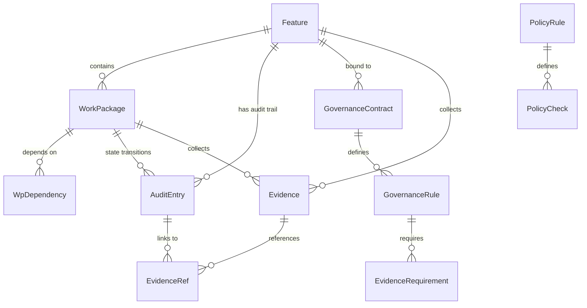
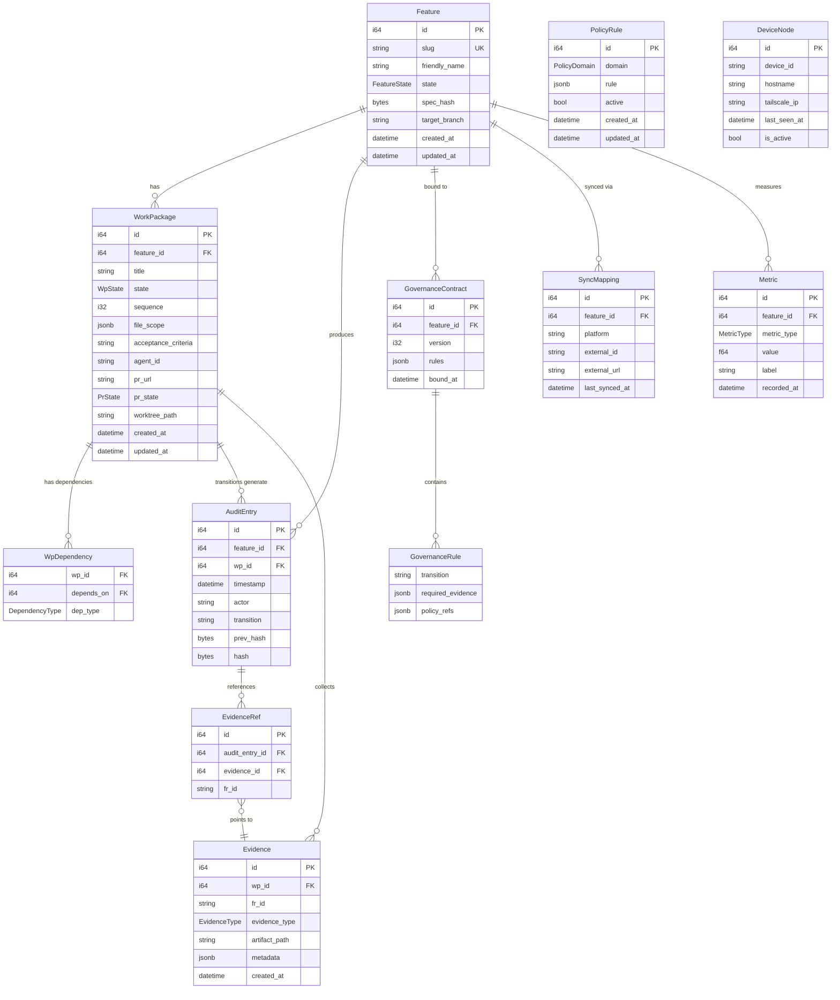

# Domain Model

The domain model is defined in `crates/agileplus-domain/src/domain/` and represents the core entities and their relationships. All entities are immutable after creation (state is modified via explicit transitions).

## Entity Relationship Diagram



## Feature

The **central domain entity**. Features represent user-visible functionality and move through an 8-stage state machine.

**Defined in**: `crates/agileplus-domain/src/domain/feature.rs`

```rust
pub struct Feature {
    pub id: i64,                      // Primary key (auto-assigned by storage)
    pub slug: String,                 // URL-safe identifier: "user-authentication"
    pub friendly_name: String,        // "User Authentication with JWT"
    pub state: FeatureState,          // Current state in FSM
    pub spec_hash: [u8; 32],          // SHA-256 of spec artifact (immutable)
    pub target_branch: String,        // Branch to merge into: "main" or "dev"
    pub created_at: DateTime<Utc>,    // When feature was created
    pub updated_at: DateTime<Utc>,    // When state last changed
}

pub enum FeatureState {
    Created,      // Idea exists; not yet formalized
    Specified,    // Spec artifact is complete
    Researched,   // Feasibility and codebase scanned
    Planned,      // Work packages generated
    Implementing, // WPs assigned and in progress
    Validated,    // All WPs done; tests pass; reviews approved
    Shipped,      // Merged to target branch
    Retrospected, // Post-incident analysis complete
}
```

**Key methods**:
```rust
impl Feature {
    pub fn new(slug: &str, friendly_name: &str, spec_hash: [u8; 32],
               target_branch: Option<&str>) -> Self
    pub fn transition(&mut self, target: FeatureState) -> Result<TransitionResult, DomainError>
    pub fn slug_from_name(name: &str) -> String  // "My Feature" → "my-feature"
}
```

**Lifecycle**:
1. Created via `Feature::new()`
2. State transitions via `Feature::transition()` (enforced by preconditions)
3. Persisted via `StoragePort::create_feature()` and `update_feature_state()`
4. Queried via `StoragePort::get_feature_by_slug()` or `list_features_by_state()`

## Work Package

A **unit of work** within a feature — small, independently implementable, with clear acceptance criteria.

**Defined in**: `crates/agileplus-domain/src/domain/work_package.rs`

```rust
pub struct WorkPackage {
    pub id: i64,                           // Primary key
    pub feature_id: i64,                   // Foreign key to Feature
    pub title: String,                     // "Core Auth Models"
    pub state: WpState,                    // Current state
    pub sequence: i32,                     // Execution order (1, 2, 3)
    pub file_scope: Vec<String>,           // Files affected: ["src/auth/mod.rs"]
    pub acceptance_criteria: String,       // Markdown with acceptance tests
    pub agent_id: Option<String>,          // Assigned agent: "claude-code"
    pub pr_url: Option<String>,            // GitHub PR when submitted
    pub pr_state: Option<PrState>,         // PR status: Open, Review, Approved, etc.
    pub worktree_path: Option<String>,     // Path to git worktree
    pub created_at: DateTime<Utc>,
    pub updated_at: DateTime<Utc>,
}

pub enum WpState {
    Planned,   // Not yet started
    Doing,     // Agent or dev is actively working
    Review,    // Code submitted for review
    Done,      // Complete and merged
    Blocked,   // Blocked by dependency or issue
}

pub enum PrState {
    Open,              // PR created, awaiting review
    Review,            // Under review
    ChangesRequested,  // Review feedback given
    Approved,          // Review approved, ready to merge
    Merged,            // Merged to target
}
```

**State Machine**:

```
Planned → Doing → Review → Done
  ↑              ↓
  └─← Blocked ←─┘
```

WPs can move backward (e.g., from `Blocked` to `Planned`) but features cannot.

**Key methods**:
```rust
impl WorkPackage {
    pub fn new(feature_id: i64, title: &str, sequence: i32,
               acceptance_criteria: &str) -> Self
    pub fn transition(&mut self, target: WpState) -> Result<(), DomainError>
    pub fn has_file_overlap(&self, other: &WorkPackage) -> Vec<String>
}
```

## Dependency Graph

Work packages are connected via an **explicit dependency graph** for scheduling.

**Defined in**: `crates/agileplus-domain/src/domain/work_package.rs`

```rust
pub struct WpDependency {
    pub wp_id: i64,          // "This WP..."
    pub depends_on: i64,     // "...depends on this WP"
    pub dep_type: DependencyType,
}

pub enum DependencyType {
    Explicit,     // Manually specified in plan
    FileOverlap,  // Both WPs touch the same file
    Data,         // WP2 consumes output from WP1
}

pub struct DependencyGraph {
    edges: HashMap<i64, Vec<WpDependency>>,
}
```

**Key methods**:
```rust
impl DependencyGraph {
    pub fn new() -> Self
    pub fn add_edge(&mut self, dep: WpDependency)
    pub fn add_file_overlap_edges(&mut self, work_packages: &[WorkPackage])
    pub fn execution_order(&self) -> Result<Vec<Vec<i64>>, DomainError>  // Kahn's algorithm
    pub fn ready_wps(&self, done: &HashSet<i64>) -> Vec<i64>
    pub fn has_cycle(&self) -> bool
}
```

**Example**: Computing parallel execution layers:

```
Input: WP01, WP02 (depends on WP01), WP03 (depends on WP01)

execution_order() → [
    [1],      // Layer 0: WP01 has no deps
    [2, 3],   // Layer 1: WP02 and WP03 can run in parallel
]
```

The system uses **Kahn's algorithm** to detect cycles and compute execution layers. This prevents deadlocks and allows parallel execution of independent WPs.

## Audit Entry

An **immutable record** of every state transition. Forms a cryptographically linked chain.

**Defined in**: `crates/agileplus-domain/src/domain/audit.rs`

```rust
pub struct AuditEntry {
    pub id: i64,                          // Primary key
    pub feature_id: i64,                  // Which feature changed
    pub wp_id: Option<i64>,               // Which WP (if applicable)
    pub timestamp: DateTime<Utc>,         // When
    pub actor: String,                    // Who: "human:alice" or "agent:claude-code"
    pub transition: String,               // What: "created->specified"
    pub evidence_refs: Vec<EvidenceRef>,  // Supporting evidence
    pub prev_hash: [u8; 32],              // Hash of previous entry (chain link)
    pub hash: [u8; 32],                   // Hash of this entry
}

pub struct EvidenceRef {
    pub evidence_id: i64,                 // Link to Evidence entity
    pub fr_id: String,                    // Functional requirement: "FR-004"
}

#[derive(Debug, Clone)]
pub struct AuditChain {
    pub entries: Vec<AuditEntry>,
}
```

**Hash Chain Integrity**:

Each entry is hashed from:
```
hash = SHA-256(
    feature_id ||
    wp_id ||
    timestamp ||
    actor ||
    transition ||
    prev_hash    // ← Previous entry's hash (the chain link)
)
```

If any field is modified, the hash changes. If the `prev_hash` doesn't match the previous entry's computed hash, verification fails.

**Key methods**:
```rust
pub fn hash_entry(entry: &AuditEntry) -> [u8; 32]

impl AuditChain {
    pub fn verify_chain(&self) -> Result<(), AuditChainError>
}
```

**Example chain**:
```
Entry 0:
  feature_id: 123
  transition: "created->specified"
  prev_hash: 0x0000... (genesis)
  hash: 0xaaaa...

Entry 1:
  feature_id: 123
  transition: "specified->researched"
  prev_hash: 0xaaaa... ← Links to previous entry
  hash: 0xbbbb...

Entry 2:
  feature_id: 123
  transition: "researched->planned"
  prev_hash: 0xbbbb... ← Links to previous entry
  hash: 0xcccc...
```

If someone tampers with Entry 0's actor field, its hash changes from 0xaaaa... to 0xffff..., breaking the link in Entry 1.

## Governance

**GovernanceRule** and **GovernanceContract** enforce preconditions for state transitions.

**Defined in**: `crates/agileplus-domain/src/domain/governance.rs`

```rust
pub struct GovernanceContract {
    pub id: i64,
    pub feature_id: i64,
    pub version: i32,                      // Version number (contracts are versioned)
    pub rules: Vec<GovernanceRule>,        // The rules
    pub bound_at: DateTime<Utc>,
}

pub struct GovernanceRule {
    pub transition: String,                // "implementing->validated"
    pub required_evidence: Vec<EvidenceRequirement>,
    pub policy_refs: Vec<String>,          // References to active policies
}

pub struct EvidenceRequirement {
    pub fr_id: String,                     // Functional requirement: "FR-004"
    pub evidence_type: EvidenceType,       // What evidence is needed
    pub threshold: Option<serde_json::Value>,  // Optional threshold
}

pub enum EvidenceType {
    TestResult,      // Unit or integration test results
    CiOutput,        // CI/CD pipeline output
    ReviewApproval,  // Code review sign-off
    SecurityScan,    // SAST or dependency scan
    LintResult,      // Linter output
    ManualAttestation, // Human approval
}
```

**Example contract**:
```json
{
  "feature_id": 123,
  "version": 1,
  "rules": [
    {
      "transition": "implementing->validated",
      "required_evidence": [
        { "fr_id": "FR-004", "evidence_type": "TestResult" },
        { "fr_id": "FR-005", "evidence_type": "SecurityScan", "threshold": { "max_cves": 0 } }
      ],
      "policy_refs": ["POLICY-001", "POLICY-003"]
    }
  ]
}
```

## Evidence

Collected outputs that satisfy governance requirements.

**Defined in**: `crates/agileplus-domain/src/domain/governance.rs`

```rust
pub struct Evidence {
    pub id: i64,
    pub wp_id: i64,                        // Which WP produced this
    pub fr_id: String,                     // Functional requirement it satisfies
    pub evidence_type: EvidenceType,       // Type of evidence
    pub artifact_path: String,             // Path to artifact (test report, scan result)
    pub metadata: Option<serde_json::Value>,
    pub created_at: DateTime<Utc>,
}
```

**Example**:
```json
{
  "id": 42,
  "wp_id": 5,
  "fr_id": "FR-004",
  "evidence_type": "TestResult",
  "artifact_path": "target/test-results.json",
  "metadata": {
    "passed": 456,
    "failed": 0,
    "coverage": 94.2
  }
}
```

## Policy Rule

Reusable governance rules that can apply to multiple features.

**Defined in**: `crates/agileplus-domain/src/domain/governance.rs`

```rust
pub enum PolicyDomain {
    Security,
    Quality,
    Compliance,
    Performance,
    Custom,
}

pub struct PolicyRule {
    pub id: i64,
    pub domain: PolicyDomain,
    pub rule: PolicyDefinition,
    pub active: bool,
    pub created_at: DateTime<Utc>,
    pub updated_at: DateTime<Utc>,
}

pub struct PolicyDefinition {
    pub description: String,
    pub check: PolicyCheck,
}

pub enum PolicyCheck {
    EvidencePresent { evidence_type: EvidenceType },
    ThresholdMet { metric: String, min: f64 },
    ManualApproval,
    Custom { script: String },
}
```

**Example**:
```json
{
  "id": 1,
  "domain": "Security",
  "description": "All features must pass security scan with zero CVEs",
  "check": {
    "EvidencePresent": {
      "evidence_type": "SecurityScan"
    }
  },
  "active": true
}
```

## Metric

Observability data — tracks command execution, API calls, and system health.

**Defined in**: `crates/agileplus-domain/src/domain/metric.rs`

```rust
pub struct Metric {
    pub id: i64,
    pub feature_id: i64,
    pub metric_type: MetricType,
    pub value: f64,
    pub label: Option<String>,
    pub recorded_at: DateTime<Utc>,
}

pub enum MetricType {
    CommandLatency,     // How long did a command take?
    AgentWallTime,      // How long was agent running?
    TestCount,          // How many tests ran?
    TestDuration,       // How long did tests take?
    CycleTime,          // Time from Planned to Shipped
    Custom { name: String },
}
```

## Complete Entity Relationship Diagram



## SyncMapping

The `SyncMapping` entity tracks the relationship between an AgilePlus feature/WP and its corresponding issue in an external tracker (Plane.so, GitHub Issues, Jira):

```rust
pub struct SyncMapping {
    pub id: i64,
    pub feature_id: i64,
    pub wp_id: Option<i64>,           // None = feature-level mapping
    pub platform: String,             // "plane", "github", "jira"
    pub external_id: String,          // "AGILE-123" or "42"
    pub external_url: String,         // "https://app.plane.so/..."
    pub external_state: String,       // Current state in external system
    pub last_synced_at: DateTime<Utc>,
    pub sync_direction: SyncDirection,
}

pub enum SyncDirection {
    Bidirectional,  // Both systems update each other
    PushOnly,       // Only AgilePlus → tracker
    PullOnly,       // Only tracker → AgilePlus
}
```

The sync orchestrator uses `SyncMapping` to:
- Look up the external issue when a WP state changes (to push updates)
- Identify which local WP to update when a webhook arrives (to pull changes)
- Detect conflicts (both systems changed since last sync)

## DeviceNode

In multi-device P2P setups (Tailscale mesh), each device that participates in AgilePlus coordination is registered as a `DeviceNode`:

```rust
pub struct DeviceNode {
    pub id: i64,
    pub device_id: String,          // Tailscale machine ID
    pub hostname: String,           // "macbook-pro" or "build-server"
    pub tailscale_ip: String,       // "100.x.x.x" Tailscale IP
    pub nats_endpoint: String,      // "nats://100.x.x.x:4222"
    pub capabilities: Vec<String>,  // ["agent:claude-code", "builder"]
    pub vector_clock: VectorClock,  // Causal ordering
    pub last_seen_at: DateTime<Utc>,
    pub is_active: bool,
}

pub struct VectorClock {
    pub clocks: HashMap<String, u64>, // device_id → logical_time
}
```

When a feature transitions on Device A, the vector clock is incremented and included in the NATS message. Device B merges it into its local clock and applies the update. This ensures causal consistency across the mesh.

## Domain Error Taxonomy

All domain operations return `Result<T, DomainError>`. The full error enum:

```rust
pub enum DomainError {
    // State machine violations
    InvalidTransition {
        from: String,
        to: String,
        reason: String,
    },

    // Entity not found
    NotFound {
        entity: String,   // "Feature", "WorkPackage"
        id: String,       // slug or numeric id
    },

    // Governance violations
    GovernanceViolation {
        requirement: String,   // "TestResult for FR-004"
        evidence_missing: bool,
        policy_id: Option<i64>,
    },

    // Audit chain integrity failure
    AuditChainTampered {
        entry_id: i64,
        expected_hash: [u8; 32],
        actual_hash: [u8; 32],
    },

    // Dependency graph issues
    CyclicDependency {
        wp_ids: Vec<i64>,   // The cycle: [WP02, WP03, WP02]
    },

    // File scope violations (agents)
    ScopeViolation {
        wp_id: String,
        unauthorized_file: String,
        authorized_files: Vec<String>,
    },

    // Storage failures (wrapped)
    StorageError(String),

    // VCS failures (wrapped)
    VcsError(String),

    // Process/agent failures
    ProcessError(String),
    Timeout(u64),   // Seconds

    // Serialization
    SerdeError(String),
}
```

This rich error taxonomy allows callers to pattern-match on exactly what went wrong and present appropriate user-facing messages or recovery paths.

## Related Pages

- [Architecture Overview](overview.md) — Port traits and crate structure
- [Port Traits](ports.md) — StoragePort, VcsPort, AgentPort definitions
- [Spec-Driven Development](../concepts/spec-driven-dev.md) — Philosophy and feature lifecycle
- [Governance & Audit](../concepts/governance.md) — State transitions and audit verification
- [Storage Port](../sdk/storage-port.md) — Full StoragePort API reference
- [VCS Port](../sdk/vcs-port.md) — Full VcsPort API reference
