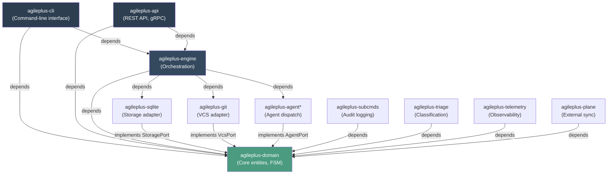

# Architecture Overview

AgilePlus is built on **hexagonal architecture** (ports and adapters) with clear separation of concerns. The domain is at the center, surrounded by adapters that handle external systems (git, SQLite, agent APIs, etc.).

## Crate Structure

The workspace contains 11 crates organized by responsibility:



## Crate Descriptions

| Crate | Purpose | Type | Stability |
|-------|---------|------|-----------|
| **agileplus-domain** | Core entities (Feature, WP, Audit), FSM, port traits | Library | Stable (WP01-04) |
| **agileplus-cli** | Command-line interface; dispatches commands to engine | Binary | MVP |
| **agileplus-api** | REST API and gRPC endpoints for remote access | Library | WP15+ |
| **agileplus-engine** | Orchestration logic; coordinates ports; implements FSM transitions | Library | In Progress |
| **agileplus-sqlite** | Storage adapter; SQLite schema, migrations, queries | Library | WP05-06 |
| **agileplus-git** | VCS adapter; git worktrees, branches, merges, artifacts | Library | WP07 |
| **agileplus-subcmds** | Agent sub-command registry and audit logging | Library | WP04 |
| **agileplus-triage** | Rule-based classification and backlog management | Library | Prototype |
| **agileplus-telemetry** | Observability: logging, tracing, metrics | Library | Planning |
| **agileplus-plane** | Sync with Plane.so for external issue tracking | Library | Future |
| **agileplus-grpc** | Protocol buffer definitions and gRPC service stubs | Library | Future |

## Dependency Rules

Strict hierarchy ensures clean dependencies:

```
Adapters (SQLite, Git, Agent) ← Domain (entities, ports, FSM)
                               ↑
Engine ← Domain + Adapters
        ↑
CLI / API ← Engine + Domain
```

**Rules**:
- Adapters **only** depend on Domain (they implement port traits)
- Engine **only** depends on Domain and adapters (it orchestrates)
- CLI/API **only** depend on Engine and Domain
- **No circular dependencies**
- **No adapter-to-adapter dependencies** (they only talk via Domain)

## Port Traits

The domain defines three primary port traits in `crates/agileplus-domain/src/ports/`:

### StoragePort (`storage.rs`)

Abstracts persistence:
- Feature CRUD (create, read, update, list by state)
- Work package CRUD
- Audit trail append and retrieval
- Evidence storage and queries
- Policy rule management
- Governance contract storage

**Implemented by**: `SqliteStorageAdapter` (crates/agileplus-sqlite)

**Key methods**:
```rust
// Features
fn create_feature(&self, feature: &Feature) -> Result<i64>
fn get_feature_by_slug(&self, slug: &str) -> Result<Option<Feature>>
fn update_feature_state(&self, id: i64, state: FeatureState) -> Result<()>
fn list_features_by_state(&self, state: FeatureState) -> Result<Vec<Feature>>

// Work packages
fn create_work_package(&self, wp: &WorkPackage) -> Result<i64>
fn list_wps_by_feature(&self, feature_id: i64) -> Result<Vec<WorkPackage>>
fn get_ready_wps(&self, feature_id: i64) -> Result<Vec<WorkPackage>>

// Audit trail
fn append_audit_entry(&self, entry: &AuditEntry) -> Result<i64>
fn get_audit_trail(&self, feature_id: i64) -> Result<Vec<AuditEntry>>
```

### VcsPort (`vcs.rs`)

Abstracts version control:
- Worktree creation and cleanup
- Branch operations (create, checkout, merge)
- Artifact read/write (spec.md, plan.md, etc.)
- Conflict detection
- History scanning

**Implemented by**: `GitVcsAdapter` (crates/agileplus-git)

**Key methods**:
```rust
fn create_worktree(&self, feature_slug: &str, wp_id: &str) -> Result<PathBuf>
fn create_branch(&self, branch_name: &str, base: &str) -> Result<()>
fn merge_to_target(&self, source: &str, target: &str) -> Result<MergeResult>
fn read_artifact(&self, feature_slug: &str, path: &str) -> Result<String>
fn write_artifact(&self, feature_slug: &str, path: &str, content: &str) -> Result<()>
```

### AgentPort (`agent.rs`)

Abstracts agent dispatch:
- Synchronous and asynchronous dispatch
- Status polling
- Job cancellation
- Sub-command execution
- Result collection

**Implemented by**: Adapter layer (Claude Code CLI in MVP; Codex batch API in WP08)

**Key methods**:
```rust
fn dispatch(&self, task: AgentTask, config: &AgentConfig) -> Result<AgentResult>
fn dispatch_async(&self, task: AgentTask, config: &AgentConfig) -> Result<String>
fn query_status(&self, job_id: &str) -> Result<AgentStatus>
fn send_instruction(&self, job_id: &str, instruction: &str) -> Result<()>
```

### Observability Port (`observability.rs`)

Abstracts logging and tracing:
- Structured logging
- Span-based tracing
- Metrics recording
- Error reporting

**Implemented by**: `tracing` crate adapters

### Review Port (`review.rs`)

Abstracts code review and governance:
- PR submission
- Review polling
- Evidence validation
- Approval tracking

**Implemented by**: GitHub API adapter (planned WP12)

## Data Flow

A typical command flow through the system:

```
User Command (CLI)
    ↓
[Command Parser] (agileplus-cli)
    ↓
Engine Dispatch (agileplus-engine)
    ├→ Load Feature from StoragePort
    │   (SQLite implementation)
    ├→ Validate state machine preconditions
    ├→ Perform operation (e.g., decompose into WPs)
    ├→ Persist results via StoragePort
    ├→ Create git branch via VcsPort
    │   (Git implementation)
    ├→ Dispatch agent via AgentPort
    │   (Claude Code implementation)
    ├→ Record audit entry
    │   (with hash chain)
    └→ Return result to CLI

CLI Output
    ↓
User Terminal
```

All operations are **transactional** at the domain level:
1. Validate preconditions
2. Load domain state
3. Apply state transition (FSM)
4. Persist to storage
5. Record audit entry
6. Return success or error

If any step fails, the entire operation fails and state is rolled back (at the storage layer).

## Technology Stack

| Layer | Technology | Rationale |
|-------|-----------|-----------|
| Language | Rust 2024 edition | Type safety, zero-cost abstractions, fearless concurrency |
| Storage | SQLite + sqlx | Local-first, no server, type-safe queries, migrations |
| VCS | git2-rs | Native git operations, stable API |
| Async | tokio | Industry standard, full-featured |
| Serialization | serde + JSON | Rust ecosystem standard |
| Hashing | SHA-256 (sha2 crate) | Cryptographic integrity |
| Error Handling | thiserror | Ergonomic error types |
| CLI | clap (planned) | Argument parsing and help |
| Observability | tracing | Structured logging and spans |

## Design Principles

### 1. Domain at the Center

Domain logic (FSM, state transitions, validation) lives in `agileplus-domain` and knows **nothing** about:
- Git implementation details
- SQLite schema
- HTTP/gRPC protocols
- Agent backend specifics

### 2. Port-Driven Testing

Tests can mock ports:
```rust
#[test]
fn feature_transition_requires_evidence() {
    let storage = MockStoragePort::new();
    let vcs = MockVcsPort::new();
    let engine = Engine::new(storage, vcs);

    // Test FSM logic without touching real git/SQLite
}
```

### 3. Append-Only Audit Trail

Every domain change produces an audit entry, creating an **immutable history**. This:
- Enables compliance audits
- Provides debugging context
- Prevents tampering (via hash chain)
- Supports forensics (who did what, when)

### 4. Async-First

All I/O operations (storage, VCS, agent dispatch) are async:
```rust
pub trait StoragePort: Send + Sync {
    fn create_feature(
        &self,
        feature: &Feature,
    ) -> impl Future<Output = Result<i64>> + Send;
}
```

This allows:
- Parallel WP implementation
- Concurrent governance checks
- Scalable agent dispatch

### 5. Error Handling

All domain operations return `Result<T, DomainError>`:

```rust
pub enum DomainError {
    InvalidTransition { from: String, to: String, reason: String },
    NotFound { entity: String, id: String },
    Conflict { details: String },
    Governance { requirement: String, evidence: String },
    // ... more variants
}
```

Errors are **semantic** (not just "database error") so callers know what went wrong.

## File Layout

```
crates/
├── agileplus-domain/
│   src/
│   ├── lib.rs                      # Public API, module exports
│   ├── domain/
│   │   ├── mod.rs
│   │   ├── state_machine.rs        # FeatureState, transitions
│   │   ├── feature.rs              # Feature entity
│   │   ├── work_package.rs         # WorkPackage, DependencyGraph
│   │   ├── governance.rs           # GovernanceRule, PolicyRule
│   │   ├── audit.rs                # AuditEntry, hash chain
│   │   └── metric.rs               # Metric for observability
│   ├── ports/
│   │   ├── mod.rs
│   │   ├── storage.rs              # StoragePort trait
│   │   ├── vcs.rs                  # VcsPort trait
│   │   ├── agent.rs                # AgentPort trait
│   │   ├── observability.rs        # ObservabilityPort trait
│   │   └── review.rs               # ReviewPort trait
│   ├── error.rs                    # DomainError enum
│   └── config.rs                   # Configuration types
├── agileplus-sqlite/
│   src/
│   ├── lib.rs
│   ├── repository/
│   │   ├── mod.rs
│   │   ├── features.rs
│   │   ├── work_packages.rs
│   │   └── audit.rs
│   ├── migrations/
│   │   ├── 001_initial_schema.sql
│   │   ├── 002_audit_chain.sql
│   │   └── ... more migrations
│   └── adapter.rs                  # StoragePort implementation
├── agileplus-git/
│   src/
│   ├── lib.rs
│   ├── repository/
│   │   └── mod.rs
│   ├── worktree/
│   │   └── mod.rs
│   ├── artifact/
│   │   └── mod.rs
│   └── adapter.rs                  # VcsPort implementation
└── ... other crates
```

## Workspace Configuration

The workspace is defined in the root `Cargo.toml`:

```toml
[workspace]
resolver = "3"
members = [
    "crates/agileplus-domain",
    "crates/agileplus-cli",
    "crates/agileplus-api",
    "crates/agileplus-grpc",
    "crates/agileplus-sqlite",
    "crates/agileplus-git",
    "crates/agileplus-telemetry",
    "crates/agileplus-triage",
    "crates/agileplus-subcmds",
]

[workspace.package]
version = "0.1.0"
edition = "2024"
rust-version = "1.85"

[workspace.dependencies]
# Shared versions across all crates
serde = { version = "1", features = ["derive"] }
serde_json = "1"
tokio = { version = "1", features = ["full"] }
```

## Full Infrastructure Stack

When running in full platform mode (`agileplus platform up`), additional infrastructure crates and external services join the architecture:

```mermaid
graph TB
    subgraph CLI ["CLI Layer"]
        CLICrate["agileplus-cli<br/>(clap subcommands)"]
    end

    subgraph API ["API Layer"]
        APICrate["agileplus-api<br/>(htmx dashboard, SSE)"]
        GRPCCrate["agileplus-grpc<br/>(protobuf, tonic)"]
    end

    subgraph ENGINE ["Engine Layer"]
        EngineCrate["agileplus-engine<br/>(orchestration)"]
        SyncCrate["agileplus-plane<br/>(Plane.so sync)"]
        TelemetryCrate["agileplus-telemetry<br/>(OTEL traces/metrics)"]
    end

    subgraph DOMAIN ["Domain Layer (no external deps)"]
        DomainCrate["agileplus-domain<br/>(Feature, WP, Audit, FSM, ports)"]
    end

    subgraph ADAPTERS ["Storage + VCS Adapters"]
        SQLiteCrate["agileplus-sqlite<br/>(sqlx, migrations)"]
        GitCrate["agileplus-git<br/>(git2-rs, worktrees)"]
        SubCmdsCrate["agileplus-subcmds<br/>(agent subcommand registry)"]
    end

    subgraph INFRA ["External Infrastructure"]
        NATS["NATS JetStream<br/>(event bus)"]
        Dragon["Dragonfly<br/>(Redis-compatible cache)"]
        Neo4j["Neo4j<br/>(dependency graph)"]
        MinIO["MinIO<br/>(artifact storage, S3)"]
        Tailscale["Tailscale<br/>(P2P mesh VPN)"]
    end

    CLICrate --> DomainCrate
    CLICrate --> EngineCrate
    APICrate --> DomainCrate
    APICrate --> EngineCrate
    GRPCCrate --> DomainCrate

    EngineCrate --> DomainCrate
    EngineCrate --> SQLiteCrate
    EngineCrate --> GitCrate
    EngineCrate --> SubCmdsCrate
    EngineCrate --> SyncCrate
    EngineCrate --> TelemetryCrate

    SQLiteCrate -->|implements StoragePort| DomainCrate
    GitCrate -->|implements VcsPort| DomainCrate
    SubCmdsCrate --> DomainCrate

    EngineCrate -->|publishes events| NATS
    EngineCrate -->|reads/writes job state| Dragon
    EngineCrate -->|dep graph queries| Neo4j
    EngineCrate -->|artifact upload/download| MinIO
    EngineCrate -->|peer discovery| Tailscale

    style DomainCrate fill:#4a9b7f,color:#fff
    style CLICrate fill:#2c3e50,color:#fff
    style APICrate fill:#2c3e50,color:#fff
    style GRPCCrate fill:#2c3e50,color:#fff
    style EngineCrate fill:#34495e,color:#fff
    style INFRA fill:#fef9e7
```



## Process-Compose Orchestration

The full platform stack is orchestrated by `process-compose`. The `process-compose.yaml` file defines startup order and dependencies:

```yaml
# process-compose.yaml (simplified)
processes:
  nats:
    command: nats-server --jetstream
    readiness_probe:
      http_get:
        path: /healthz
        port: 8222

  dragonfly:
    command: dragonfly --port 6379
    depends_on:
      nats:
        condition: process_healthy

  neo4j:
    command: neo4j console
    depends_on:
      dragonfly:
        condition: process_healthy

  minio:
    command: minio server /data --console-address :9001

  agileplus-api:
    command: agileplus serve --port 8080
    depends_on:
      nats:
        condition: process_healthy
      dragonfly:
        condition: process_healthy
      neo4j:
        condition: process_healthy
```

Start the full stack:

```bash
agileplus platform up
# Starts: NATS, Dragonfly, Neo4j, MinIO, API server
# Output:
#  ✓ NATS JetStream running on :4222
#  ✓ Dragonfly (Redis) running on :6379
#  ✓ Neo4j running on :7687
#  ✓ MinIO running on :9000 (console :9001)
#  ✓ AgilePlus API running on :8080
#  Dashboard: http://localhost:8080

agileplus platform status
# Shows health of all services

agileplus platform logs --service nats
# Stream logs from a specific service

agileplus platform down
# Graceful shutdown of all services
```

## Neo4j Dependency Graph

The dependency graph between WPs is stored in Neo4j for fast traversal and cycle detection:

```cypher
// Node: WorkPackage
CREATE (wp:WorkPackage {
  id: 42,
  feature_slug: "user-authentication",
  wp_id: "WP02",
  state: "planned"
})

// Edge: DEPENDS_ON
MATCH (wp2:WorkPackage {wp_id: "WP02"})
MATCH (wp1:WorkPackage {wp_id: "WP01"})
CREATE (wp2)-[:DEPENDS_ON {dep_type: "explicit"}]->(wp1)

// Query: find all WPs that WP04 transitively depends on
MATCH path = (wp4:WorkPackage {wp_id: "WP04"})-[:DEPENDS_ON*]->(dep)
RETURN dep.wp_id, length(path) as depth
ORDER BY depth

// Query: detect cycles
MATCH path = (wp)-[:DEPENDS_ON*]->(wp)
RETURN wp.wp_id
```

This enables efficient queries for:
- "What WPs are ready to start?" (no unfinished dependencies)
- "What is the critical path?" (longest dependency chain)
- "Would adding this dependency create a cycle?"

## MinIO Artifact Storage

Artifacts (specs, plans, test reports, agent outputs) are stored in MinIO (S3-compatible):

```
Bucket: agileplus-artifacts
  ├── features/
  │   └── user-authentication/
  │       ├── spec.md
  │       ├── research.md
  │       ├── plan.md
  │       └── WP01/
  │           ├── prompt.md
  │           ├── test-report.json
  │           └── coverage.html
  └── audit/
      └── user-authentication/
          └── chain.jsonl
```

Artifacts are also accessible via `VcsPort::read_artifact()` which abstracts over local git storage (development) or MinIO (production):

```bash
# Upload an artifact
agileplus artifact write --feature user-authentication \
  --path WP01/test-report.json \
  --file ./target/test-report.json

# Download an artifact
agileplus artifact read --feature user-authentication \
  --path spec.md
```

## htmx Dashboard

The `agileplus-api` crate serves a real-time dashboard using htmx (server-driven UI), Askama templates, and Alpine.js for drag-and-drop:

```
Dashboard routes:
  GET  /                    → Feature list (Kanban board)
  GET  /features/{slug}     → Feature detail page
  GET  /features/{slug}/wps → WP board with drag-and-drop
  GET  /events              → SSE stream (real-time updates)
  POST /features/{slug}/transition → Trigger state transition
  POST /wps/{id}/transition → Trigger WP state change
```

The SSE stream pushes updates to all connected clients whenever a feature or WP changes state, a new audit entry is recorded, or an agent completes work:

```
data: {"type": "wp.state.changed", "wp_id": "WP02", "from": "doing", "to": "review"}
data: {"type": "audit.entry.added", "feature_slug": "user-authentication", "actor": "agent:claude-code"}
data: {"type": "agent.completed", "job_id": "3a6b8c9d", "success": true}
```

## Related Pages

- [Domain Model](domain-model.md) — Entity relationships and ER diagrams
- [Port Traits](ports.md) — Detailed port interface documentation
- [Quick Start](../guide/quick-start.md) — Get the platform running
- [Environment Variables](../reference/env-vars.md) — Full configuration reference
- [Contributing](../developers/contributing.md) — Development setup
- [Extending](../developers/extending.md) — Adding adapters and crates
