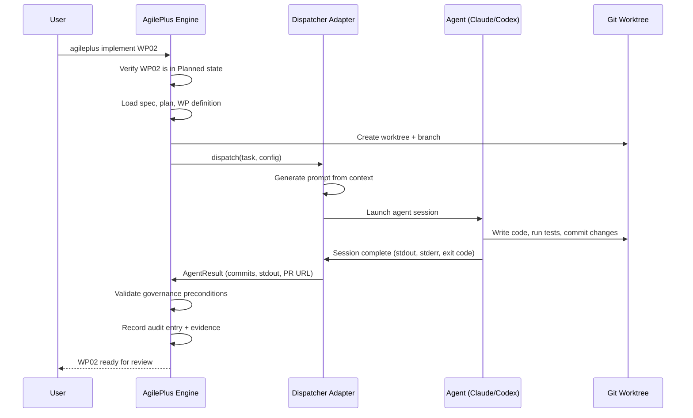
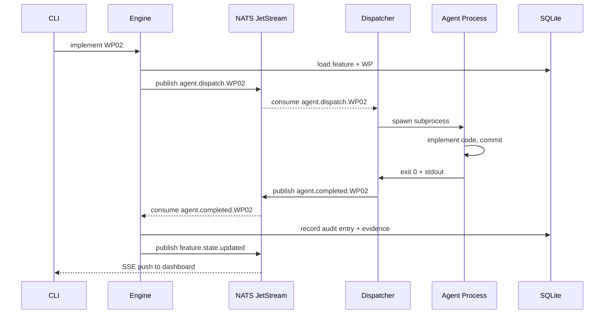
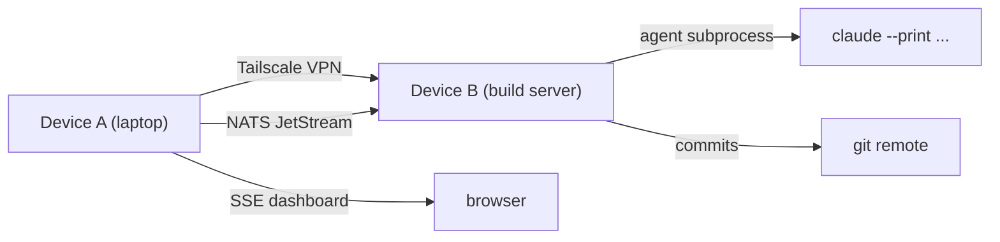

# Agent Dispatch

AgilePlus orchestrates AI coding agents as **first-class participants** in the development pipeline. Agents receive **structured prompts** derived from specs and plans, operate in **isolated branches**, and are **held to the same governance** as human developers.

The agent dispatch system is defined in domain ports (`crates/agileplus-domain/src/ports/agent.rs`) and implemented by adapter crates.

## Dispatch Overview

When a work package is ready for implementation:



## Supported Agents

| Agent | Integration | Transport | Status |
|-------|---|---|--------|
| **Claude Code** | Direct CLI | stdin/stdout | Active (MVP) |
| **Codex** | Batch API | HTTP request | Planned (WP08) |
| **Cursor** | IDE rule files | Workspace operations | Planned (WP09) |
| **Copilot** | Chat protocol | GitHub Copilot API | Future |

The agent abstraction (defined in `crates/agileplus-domain/src/ports/agent.rs::AgentPort`) means new agents can be added without modifying core dispatch logic.

## Prompt Generation

When dispatching to an agent, AgilePlus constructs a **multi-part prompt** that includes:

### 1. Feature Specification Context
```
# Feature: User Authentication

## Functional Requirements
- Users can log in with email/password
- Session tokens expire after 1 hour
- Failed login attempts are rate-limited

## Success Criteria
- [ ] All tests in tests/auth.rs pass
- [ ] Code review approved
- [ ] No security warnings from cargo audit
```

### 2. Implementation Plan
```
# Plan Overview

## Architecture Decision
- Use `jsonwebtoken` crate for token generation
- SQLite for session storage
- Tokio for async operations

## File Structure
src/
  ├── auth/
  │   ├── mod.rs
  │   ├── login.rs
  │   └── session.rs
  ├── db/
  │   └── session.rs
```

### 3. Work Package Definition
```
# Work Package: WP01 - Core Auth Models

## Scope
Implement the User and Session models in src/auth/mod.rs

## Acceptance Criteria
- [ ] User struct with email/password_hash fields
- [ ] Session struct with token/expiry fields
- [ ] Serde support for JSON serialization
- [ ] Unit tests for validation logic

## File Scope
- src/auth/mod.rs (new)
- tests/auth.rs (new)

## Dependencies
- None (WP01 is first)

## Acceptance Tests
```bash
cargo test --lib auth::tests
```
```

### 4. Contextual Code Examples
The prompt includes:
- Relevant existing code patterns from the codebase
- Dependencies and version constraints
- Build/test commands
- Prior work on similar WPs (if any)

## Agent Configuration

The dispatcher accepts an `AgentConfig` that controls behavior:

```rust
pub struct AgentConfig {
    pub kind: AgentKind,          // ClaudeCode or Codex
    pub max_review_cycles: u32,   // How many review-fix-review loops
    pub timeout_secs: u64,        // Max time before killing agent
    pub extra_args: Vec<String>,  // Agent-specific flags
}
```

Example:
```rust
AgentConfig {
    kind: AgentKind::ClaudeCode,
    max_review_cycles: 3,   // Allow up to 3 fix rounds
    timeout_secs: 600,      // Kill after 10 minutes
    extra_args: vec!["--fast".into()],  // Use fast mode
}
```

## Agent Task Definition

The `AgentTask` struct specifies exactly what to do:

```rust
pub struct AgentTask {
    pub wp_id: String,              // "WP01"
    pub feature_slug: String,       // "user-authentication"
    pub prompt_path: PathBuf,       // Path to generated prompt file
    pub worktree_path: PathBuf,     // Path to git worktree
    pub context_files: Vec<PathBuf>, // Additional context files
}
```

## Agent Sub-Commands

Agents have access to **25 hidden sub-commands** for fine-grained control. These are invoked from within agent code:

### Branch Management (4 commands)
```bash
agileplus branch create <name> <base>
agileplus branch checkout <name>
agileplus branch delete <name>
agileplus branch current
```

### Commit Management (5 commands)
```bash
agileplus commit create -m "message"
agileplus commit amend -m "new message"
agileplus commit fixup <commit_hash>
agileplus commit list
agileplus commit show <hash>
```

### Artifact Management (4 commands)
```bash
agileplus artifact write <path> <content>
agileplus artifact read <path>
agileplus artifact hash <path>
agileplus artifact list
```

### Governance Operations (4 commands)
```bash
agileplus governance check <transition>
agileplus governance enforce <transition>
agileplus governance status
agileplus governance audit
```

### WP Management (4 commands)
```bash
agileplus wp status <wp_id>
agileplus wp complete <wp_id>
agileplus wp block <wp_id> <reason>
agileplus wp unblock <wp_id>
```

### CI/CD Operations (2 commands)
```bash
agileplus ci run <suite>
agileplus ci status <job_id>
```

### Query Operations (2 commands)
```bash
agileplus query spec <feature_slug>
agileplus query plan <feature_slug>
```

Each sub-command is **logged to an append-only JSONL audit trail** with:
- Command name and arguments
- Pre-command state (git status, file list)
- Exit code and output
- Post-command state
- Timestamp and agent ID

Example audit entry:
```json
{
  "timestamp": "2025-03-01T14:32:15Z",
  "agent_id": "claude-code",
  "command": "commit",
  "args": ["create", "-m", "Implement User model"],
  "pre_state": { "branch": "feature/user-auth/WP01", "files_changed": 2 },
  "exit_code": 0,
  "post_state": { "branch": "feature/user-auth/WP01", "commits_ahead": 1 }
}
```

## Agent Result Handling

When an agent finishes (successfully or with errors), the dispatcher captures:

```rust
pub struct AgentResult {
    pub success: bool,
    pub pr_url: Option<String>,    // If PR was created
    pub commits: Vec<String>,      // Commit hashes
    pub stdout: String,            // Full agent output
    pub stderr: String,            // Error messages
    pub exit_code: i32,            // Exit status
}
```

The result is **validated** against the WP's acceptance criteria:
1. Tests pass? (`cargo test` exit code 0)
2. Type check passes? (`cargo check` exit code 0)
3. Lint warnings? (parsed from `cargo clippy`)
4. Coverage thresholds? (if configured)
5. File scope respected? (agent didn't touch files outside its scope)

If validation fails, the agent can be re-run (if `max_review_cycles > 0`) with feedback:
```
❌ Tests failed:
  - test_password_validation: expected 8 chars minimum, got 5 chars

Fix the validation logic in src/auth/mod.rs and try again.
```

## Async Dispatch and Status Polling

Agents can be dispatched **asynchronously** for long-running tasks:

```rust
let job_id = agent_port.dispatch_async(task, &config).await?;
// Returns immediately with job_id

// Later, poll status:
loop {
    let status = agent_port.query_status(&job_id).await?;
    match status {
        AgentStatus::Running { pid } => {
            println!("Still running (PID {})", pid);
            sleep(Duration::from_secs(5)).await;
        }
        AgentStatus::WaitingForReview { pr_url } => {
            println!("Waiting for review at {}", pr_url);
            break;
        }
        AgentStatus::Completed { result } => {
            println!("Done: {}", if result.success { "✓" } else { "✗" });
            break;
        }
        AgentStatus::Failed { error } => {
            eprintln!("Agent failed: {}", error);
            break;
        }
        _ => {}
    }
}
```

## Governance Validation

After the agent produces output, AgilePlus validates **governance preconditions** for the `Implementing → Validated` transition:

1. **Evidence Collection**
   - Test results from `cargo test`
   - Lint output from `cargo clippy`
   - Type check output from `cargo check`
   - Code coverage (if configured)

2. **Policy Evaluation**
   - Does the security policy require a security scan? Run one.
   - Does the quality policy require >80% code coverage? Check it.
   - Does the compliance policy require manual approval? Request it.

3. **Audit Recording**
   - All evidence is linked to the WP
   - Audit entry records the transition with evidence refs
   - Hash chain is updated

If validation fails, the feature stays in `Implementing` and the agent can fix and retry.

## Agent Harness Adapters

Each agent type has a **harness** — an adapter that translates AgilePlus protocol into agent-specific invocations:

### Claude Code Harness (Current)
```
1. Write prompt to PROMPT.md
2. Invoke: claude --print < PROMPT.md
3. Capture stdout
4. Parse output for git commands and agent sub-commands
5. Execute commands in worktree
6. Return AgentResult
```

### Codex Harness (Planned - WP08)
```
1. Write prompt to codex_input.json
2. Invoke Codex API: POST /batch
3. Wait for job completion
4. Collect outputs from job object
5. Execute any provisioned branch operations
6. Return AgentResult
```

### Cursor Harness (Planned - WP09)
```
1. Write prompt to .cursorrules
2. Write slash commands to COMMANDS.txt
3. Monitor workspace for changes
4. Poll VSCode/Cursor for completion
5. Extract commits and changes
6. Return AgentResult
```

## Event Bus Integration (NATS JetStream)

When running with the full platform stack (`agileplus platform up`), agent dispatch events flow through NATS JetStream for durable, at-least-once delivery:



This decoupling means:
- The CLI can return immediately while the agent runs in the background
- If the process crashes, NATS re-delivers the message (durable subscriber)
- Multiple agents can run concurrently on different WPs
- The htmx dashboard receives live updates via SSE without polling

## Dragonfly Cache (Redis-Compatible) Layer

The dispatcher uses Dragonfly (Redis-compatible) for job state tracking. When an async dispatch is created, a job entry is written to Dragonfly:

```
KEY: agileplus:job:{job_id}
VALUE: {
  "state": "running",
  "feature_slug": "user-authentication",
  "wp_id": "WP01",
  "pid": 12345,
  "started_at": "2026-03-01T10:00:00Z",
  "timeout_at": "2026-03-01T10:30:00Z"
}
TTL: 7200 (2 hours after completion)
```

Job state transitions:
- `pending` → job created, not yet picked up
- `running` → agent subprocess is active
- `waiting_for_review` → agent finished, PR created
- `completed` → all governance checks passed
- `failed` → agent exited with non-zero, or governance check failed

```bash
# Poll job status via CLI
agileplus events query --job-id 3a6b8c9d-1e2f-4a5b-8c9d
# Output: state=running, elapsed=4m23s, commits=2

# Or use the dashboard (SSE-driven, real-time)
agileplus platform status
```

## P2P Sync via Tailscale

In multi-device setups (e.g., laptop + build server), agent dispatch uses Tailscale for peer discovery and NATS replication. The engine on Device A can dispatch an agent running on Device B:



Vector clocks ensure causal ordering when events arrive from multiple devices:

```rust
pub struct VectorClock {
    pub clocks: HashMap<String, u64>, // device_id → logical_time
}
```

This means AgilePlus can coordinate agent work across machines without requiring shared filesystem access.

## CLI Sub-Command Tracing

Every agent sub-command invocation is traced with OpenTelemetry. The complete audit of what an agent did during a session is reconstructable from the OTEL trace:

```
Trace: agent_session (job_id=3a6b8c9d)
  Span: dispatch (4m 23s)
    Span: setup_worktree (1.2s)
    Span: generate_prompt (0.3s)
    Span: spawn_process (0.1s)
    Span: wait_for_completion (4m 21s)
      Event: commit (WP01: Implement User model)
      Event: commit (WP01: Add tests)
      Event: governance_check (passing)
    Span: collect_results (0.2s)
    Span: record_audit_entry (0.05s)
```

This trace is stored in the OTEL backend (Jaeger by default) and is cross-referenced with the audit chain hash.

## Next Steps

- [Spec-Driven Development](spec-driven-dev.md) — Prompt generation from specs
- [Governance & Audit](governance.md) — Validation and audit trail
- [Feature Lifecycle](feature-lifecycle.md) — Agent work within the broader pipeline
- [Ports & Adapters](../architecture/ports.md) — Technical interface definition
- [Harness Integration](harness-integration.md) — Adding new agent adapters
- [Prompt Format](prompt-format.md) — Exact prompt structure agents receive
- [Environment Variables](../reference/env-vars.md) — NATS, Dragonfly, agent configuration
