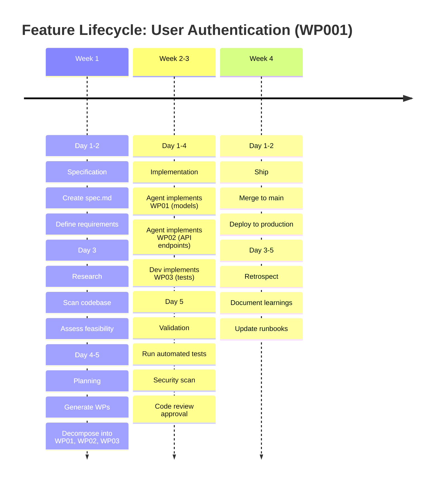
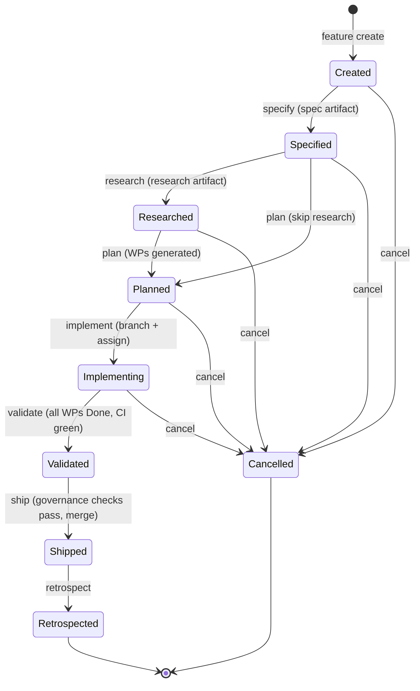

# Feature Lifecycle

Every feature in AgilePlus follows a **structured, auditable lifecycle** from idea to deployment. Each phase maps to the feature state machine and enforces governance preconditions.

## Complete Feature Timeline



## Detailed Phase Walkthrough

### 1. Created (Idea Phase)

**Entry condition**: Feature record created in the system
**Duration**: Minutes to hours
**Owner**: PM, architect, or user
**Output**: Feature slug, initial title, target branch

```
Input: "We need user authentication"
↓
agileplus create --feature "user-authentication" \
  --target-branch main \
  --title "User authentication with JWT tokens"
↓
Output:
  Feature created: user-authentication
  ID: 42
  State: Created
  Audit entry recorded
```

At this point:
- Feature exists in the domain model (Feature struct, state = `Created`)
- An audit entry is created with actor, timestamp, initial metadata
- The hash chain begins (prev_hash = 0x0...)

### 2. Specified (Specification Phase)

**Entry condition**: Spec artifact exists with all required fields
**Duration**: 2-8 hours
**Owner**: PM or senior developer
**Artifact**: `features/<slug>/spec.md`
**Evidence Type**: `ArtifactPresent`

The spec document is **narrative** (meant for humans) but **parseable** (meant for agents):

```markdown
---
feature_id: user-authentication
status: specified
created_at: 2025-03-01T10:00:00Z
---

# User Authentication

## Functional Requirements

- [ ] Users can register with email/password
- [ ] Users can log in with email/password
- [ ] Sessions last 1 hour
- [ ] Passwords are hashed with bcrypt
- [ ] Failed login attempts are rate-limited (5 per minute)

## Actors

1. **End User** — logs in to access protected resources
2. **Admin** — manages user permissions
3. **System** — enforces session timeouts

## Acceptance Criteria

- [ ] All FR tests pass
- [ ] Code review approved
- [ ] Security scan: zero CVEs
- [ ] Response time < 200ms for login

## Scope Boundaries

NOT included:
- OAuth / social login (future feature)
- Multi-factor authentication (WP004)
- User profile editing (separate feature)

## Assumptions

- Using PostgreSQL (already configured)
- Using tokio async runtime
- JWT tokens stored in httpOnly cookies
```

The spec is stored in the **VCS artifact system** (via `VcsPort::write_artifact`), and a SHA-256 hash is computed:

```
spec_hash = sha256("# User Authentication\n...")
           = 0x3f7e1a9c...
```

This hash is immutable and tracks the feature through its lifecycle.

Transition to **Specified**:
```
agileplus transition user-authentication created->specified \
  --spec-path features/user-authentication/spec.md

Validating...
✓ Spec artifact found
✓ Required fields present (functional requirements, scope, criteria)
✓ Audit entry created

Feature now in state: Specified
Audit chain: ... -> {spec_hash: 0x3f7e1a9c, actor: alice, transition: created->specified}
```

### 3. Researched (Research Phase)

**Entry condition**: Research artifact linked; codebase scanned
**Duration**: 4-16 hours
**Owner**: Architect or senior dev
**Artifact**: `features/<slug>/research.md`
**Evidence Type**: `ManualAttestation` or `CiOutput`

The research phase answers: **Can we build this? What patterns exist?**

```markdown
# Research: User Authentication

## Codebase Scan Results

### Existing Authentication
- `src/auth/mod.rs` — old password hashing (MD5, deprecated)
- `src/session.rs` — stateful session management
- `tests/auth_test.rs` — 15 existing auth tests

### Dependency Audit
- `tokio` v1.35 — available
- `jsonwebtoken` v9.1 — available
- `bcrypt` v0.15 — available (but not yet in Cargo.toml)

### Architecture Decision
We will:
1. Replace MD5 hashing with bcrypt
2. Migrate from stateful to stateless JWT
3. Keep existing `User` struct, extend with `password_hash` field
4. Create new `Session` struct for JWT payload

### Risk Assessment
- **Breaking change**: Old sessions won't work (MITIGATED: migration script in WP003)
- **Performance**: JWT verification is faster than DB lookup (POSITIVE)
- **Security**: Bcrypt is industry standard (POSITIVE)

### Recommendation
**PROCEED**. Build plan with 3 work packages.
```

Transition to **Researched**:
```
agileplus transition user-authentication specified->researched \
  --research-path features/user-authentication/research.md

Validating...
✓ Research artifact found
✓ Decision documented
✓ Risk analysis complete
✓ Audit entry created

Feature now in state: Researched
```

### 4. Planned (Planning Phase)

**Entry condition**: WPs generated; dependency graph computed; no cycles
**Duration**: 2-4 hours
**Owner**: Architect
**Artifact**: `features/<slug>/plan.md`
**Evidence Type**: `CiOutput` (plan validation)

The plan **decomposes** the feature into independent work packages with clear boundaries:

```markdown
# Implementation Plan

## Architecture Overview

```
User -> bcrypt -> password_hash (DB)
              -> compare on login

Login flow:
  1. User submits email + password
  2. Query user by email
  3. bcrypt.verify(password, user.password_hash)
  4. If OK, issue JWT token (signed with RS256)
  5. Token stored in httpOnly cookie
  6. Future requests validate token signature
```

## File Structure

```
src/
  ├── auth/
  │   ├── mod.rs (new)
  │   ├── models.rs (User, Session)
  │   ├── login.rs (login endpoint)
  │   └── register.rs (register endpoint)
  ├── middleware/
  │   └── auth.rs (JWT validation middleware)
tests/
  ├── auth_integration.rs (new)
```

## Work Packages

### WP01: Core Models
- Implement `User` struct with `password_hash: String`
- Implement `Session` struct with JWT payload
- Tests: `tests/auth_integration.rs::user_model_tests`
- File scope: `src/auth/models.rs`, `tests/auth_integration.rs`
- Acceptance criteria:
  - [ ] User can be created with email + password
  - [ ] Password stored as bcrypt hash
  - [ ] Session can encode JWT token
  - [ ] All unit tests pass

### WP02: API Endpoints
- POST /auth/register
- POST /auth/login
- Depends on: WP01
- File scope: `src/auth/login.rs`, `src/auth/register.rs`
- Acceptance criteria:
  - [ ] Registration validates email format
  - [ ] Login checks password correctly
  - [ ] Response includes JWT token
  - [ ] Rate limiting works (5 per minute)

### WP03: Middleware + Integration
- JWT validation middleware
- Protect existing endpoints with auth
- Depends on: WP01, WP02
- File scope: `src/middleware/auth.rs`, `src/main.rs`
- Acceptance criteria:
  - [ ] Requests without token are rejected
  - [ ] Valid tokens are accepted
  - [ ] Expired tokens are rejected
  - [ ] Integration tests pass

## Dependency Graph

```
WP01 (Models)
  ├→ WP02 (API)
  └→ WP03 (Middleware)

Execution order:
  Layer 1: WP01 (no dependencies)
  Layer 2: WP02 (depends on WP01)
  Layer 3: WP03 (depends on WP01, WP02)
```

## Build Sequence

1. `cargo add bcrypt jsonwebtoken`
2. WP01: Define models, write tests
3. WP02: Implement endpoints, test login/register
4. WP03: Add middleware, test integration
5. `cargo test` — full suite passes
6. `cargo clippy` — no warnings
7. Merge to main

## Expected Timeline

- WP01: 4 hours (agent implementation)
- WP02: 6 hours (agent implementation)
- WP03: 4 hours (developer implementation or agent review)
- Review + fixes: 2-4 hours
- Total: 16-20 hours (2-3 days)
```

Transition to **Planned**:
```
agileplus transition user-authentication researched->planned \
  --plan-path features/user-authentication/plan.md

Validating...
✓ Plan artifact found
✓ WPs generated: WP01, WP02, WP03
✓ Dependency graph computed
✓ No cycles detected (validation passed)
✓ Audit entry created

Feature now in state: Planned
Created work packages:
  - WP01: Core Models
  - WP02: API Endpoints
  - WP03: Middleware + Integration
```

### 5. Implementing (Implementation Phase)

**Entry condition**: At least one WP assigned; branches created
**Duration**: Days to weeks (per WP parallelization)
**Owner**: Agents and developers
**WP states**: `Doing`, `Review`, `Blocked`

For each WP, an agent or developer:

1. Creates a worktree and branch:
   ```
   git worktree add .worktrees/user-authentication/WP01 \
     -b feature/user-authentication/WP01 main
   ```

2. Receives a **structured prompt** containing:
   - WP definition (scope, criteria)
   - Code examples from existing patterns
   - Acceptance tests to satisfy

3. Implements in isolation:
   ```
   $ cd .worktrees/user-authentication/WP01
   $ cargo add bcrypt
   $ # Implement src/auth/models.rs
   $ cargo test
   $ git commit -m "WP01: Implement User and Session models"
   ```

4. Pushes for review (agent workflow):
   ```
   $ agileplus wp complete WP01
   Validating WP01 acceptance criteria...
   ✓ All tests pass
   ✓ File scope respected
   ✓ PR created: #123

   WP01 moved to Review state.
   ```

WP state transitions:
- `Planned → Doing` — agent starts work
- `Doing → Review` — code ready for review
- `Review → Done` — approved and merged
- OR `Review → Doing` — changes requested

### 6. Validated (Validation Phase)

**Entry condition**: All WPs in `Done` state; CI pipeline green
**Duration**: 1-4 hours
**Evidence Type**: `TestResult`, `LintResult`, `SecurityScan`

All WPs must complete and merge before the feature can move to `Validated`:

```
agileplus transition user-authentication implementing->validated

Validating...
✓ All WPs complete:
  - WP01: Done (merged 2 hours ago)
  - WP02: Done (merged 1 hour ago)
  - WP03: Done (merged 30 min ago)

Running governance checks...
✓ Tests pass (456 tests, 0 failures)
✓ Lint clean (0 clippy warnings)
✓ Coverage > 80% (94% actual)
✓ Security scan: 0 CVEs
✓ Code review approved

Feature now in state: Validated
Evidence collected and linked to audit entry
```

### 7. Shipped (Deployment Phase)

**Entry condition**: All governance checks pass; branches merged
**Duration**: Minutes (automated) or hours (if manual approval needed)
**Output**: Feature merged to target branch (usually `main`); deployed

```
agileplus transition user-authentication validated->shipped

Validating...
✓ All evidence complete
✓ Governance contract satisfied
✓ Ready to deploy

Merging...
✓ feature/user-authentication merged to main
✓ Merge commit: abc1234
✓ CI job: deploy-prod started

Feature now in state: Shipped
Deployed to: production
```

At this point, the feature is **live** and users can use it.

### 8. Retrospected (Post-Incident Phase)

**Entry condition**: Feature shipped; time for reflection
**Duration**: 2-4 hours (scheduled days/weeks after ship)
**Owner**: Team lead or PM
**Artifact**: `features/<slug>/retrospective.md`

After the feature has been live for a period, the team gathers to reflect:

```markdown
# Retrospective: User Authentication

## What Went Well

- Clean dependency graph; WPs didn't conflict
- Bcrypt integration was smooth
- Agent-generated code passed all tests on first try

## What Could Improve

- JWT expiry handling was underestimated (WP03 took longer than planned)
- Missing edge case: password reset flow (added to WP004)
- Rate limiting should use Redis (not in scope for this feature)

## Action Items

- [ ] WP004: Password reset endpoint
- [ ] WP005: Redis-backed rate limiting
- [ ] Operational: Monitor JWT expiry metrics in production

## Metrics

- Time from Planned to Shipped: 18 hours
- Agent involvement: 10 hours (WP01, WP02)
- Developer involvement: 4 hours (WP03, review)
- Total commits: 23
- Lines added: 1,247
- Lines removed: 84
```

Transition to **Retrospected**:
```
agileplus transition user-authentication shipped->retrospected \
  --retrospective-path features/user-authentication/retrospective.md

Validating...
✓ Retrospective artifact found
✓ Audit entry created

Feature now in state: Retrospected
Lifecycle complete.
```

## Complete Audit Trail

After the feature is retrospected, the audit chain contains entries like:

```
1. {actor: pm:alice, timestamp: 2025-03-01T10:00Z, transition: created->specified}
2. {actor: architect:bob, timestamp: 2025-03-01T14:00Z, transition: specified->researched}
3. {actor: architect:bob, timestamp: 2025-03-01T16:00Z, transition: researched->planned}
4. {actor: agent:claude-code, timestamp: 2025-03-02T08:00Z, transition: planned->implementing}
5. {actor: agent:claude-code, timestamp: 2025-03-02T16:00Z, transition: (WP01 complete)}
6. {actor: agent:claude-code, timestamp: 2025-03-03T10:00Z, transition: (WP02 complete)}
7. {actor: dev:charlie, timestamp: 2025-03-03T14:00Z, transition: (WP03 complete)}
8. {actor: ci:automation, timestamp: 2025-03-03T16:00Z, transition: implementing->validated}
9. {actor: ci:automation, timestamp: 2025-03-03T17:00Z, transition: validated->shipped}
10. {actor: pm:alice, timestamp: 2025-03-10T14:00Z, transition: shipped->retrospected}
```

Each entry is cryptographically signed and chained. The complete history is **immutable** and **auditable**.

## State Machine Summary



## Parallel WP Timeline

For a feature with multiple WPs and dependency constraints:

```
Timeline (horizontal = time):

Week 1            Week 2              Week 3
─────────────────────────────────────────────────
Specify ──→
Research ────────→
Plan ─────────────→
                  WP01 ──────────────→ Done
                       WP02 ──────────→ Done
                       WP03 ────────────────→ Done
                                         Validate ─→
                                                 Ship ─→
```

WP01 runs first (no deps). WP02 and WP03 both depend on WP01 but not each other, so they can run concurrently once WP01 merges. WP04 (not shown) would wait for all three.

## NATS Events Throughout Lifecycle

Every phase transition publishes to NATS JetStream. This drives:
- Real-time SSE updates to the dashboard
- Dragonfly cache invalidation
- External sync hooks (Plane.so, GitHub)
- OpenTelemetry span generation

```
Subject: agileplus.feature.{slug}.state.changed
Payload: {
  "feature_slug": "user-authentication",
  "from": "researched",
  "to": "planned",
  "actor": "human:alice",
  "timestamp": "2026-03-01T16:00:00Z",
  "audit_entry_id": 3,
  "audit_hash": "0x9c0d..."
}
```

Subscribe to events in real-time:

```bash
# Watch all events for a feature
agileplus events query --feature user-authentication --follow

# Watch all feature state changes
nats sub "agileplus.feature.*.state.changed"
```

## Evidence Collection per Phase

Evidence accumulates as the feature progresses. By the time it reaches `Validated`, multiple evidence types are on file:

| Phase | Evidence Type | Example |
|-------|--------------|---------|
| Specified | `ArtifactPresent` | SHA-256 of spec.md |
| Researched | `ManualAttestation` | Research doc hash |
| Planned | `CiOutput` | Plan validation output |
| Implementing → Validated | `TestResult` | 456 tests, 0 failed |
| Implementing → Validated | `LintResult` | 0 clippy warnings |
| Implementing → Validated | `SecurityScan` | 0 CVEs |
| Validated → Shipped | `ReviewApproval` | PR #42 approved |

The `GovernanceContract` bound at `Planned` state defines exactly which evidence types are required for the `implementing → validated` and `validated → shipped` transitions.

## Retrospective Structure

The retrospective artifact is a structured markdown document in `features/{slug}/retrospective.md`:

```markdown
---
feature_slug: user-authentication
completed_at: 2026-03-10T14:00:00Z
cycle_time_hours: 18
agent_hours: 10
developer_hours: 4
---

# Retrospective: User Authentication

## What Went Well

- Clean dependency graph: WP01 → WP02 → WP03 with no conflicts
- Agent-generated code passed all tests first attempt
- Spec was clear: no ambiguities discovered during implementation

## What Could Improve

- JWT expiry edge case was underspecified in the spec
- WP03 scope was too large (4h estimated, 7h actual)
- Security scan should run earlier, not just at Validated gate

## Action Items

| Item | Owner | Due Date |
|------|-------|----------|
| Split large WPs at 4h max | Architect | Next feature |
| Add security scan to WP-level CI | DevOps | Sprint 12 |
| Document JWT edge cases in spec template | PM | This week |

## Metrics

- Time from Created to Shipped: 18 hours
- Agent hours: 10h (WP01, WP02)
- Developer hours: 4h (WP03, review)
- Review cycles: 1 (approved on first pass)
- Lines added: 1,247  |  Lines removed: 84
- Test coverage: 94%
```

## Next Steps

- [Spec-Driven Development](spec-driven-dev.md) — Philosophy
- [Governance & Audit](governance.md) — State machine details
- [Agent Dispatch](agent-dispatch.md) — How agents work
- [Quick Start](../guide/quick-start.md) — Get started in 5 minutes
- [Core Workflow](../guide/workflow.md) — Full pipeline walkthrough
- [Prompt Format](../agents/prompt-format.md) — What agents receive
