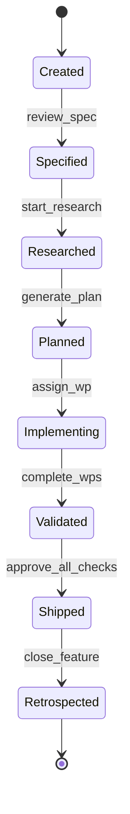
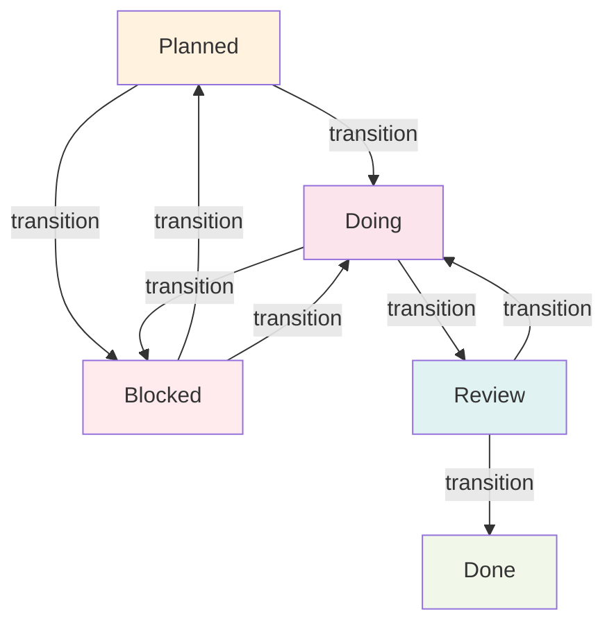
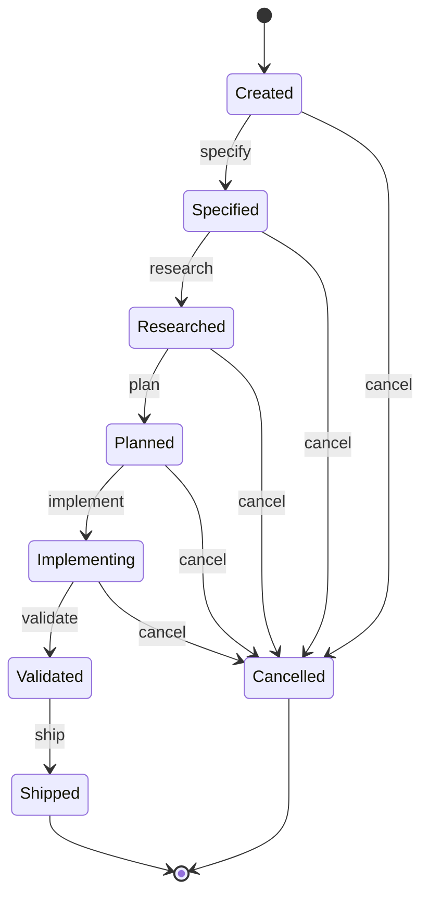
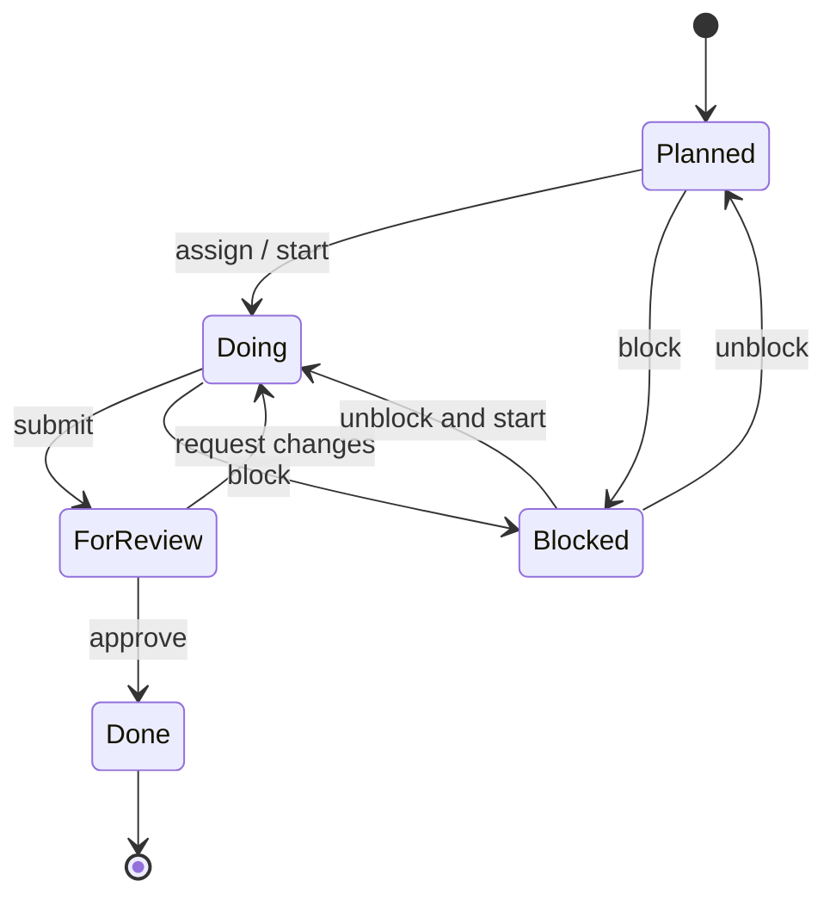

# Governance & Audit

AgilePlus treats governance as **infrastructure, not paperwork**. Every action produces an immutable record. Every transition is enforced by the system, not by human honor.

## Feature State Machine

Features move through an 8-state deterministic state machine defined in `crates/agileplus-domain/src/domain/state_machine.rs`:



### States

| State | Meaning | Entry Condition |
|-------|---------|-----------------|
| **Created** | Idea exists but not yet formalized | Feature record created |
| **Specified** | Specification document is complete and reviewed | Spec artifact present; minimum fields validated |
| **Researched** | Codebase scanned for patterns and feasibility assessed | Research artifact linked; decision recorded |
| **Planned** | Work packages generated; dependency graph is acyclic | WPs created with file scopes; all dependencies explicit |
| **Implementing** | WPs assigned to agents/developers; code is being written | At least one WP in `Doing` state; branch created |
| **Validated** | All tests pass; reviews approved; governance checks succeed | All WPs in `Done` state; CI pipeline green |
| **Shipped** | Code merged to target branch; deployed (or ready for deploy) | All checks passed; branches merged; git commit recorded |
| **Retrospected** | Post-incident analysis complete; lessons documented | Retrospective artifact exists |

### Transitions and Preconditions

Each forward transition is **one-way** (no backtracking) and guarded by preconditions:

| From | To | Enforced Precondition | Evidence Type |
|---|---|---|---|
| Created | Specified | Spec artifact exists with functional requirements, scope, acceptance criteria | `ArtifactPresent` (spec hash) |
| Specified | Researched | Research output attached (codebase scan, feasibility doc, or design notes) | `ManualAttestation` or `CiOutput` |
| Researched | Planned | WPs generated; dependency graph computed (Kahn's algorithm); no cycles detected | `CiOutput` (plan validation) |
| Planned | Implementing | At least one WP assigned; git branch created; agent/dev notified | `ManualAttestation` (assignment) |
| Implementing | Validated | All WPs complete (`Done` state); CI pipeline runs successfully | `TestResult`, `LintResult`, `CiOutput` |
| Validated | Shipped | All governance checks pass; all evidence requirements satisfied; merge approved | `ReviewApproval`, `SecurityScan` |
| Shipped | Retrospected | Retrospective artifact exists; action items (if any) documented | `ManualAttestation` |

Attempting to transition without meeting all preconditions raises a `DomainError::InvalidTransition`.

### Work Package State Machine

While features move forward linearly, work packages have a more flexible state machine (defined in `crates/agileplus-domain/src/domain/work_package.rs`):



WPs can move backward (from `Blocked` to `Planned`) and cycle (from `Review` back to `Doing` for changes), but features cannot. This allows flexibility at the work-package level while maintaining forward progress at the feature level.

## Audit Chain

Every state transition (both feature and WP) produces an **immutable audit entry** stored in the domain (`crates/agileplus-domain/src/domain/audit.rs`):

```rust
pub struct AuditEntry {
    pub id: i64,
    pub feature_id: i64,
    pub wp_id: Option<i64>,              // WP ID if transition was for a WP
    pub timestamp: DateTime<Utc>,
    pub actor: String,                   // "human:alice" or "agent:claude-code"
    pub transition: String,               // "created->specified"
    pub evidence_refs: Vec<EvidenceRef>,  // links to supporting evidence
    pub prev_hash: [u8; 32],             // SHA-256 of previous entry
    pub hash: [u8; 32],                  // SHA-256 of this entry
}
```

### Hash Chain Integrity

Each entry computes its hash from:
- Feature ID
- Work package ID (if applicable)
- Timestamp
- Actor identifier
- Transition string
- **Previous entry's hash** (creating a chain)

If any field is modified, the hash changes. If the hash chain is broken, verification fails. This is cryptographically similar to a blockchain but local (no distributed consensus needed).

```
Entry 1: hash(feature=123, actor=alice, transition=created->specified, prev_hash=0x0000...)
         → hash1 = 0x1234...

Entry 2: hash(feature=123, actor=alice, transition=specified->researched, prev_hash=0x1234...)
         → hash2 = 0x5678...

Entry 3: hash(feature=123, actor=claude-code, transition=researched->planned, prev_hash=0x5678...)
         → hash3 = 0xabcd...
```

The chain can be **verified** by calling `AuditChain::verify_chain()`:
1. Recompute each entry's hash
2. Verify each entry's `prev_hash` matches the previous entry's computed hash
3. Return `Ok(())` if all entries match, or `AuditChainError::HashMismatch` if any entry was tampered

## Governance Contracts

Each feature is bound to a **governance contract** at the time it transitions to `Planned` state:

```rust
pub struct GovernanceContract {
    pub id: i64,
    pub feature_id: i64,
    pub version: i32,
    pub rules: Vec<GovernanceRule>,
    pub bound_at: DateTime<Utc>,
}

pub struct GovernanceRule {
    pub transition: String,              // e.g., "validated->shipped"
    pub required_evidence: Vec<EvidenceRequirement>,
    pub policy_refs: Vec<String>,        // references to active policies
}
```

The contract is **immutable** once bound. If governance policies change, a new contract version is created for new features, but existing features keep their original contract. This prevents surprise requirement changes mid-feature.

## Evidence and Policy

**Evidence** is the output of checks that satisfy governance requirements:

```rust
pub struct Evidence {
    pub id: i64,
    pub wp_id: i64,
    pub fr_id: String,                   // functional requirement, e.g., "FR-004"
    pub evidence_type: EvidenceType,     // TestResult, CiOutput, ReviewApproval, etc.
    pub artifact_path: String,           // link to artifact (test report, scan results)
    pub metadata: Option<serde_json::Value>,
    pub created_at: DateTime<Utc>,
}
```

**Policies** define what evidence is required:

```rust
pub struct PolicyRule {
    pub id: i64,
    pub domain: PolicyDomain,            // Security, Quality, Compliance, Performance
    pub rule: PolicyDefinition,
    pub active: bool,
    pub created_at: DateTime<Utc>,
}

pub enum PolicyCheck {
    EvidencePresent { evidence_type: EvidenceType },
    ThresholdMet { metric: String, min: f64 },
    ManualApproval,
    Custom { script: String },
}
```

Example: A `Security` domain policy might require:
- **Evidence Type**: `SecurityScan`
- **Policy Check**: `ThresholdMet { metric: "cve_count", min: 0 }` (zero CVEs allowed)
- Policy applies to all features transitioning `Implementing → Validated`

## Why This Matters

### For Humans

You get a **complete, cryptographically verifiable record** of:
- Every decision made about the feature
- Who made each decision (agent or developer ID)
- When it happened
- What evidence satisfied the requirement
- A signed chain that proves nobody tampered with the log

Useful for:
- **Compliance** — auditors can verify the log
- **Post-mortems** — understand what went wrong and when
- **Onboarding** — new team members see the full context
- **Legal disputes** — immutable evidence of approved changes

### For Agents

Agents **cannot skip steps**. The system enforces preconditions:
- They receive a structured prompt derived from the approved spec and plan
- Their output (branches, commits) are validated automatically
- If they produce bad code, the validation stage catches it before ship
- Their actions are all recorded — no ambiguity about what they did

### For Teams

Multiple agents can work on different WPs in **parallel**:
- Each WP has its own git branch (no conflicts by design)
- Dependencies are explicit (via the dependency graph)
- The system prevents premature merges (WP2 can't merge until WP1 is done, if they depend)
- The audit trail shows exactly who did what, helping teams coordinate better

## Reference Implementation

- **State machine**: `crates/agileplus-domain/src/domain/state_machine.rs`
- **Feature entity**: `crates/agileplus-domain/src/domain/feature.rs`
- **Work package states**: `crates/agileplus-domain/src/domain/work_package.rs`
- **Governance rules**: `crates/agileplus-domain/src/domain/governance.rs`
- **Audit chain**: `crates/agileplus-domain/src/domain/audit.rs`
- **Storage port**: `crates/agileplus-domain/src/ports/storage.rs` (persistence layer)

## Cancellation Paths

Features can be cancelled at any point before `Shipped`. Cancellation is a valid terminal state, not a failure:



Cancellation requires a reason (stored in the audit entry) and is recorded like any other transition. This keeps the audit trail complete even for abandoned features.

## Work Package State Machine (Full Detail)



Unlike features, WPs can cycle (`ForReview → Doing → ForReview`) for review-fix loops. The maximum review cycles is controlled by `AgentConfig::max_review_cycles`.

## Audit Hash-Chain Deep Dive

The hash chain is the central integrity mechanism. Here is the exact computation:

```rust
pub fn hash_entry(entry: &AuditEntry) -> [u8; 32] {
    use sha2::{Sha256, Digest};
    let mut hasher = Sha256::new();

    // All fields contribute to the hash
    hasher.update(entry.feature_id.to_le_bytes());
    if let Some(wp_id) = entry.wp_id {
        hasher.update(wp_id.to_le_bytes());
    }
    hasher.update(entry.timestamp.timestamp_millis().to_le_bytes());
    hasher.update(entry.actor.as_bytes());
    hasher.update(entry.transition.as_bytes());
    for ev_ref in &entry.evidence_refs {
        hasher.update(ev_ref.fr_id.as_bytes());
        hasher.update(ev_ref.evidence_id.to_le_bytes());
    }
    // THE CHAIN LINK — previous entry's hash is included
    hasher.update(&entry.prev_hash);

    hasher.finalize().into()
}
```

Visual representation of the chain for a feature going from `Created` to `Shipped`:

```
Genesis (prev_hash = 0x0000...0000)
    │
    ▼
Entry 0: created → specified
    actor: human:alice
    timestamp: 2026-03-01T10:00:00Z
    prev_hash: 0x0000...0000
    hash: 0x1a2b3c4d...  ──────────────────────┐
                                               │
Entry 1: specified → researched               │
    actor: agent:claude-code                  │
    timestamp: 2026-03-01T12:30:00Z           │
    prev_hash: 0x1a2b3c4d... ◄────────────────┘
    hash: 0x5e6f7a8b...  ──────────────────────┐
                                               │
Entry 2: researched → planned                 │
    actor: human:alice                        │
    timestamp: 2026-03-01T14:00:00Z           │
    prev_hash: 0x5e6f7a8b... ◄────────────────┘
    hash: 0x9c0d1e2f...  ──────────────────────┐
                                               │
Entry 3: planned → implementing               │
    actor: agent:claude-code                  │
    timestamp: 2026-03-02T09:00:00Z           │
    prev_hash: 0x9c0d1e2f... ◄────────────────┘
    hash: 0x3a4b5c6d...
```

If an attacker modifies Entry 0 (e.g., changes the actor from `human:alice` to `human:bob`), the hash of Entry 0 changes. Entry 1's `prev_hash` field no longer matches, breaking the chain at that link. `AuditChain::verify_chain()` catches this immediately.

### Chain Verification

```rust
impl AuditChain {
    pub fn verify_chain(&self) -> Result<(), AuditChainError> {
        let mut prev_hash = [0u8; 32]; // Genesis hash is all zeros

        for entry in &self.entries {
            // 1. Check prev_hash matches what we computed
            if entry.prev_hash != prev_hash {
                return Err(AuditChainError::HashMismatch {
                    entry_id: entry.id,
                    expected: prev_hash,
                    actual: entry.prev_hash,
                });
            }

            // 2. Recompute this entry's hash
            let computed = hash_entry(entry);

            // 3. Check the stored hash matches
            if entry.hash != computed {
                return Err(AuditChainError::TamperedEntry {
                    entry_id: entry.id,
                    expected: computed,
                    actual: entry.hash,
                });
            }

            // 4. Advance the chain
            prev_hash = computed;
        }

        Ok(())
    }
}
```

Run verification at any time:

```bash
agileplus events audit-verify --feature user-authentication
# Output: ✓ Audit chain intact (10 entries verified)
# Or:     ✗ Chain broken at entry 5 (tampering detected)
```

## OpenTelemetry Integration

Every governance operation emits OpenTelemetry spans and metrics. This allows observability platforms (Jaeger, Grafana, Honeycomb) to track transition latency, failure rates, and audit performance:

```
Span: feature.transition
  feature.id: 42
  feature.slug: user-authentication
  transition.from: researched
  transition.to: planned
  transition.actor: human:alice
  transition.success: true
  transition.duration_ms: 145
```

Governance failures also emit events:

```
Event: governance.violation
  feature.id: 42
  transition.attempted: implementing → validated
  violation.rule: TestResult required for FR-004
  violation.evidence_missing: true
```

Configure the OTEL exporter:

```bash
export OTEL_EXPORTER_OTLP_ENDPOINT=http://localhost:4317
export OTEL_SERVICE_NAME=agileplus
agileplus sync push
```

## Governance Rule Configuration

The default governance rules are defined in `crates/agileplus-domain/src/domain/governance.rs`. They can be extended for project-specific requirements by adding `PolicyRule` entries:

```rust
// Example: require security scan before shipping
let security_policy = PolicyRule {
    id: 0, // assigned by storage
    domain: PolicyDomain::Security,
    rule: PolicyDefinition {
        description: "Security scan required before shipping".into(),
        check: PolicyCheck::EvidencePresent {
            evidence_type: EvidenceType::SecurityScan,
        },
    },
    active: true,
    created_at: Utc::now(),
    updated_at: Utc::now(),
};

storage.create_policy_rule(&security_policy).await?;
```

Once active, this policy is automatically incorporated into governance contracts for any new feature transitioning to `Planned` state.

## Next Steps

- [Spec-Driven Development](spec-driven-dev.md) — Philosophy and principles
- [Agent Dispatch](agent-dispatch.md) — How agents are held accountable
- [Architecture Overview](../architecture/overview.md) — Port trait design
- [Domain Model](../architecture/domain-model.md) — Entity relationships
- [Feature Lifecycle](feature-lifecycle.md) — Full phase-by-phase walkthrough
- [Environment Variables](../reference/env-vars.md) — OTEL and audit configuration
