# Spec-Driven Development

Spec-driven development inverts the typical development workflow. Instead of jumping from idea to code, every feature begins as a **specification** — a structured document that defines what gets built, why, and what success looks like. This philosophy creates a linear, auditable path from requirement to shipped code.

## The Problem

Most development workflows fail in predictable ways:

- **Scope creep** — features grow unbounded because nobody defined boundaries upfront
- **Audit gaps** — no historical record of decisions, tradeoffs, or who approved what
- **Agent chaos** — AI agents generate code without governance or quality gates
- **Integration friction** — work packages conflict because they weren't planned together
- **Rework burden** — code must be rewritten because requirements weren't clear
- **Compliance risk** — no evidence trail for regulated environments

Traditional agile methods address some of these, but they often:
- Rely on oral tradition and Jira descriptions
- Assume human judgment at every gate
- Don't scale to distributed AI-driven development
- Lack cryptographic integrity for audit trails

## The AgilePlus Approach

AgilePlus enforces an **8-stage pipeline** where each transition is governed and auditable:

```
Created → Specified → Researched → Planned → Implementing → Validated → Shipped → Retrospected
```

Every feature moves through a deterministic state machine (defined in `crates/agileplus-domain/src/domain/state_machine.rs`). You cannot skip stages. You cannot ship unvalidated work. Every state transition is recorded with SHA-256 hash chain integrity.

The pipeline flow as a visual:

```mermaid
graph LR
    A["Created<br/>(idea)"] --> B["Specified<br/>(requirements)"]
    B --> C["Researched<br/>(codebase scan)"]
    C --> D["Planned<br/>(WP decomposition)"]
    D --> E["Implementing<br/>(agent/dev work)"]
    E --> F["Validated<br/>(tests + review)"]
    F --> G["Shipped<br/>(merged to main)"]
    G --> H["Retrospected<br/>(lessons learned)"]

    style A fill:#e1f5ff
    style B fill:#fff3e0
    style C fill:#f3e5f5
    style D fill:#e8f5e9
    style E fill:#fce4ec
    style F fill:#e0f2f1
    style G fill:#f1f8e9
    style H fill:#ede7f6
```



## Key Principles

### Specifications First

A feature doesn't exist until it has a **spec artifact**. The spec document defines:

- **Functional requirements**: What the feature does; acceptance criteria
- **Actors and scenarios**: Who uses it; typical workflows
- **Success metrics**: How to measure success
- **Scope boundaries**: What is explicitly NOT included
- **Assumptions**: Dependencies on external services, data, timelines
- **Trade-offs**: Rationale for design choices

The spec is a narrative document (markdown), not a checklist. It's meant to be read by humans and parsed by agents. Every spec gets a SHA-256 hash on creation; this hash is immutable and tracks the feature through its lifecycle.

### Work Packages (WPs)

Large features are decomposed into **work packages** — small, independently implementable units with clear dependencies. Each WP:

- Has a unique ID (WP01, WP02, etc.)
- Gets its own git branch (`feature/my-feature/WP01`)
- Contains **acceptance criteria** (boolean success conditions)
- Specifies a **file scope** (which source files it affects)
- Can be assigned to a different agent or developer
- Moves through its own state machine: `Planned → Doing → Review → Done` (or `Blocked`)

WPs are generated by the **Plan** stage and stored in the domain model (`crates/agileplus-domain/src/domain/work_package.rs`). The planner uses a dependency graph to detect:

- **Explicit dependencies**: WP03 depends on WP01
- **File overlap**: WP01 and WP02 both touch `src/lib.rs`, so WP02 must wait for WP01
- **Data dependencies**: WP02 consumes output from WP01

The system prevents concurrent modification of the same file using **topological sort** (Kahn's algorithm). This avoids merge conflicts before they happen.

### Governance by Default

Every state transition requires **preconditions** enforced by the system:

| Transition | Enforced Requirement |
|---|---|
| Created → Specified | Spec artifact exists with minimum required fields |
| Specified → Researched | Research output (codebase scan or feasibility doc) attached |
| Researched → Planned | WP decomposition generated; dependency graph is acyclic |
| Planned → Implementing | At least one WP assigned; branch created; agent/dev notified |
| Implementing → Validated | All WPs marked `Done`; automated tests queued |
| Validated → Shipped | All governance checks pass; all WPs merged cleanly |
| Shipped → Retrospected | Post-incident analysis / lessons learned documented |

You cannot move a feature to `Implementing` without a plan. You cannot `Ship` without validation passing. The system enforces this programmatically — it's not a human honor system.

Each precondition check is recorded as an **evidence artifact** (test result, CI output, review approval, etc.). Evidence is stored in the domain and indexed by functional requirement (FR-*).

### Agent-Agnostic Dispatch

AgilePlus doesn't care which agent writes the code:

- **Claude Code** — dispatched via CLI with structured prompt
- **Codex** — batch job submission with context files
- **Cursor** — rule files + slash commands in IDE
- **Copilot** — prompt files in `.github/prompts/`

All agents receive:
1. **Spec context** — what to build
2. **Plan context** — how to decompose it
3. **WP definition** — exactly which piece to implement
4. **Acceptance criteria** — boolean success conditions
5. **File scope** — which files can be touched

Agents can call **hidden sub-commands** (25 total, across 8 categories) to:
- Manage branches (`agileplus branch create`, `checkout`, `delete`)
- Commit atomically (`agileplus commit create`, `amend`, `fixup`)
- Write governance artifacts (`agileplus artifact write`, `hash`)
- Query governance state (`agileplus governance check`)

Each sub-command is logged in an append-only JSONL audit trail with pre/post-dispatch entries. The system knows exactly what each agent did, when, and why.

## What This Means in Practice

A developer or AI agent working with AgilePlus **never writes code without context**:

1. **Spec phase** — The spec tells you what to build and why
2. **Research phase** — You scan the codebase for patterns and existing solutions
3. **Plan phase** — You decompose into work packages with clear boundaries
4. **Implementation phase** — You implement one WP at a time, in isolation
5. **Validation phase** — Tests, type checks, and reviews run automatically
6. **Ship phase** — You merge cleanly into the target branch
7. **Retrospect phase** — You document what went well and what could improve

The **audit trail** (`crates/agileplus-domain/src/domain/audit.rs`) records every transition:

- **Who** made the change (human or agent ID)
- **What** changed (from state to to state)
- **When** it happened (timestamp)
- **Why** it happened (attached evidence: test results, reviews, metrics)
- **Proof** of integrity (SHA-256 hash of this entry + hash of previous entry)

The chain is cryptographically linked. If anyone tampers with an entry, the hash chain breaks and validation fails.

## Reference Implementations

- **State machine**: `crates/agileplus-domain/src/domain/state_machine.rs` (FeatureState enum, validation rules)
- **Feature entity**: `crates/agileplus-domain/src/domain/feature.rs` (Feature struct with state, hash tracking)
- **Work packages**: `crates/agileplus-domain/src/domain/work_package.rs` (WpState, dependency graph)
- **Governance**: `crates/agileplus-domain/src/domain/governance.rs` (rules, contracts, evidence)
- **Audit chain**: `crates/agileplus-domain/src/domain/audit.rs` (AuditEntry, hash verification)

## Related Pages

- [Governance & Audit](governance.md) — Detailed state machine and audit chain mechanics
- [Feature Lifecycle](feature-lifecycle.md) — Visual walkthrough of a feature from idea to ship
- [Work Package States](../guides/work-packages.md) — Managing WPs and dependencies
- [Agent Dispatch](agent-dispatch.md) — How agents receive prompts and execute code
