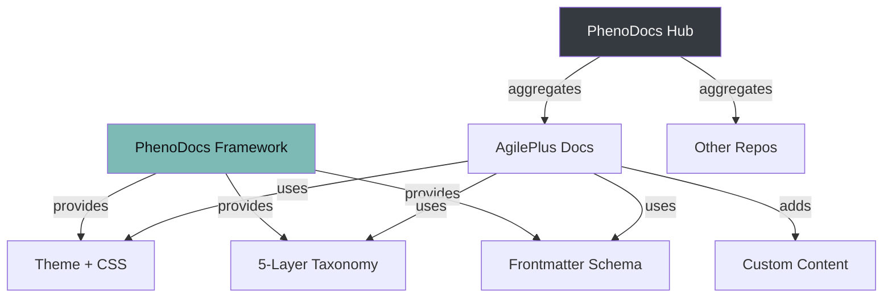

# Federation & PhenoDocs

AgilePlus documentation is built on the **PhenoDocs** framework — a template system for multi-project documentation within the Phenotype ecosystem.

## How It Works



## Architecture

PhenoDocs serves as a **framework/library**, not a monolithic aggregator:

| Concern | Owned By | Description |
|---------|----------|-------------|
| Theme + styling | PhenoDocs | Layer badges, status badges, doc-type cards, brand palette |
| Taxonomy | PhenoDocs | 5-layer model, doc types, frontmatter schema |
| Content | AgilePlus | All markdown content, custom components |
| Build | AgilePlus | VitePress config, deployment pipeline |

## Federation Model

Each Phenotype repo builds its **own** docs site using PhenoDocs patterns. The PhenoDocs hub optionally aggregates all repos into a unified portal.

### Per-Repo (Current)

Each repo is self-contained:

```
AgilePlus/
└── docs/
    ├── .vitepress/          # VitePress config + theme
    │   └── theme/
    │       ├── custom.css   # Keycap palette + PhenoDocs layer CSS
    │       └── ...
    ├── guide/               # Layer 2 content
    ├── architecture/        # Layer 2 content
    ├── workflow/            # Layer 2 content
    └── process/            # Layer 2-3 content
```

### Hub Aggregation (Future)

PhenoDocs hub discovers sibling repos and generates a unified site:

```bash
docs hub --hub-dir ../phenodocs
```

This generates:
- Combined navigation across all repos
- Cross-repo search
- Unified layer views (all L2 specs across projects)

## Conventions

### File Organization by Layer

```
docs/
├── scratch/     # Layer 0 (gitignored)
├── ideas/       # Layer 1
├── research/    # Layer 1
├── guide/       # Layer 2
├── architecture/# Layer 2
├── reference/   # Layer 2
├── reports/     # Layer 3
├── retros/      # Layer 4
└── kb/          # Layer 4
```

### Cross-Document Linking

Use `relates_to` for bidirectional links and `traces_to` for traceability:

```yaml
---
relates_to: ["architecture/domain-model.md"]
traces_to: ["WP01", "ADR-003"]
---
```

### Reuse Protocol

When content is valuable across repos:
1. Extract to PhenoDocs as a shared template
2. Reference from AgilePlus via import or link
3. PhenoDocs hub surfaces shared content automatically
