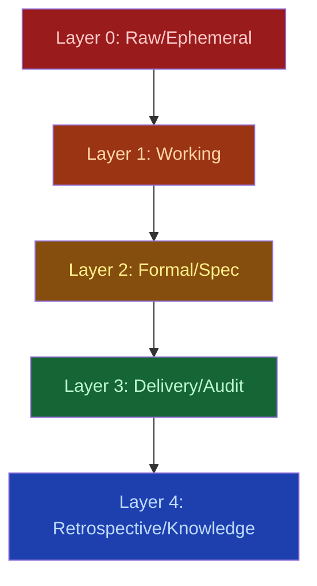

# Documentation Layers

AgilePlus follows the PhenoDocs 5-layer documentation model. Each layer represents a maturity stage for documentation artifacts.

## The Five Layers



### <span class="layer-badge layer-0">Layer 0</span> Raw / Ephemeral

Scratch notes, conversation dumps, agent work logs. Not published. Retained for 48–90 days, then promoted or discarded.

| Type | Path | Retention |
|------|------|-----------|
| Conversation dump | `docs/research/CONVERSATION_DUMP_*.md` | 90 days |
| Scratch note | `docs/scratch/YYYYMMDD-*.md` | 48 hours |
| Agent work log | `docs/reference/WORK_STREAM.md` | Permanent |

### <span class="layer-badge layer-1">Layer 1</span> Working / Lab

Ideas, research docs, debug logs. Published under `/lab/`. Working documents that may be promoted to formal specs.

| Type | Path | Promotes To |
|------|------|-------------|
| Idea note | `docs/ideas/YYYY-MM-DD-{slug}.md` | Research doc |
| Research doc | `docs/research/{TOPIC}.md` | Design doc / FR |
| Debug log | `docs/debug/YYYY-MM-DD-{issue}.md` | Incident retro |

### <span class="layer-badge layer-2">Layer 2</span> Formal / Spec

Source-of-truth documents: PRDs, ADRs, functional requirements, architecture docs. Published under `/docs/`.

| Type | Path | ID System |
|------|------|-----------|
| Spec | `kitty-specs/{NNN}-{slug}/spec.md` | Feature number |
| Plan | `kitty-specs/{NNN}-{slug}/plan.md` | Feature number |
| ADR | `docs/adr/ADR-{NNN}-{slug}.md` | ADR-{NNN} |

### <span class="layer-badge layer-3">Layer 3</span> Delivery / Audit

Changelogs, completion reports, sprint plans. Published under `/audit/`. Created automatically from lifecycle events.

| Type | Path | Trigger |
|------|------|---------|
| Changelog | `CHANGELOG.md` | Git tag |
| Completion report | `docs/reports/*-complete.md` | Feature shipped |
| Sprint plan | `docs/sprints/SPRINT-{NN}.md` | Sprint planning |

### <span class="layer-badge layer-4">Layer 4</span> Retrospective / Knowledge

Retrospectives, knowledge extracts, lessons learned. Published under `/kb/`. Created after feature completion.

| Type | Path | Trigger |
|------|------|---------|
| Feature retro | `kitty-specs/{NNN}-{slug}/retrospective.md` | Feature shipped |
| Sprint retro | `docs/retros/SPRINT-{NN}-retro.md` | Sprint end |
| Knowledge extract | `docs/kb/{topic}/{slug}.md` | Semantic indexer |

## Layer Progression

Documents flow upward through layers as they mature:

1. **Scratch note** (L0) → promoted to **idea** (L1)
2. **Research doc** (L1) → becomes **spec** (L2)
3. **Spec** (L2) → produces **completion report** (L3) when shipped
4. **Completion report** (L3) → feeds **retrospective** (L4)

### Example Progression: Adding OAuth2

```
Layer 0 (Raw)
  2026-02-01 09:00
  Conversation dump from Slack:
  docs/research/CONVERSATION_DUMP_20260201_oauth.md
  "We should add OAuth2 support. Google and GitHub login?"

  → Expires: 2026-05-01 unless promoted

Layer 1 (Working)
  2026-02-02
  Team discusses, creates working doc:
  docs/ideas/2026-02-02-oauth2-design.md
  "OAuth2 integration for web app, support Google & GitHub"

  → After research, promote to L2

Layer 2 (Formal Spec)
  2026-02-03
  Convert to feature specification:
  kitty-specs/001-oauth-auth/spec.md
  "Add OAuth2 Authentication"
  - Functional Requirements (FR-1 through FR-5)
  - User Scenarios
  - Success Criteria
  - Edge Cases
  - Constraints

  → After spec passes checklist, proceed to planning
  → This is the source of truth for implementation

Layer 3 (Delivery)
  2026-02-13 (Feature shipped)
  Auto-generated completion report:
  docs/reports/001-oauth-auth-complete.md
  - All FRs implemented
  - All tests passing (87% coverage)
  - Shipped to production
  - Release notes prepared

  → Feeds into retrospective process

Layer 4 (Knowledge)
  2026-02-20 (One week post-ship)
  Retrospective analysis:
  kitty-specs/001-oauth-auth/retrospective.md
  - Timeline: 9 days (on estimate)
  - WP01 error handling gap caught and fixed
  - Lessons: edge cases matter for payment flows
  - Constitution updates: new spec/impl checklist items

  → Learning feeds back into process for next feature
  → Knowledge extract indexed for future reference
```

## Layer-Specific Practices

### Layer 0: Raw/Ephemeral

**Purpose**: Capture initial thoughts without structure
**Tools**: Notes app, Slack threads, conversation dumps
**Audience**: Individual or pair

```markdown
# Conversation Dump — OAuth2 Implementation

## Slack Thread (Feb 1, 9am)

alice: Should we add OAuth2?
bob: Yeah, Google at minimum. GitHub too?
alice: Let's check existing code for patterns

## Initial Thoughts

- Existing JWT auth infrastructure (can reuse)
- Database: PostgreSQL user table exists
- Framework: Actix-web has middleware system
- Dependencies: openidconnect crate looks solid
```

**Retention**: 48 hours to 90 days (auto-delete or promote)
**Promotion**: Extract to Layer 1 idea doc

### Layer 1: Working/Lab

**Purpose**: Develop ideas before formalizing
**Tools**: Markdown, research docs, debug logs
**Audience**: Team leads, architects

```markdown
# Research: OAuth2 Integration Patterns

## Existing Code Analysis

Found session middleware in `src/middleware/session.rs`:
- Validates JWT tokens
- Manages session lifecycle
- Can extend for OAuth

## Framework Support

Actix-web 4.4:
- Middleware support ✓
- Route handlers ✓
- Error handling ✓

## Dependency Options

1. openidconnect (0.11) — Full OIDC support
2. oauth2 (4.4) — Generic OAuth2
3. Manual implementation — Not recommended (security risk)

Recommendation: Use openidconnect (includes OIDC extensions)

## Next Steps

1. Design OAuth flow
2. Create specification
3. Plan work packages
```

**Retention**: 30–90 days (decide: promote or archive)
**Promotion**: Becomes specification (Layer 2)

### Layer 2: Formal/Spec

**Purpose**: Source of truth for requirements
**Tools**: Markdown with strict structure
**Audience**: Developers, agents, PMs

```markdown
# Specification: OAuth2 Authentication

## Overview
Add Google and GitHub OAuth2 login flows to the web application.

## Functional Requirements

FR-1: Users can sign up via Google OAuth
- Users click "Sign in with Google"
- Redirected to Google login
- Authorization granted → returned to app
- User profile fetched and stored
- Session created

FR-2: Users can sign up via GitHub OAuth
FR-3: Sessions persist across browser restarts
FR-4: Logout clears all sessions
FR-5: Error handling for failed authentication

## Success Criteria

SC-1: Both OAuth flows complete in < 2 seconds (p95)
SC-2: Session valid for 30 days
SC-3: Logout is instant (no noticeable delay)
SC-4: No sensitive data leaked in logs or errors

## Edge Cases

EC-1: User denies OAuth permission
EC-2: OAuth provider is temporarily down
EC-3: User's email already exists in system
EC-4: Database is unavailable during login
```

**Retention**: Permanent (git-tracked)
**Use**: Planning, implementation, acceptance testing
**Status**: Locked after implementation starts

### Layer 3: Delivery/Audit

**Purpose**: Record what was delivered
**Tools**: Auto-generated reports, CHANGELOG
**Audience**: Product, operations, auditors

```markdown
# Completion Report: OAuth2 Authentication

Feature: 001-oauth-auth
Shipped: 2026-02-13
Status: SHIPPED TO PRODUCTION

## Delivery Summary

All 12 functional requirements implemented ✓
All 4 success criteria met ✓
All 6 edge cases handled ✓
Test coverage: 87% (target: 85%) ✓

## What Was Built

- Google OAuth2 flow (WP02)
- GitHub OAuth2 flow (WP03)
- Session management (WP04)
- Integration tests (WP04)

## Quality Metrics

- Commits: 16
- Files: 24
- Tests: 42 (all passing)
- Code review cycles: 1.25 avg per WP
- Critical bugs: 0

## Release Notes

Version 0.2.0 — OAuth2 Authentication
- Add Google and GitHub login
- Persistent sessions (30-day tokens)
- Improved security with OAuth2 standards
```

**Retention**: Permanent (git-tracked, archived)
**Use**: Release management, compliance, historical reference

### Layer 4: Retrospective/Knowledge

**Purpose**: Extract learnings and share knowledge
**Tools**: Retrospective docs, knowledge base
**Audience**: Team, future projects

```markdown
# Retrospective: OAuth2 Authentication

## Timeline

Specification → Shipped: 9 days (on estimate)

## What Worked

✓ Specification-first approach: 95% accuracy
  No major changes during implementation

✓ Parallelization: WP02 & WP03 ran in parallel
  Saved 1 day vs. sequential

✓ Agent quality: 100% pass rate (4 WPs approved first review)

## What Could Improve

⚠ WP02 rework: Error handling for failed OAuth
  Root cause: Spec lacked explicit failure paths
  Fix: Add to specification checklist

⚠ Review cycle time: 4 hours average
  Action: Add automated linting gate in CI

## Constitution Updates

- Add "error path" requirement to spec checklist
- Add "error handling" to implementation checklist
- Automate code review filters in CI

## Metrics for Next Feature

- Cycle time target: 9 days
- Test coverage target: 85%+
- Agent pass rate target: 100%

## Knowledge Extract

Title: "OAuth2 Implementation Patterns in Actix-web"
Content: Condensed guide to implementing OAuth flows
Audience: Developers building auth features
Status: Published to /kb/auth/oauth2-patterns.md
```

**Retention**: Permanent (git-tracked, searchable)
**Use**: Training, decision-making, pattern libraries

## Cross-Layer Linking

Documents reference each other across layers:

```yaml
---
title: "OAuth2 Error Handling"
relates_to:
  - "kitty-specs/001-oauth-auth/spec.md"          # Layer 2
  - "docs/reports/001-oauth-auth-complete.md"    # Layer 3
  - "kitty-specs/001-oauth-auth/retrospective.md" # Layer 4
  - "docs/kb/auth/oauth2-patterns.md"             # Layer 4
traces_to:
  - "FR-1"    # Functional requirement
  - "WP02"    # Work package
  - "ADR-005" # Architectural decision
---
```

## Layer Metadata

Each layer documents its metadata to enable automation:

| Layer | Status | Author | Creation | Expiry | Audience | Searchable |
|-------|--------|--------|----------|--------|----------|------------|
| 0 | Draft | Agent | Auto | 90d | Individual | No |
| 1 | Active | Human | Manual | 90d | Team | Yes |
| 2 | Published | Human | Manual | ∞ | All | Yes |
| 3 | Archived | Auto | Auto | ∞ | Auditors | Yes |
| 4 | Canonical | Human | Manual | ∞ | All | Yes |

## Using Layers in Your Workflow

1. **Specification Phase** (Layer 2)
   - Write formal spec in layer 2
   - Pass through spec checklist
   - Share with team

2. **Implementation Phase** (Layers 1–2)
   - Reference layer 2 spec constantly
   - Layer 1 docs: debug logs, design decisions
   - Archive layer 1 after feature ships

3. **Delivery Phase** (Layer 3)
   - System auto-generates completion report
   - Release manager uses for changelog
   - Archived for audit/compliance

4. **Learning Phase** (Layer 4)
   - Create retrospective (automatic)
   - Extract knowledge to knowledge base
   - Update constitution with learnings

## Benefits

- **Clarity**: Each layer has a clear purpose and audience
- **Lifecycle**: Documents flow through stages naturally
- **Retention**: Ephemeral docs auto-deleted; formal docs permanent
- **Discovery**: Knowledge base surfaces lessons learned
- **Compliance**: Audit trail available for regulatory review
