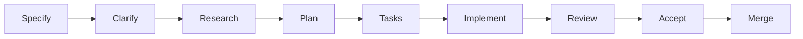
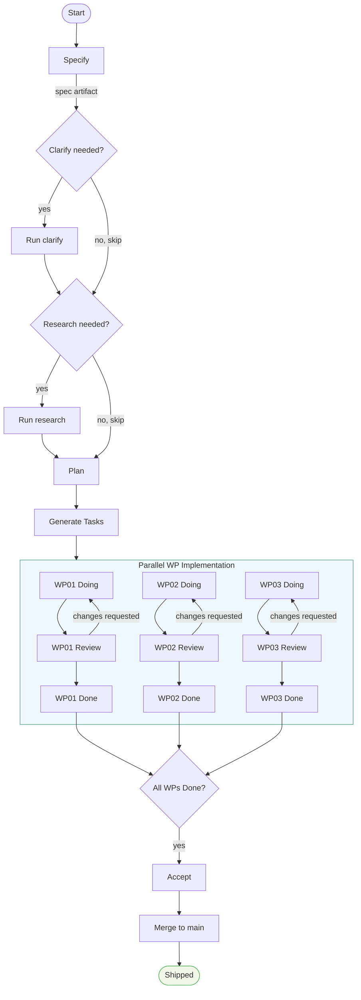

# Core Workflow

AgilePlus implements a spec-driven development pipeline that guides features from idea to shipped code. This workflow is the backbone of all feature development.

## Pipeline Overview



## The 8-Stage Pipeline

Each stage produces artifacts and preconditions for the next stage:

| # | Stage | Command | Input | Output | Duration |
|---|-------|---------|-------|--------|----------|
| 1 | **Specify** | `specify` | Natural language description | spec.md, meta.json | 2-5 min |
| 2 | **Clarify** | `clarify` | Spec with ambiguities | Updated spec | 1-2 min |
| 3 | **Research** | `research` | Spec | codebase-scan.md, feasibility.md | 2-5 min |
| 4 | **Plan** | `plan` | Spec + research | plan.md, architecture decisions | 3-10 min |
| 5 | **Tasks** | `tasks` | Plan | WP01, WP02, ... (work packages) | 1-2 min |
| 6 | **Implement** | `implement` | Work package | Code changes, commits | hours/days |
| 7 | **Review** | `review` | Implementation | Approve or request changes | 5-15 min/WP |
| 8 | **Accept + Merge** | `accept`, `merge` | All WPs done | Shipped to main | 1-2 min |

## State Machine

Features follow a strict state progression:

```
Draft
  ↓
Specified
  ↓
Clarified (optional)
  ↓
Researched (optional)
  ↓
Planned
  ↓
Tasked
  ↓
Implementing ←→ Blocked (waiting for dependencies)
  ↓
Validating ←→ Changes Requested
  ↓
Accepted
  ↓
Shipped
```

**Preconditions for each transition:**

- **→ Specified**: Spec has ≥3 user scenarios, requirements, and success criteria
- **→ Clarified**: All `[NEEDS CLARIFICATION]` markers resolved
- **→ Researched**: Feasibility assessment complete, dependencies identified
- **→ Planned**: Architecture decisions documented, file changes identified
- **→ Tasked**: Work packages created with dependency graph
- **→ Implementing**: WP dependencies met, branch created
- **→ Validating**: All subtasks completed, tests passing
- **→ Accepted**: All success criteria met, all WPs approved
- **→ Shipped**: All branches merged, worktrees cleaned, closed issues

## Detailed Stage Descriptions

### Stage 1: Specify

**Goal**: Define what to build, without specifying how.

```bash
agileplus specify "Add two-factor authentication"
```

**Specification interview:**

The tool asks targeted questions to capture:
- What problem does this solve?
- Who will use it?
- What are the key scenarios?
- What's success?
- What's explicitly out of scope?

**Output:**

```
kitty-specs/001-two-factor-auth/
├── spec.md              # Full specification
└── meta.json            # Feature metadata
```

**spec.md contains:**

```markdown
# Two-Factor Authentication

## Overview
Users can enable 2FA on their account using TOTP apps.

## User Scenarios
- User enables 2FA from account settings
- User logs in with password + TOTP code
- User recovers account with backup codes

## Functional Requirements
- Support TOTP (Time-based One-Time Password)
- Generate backup codes during setup
- Enforce 2FA on login
- Allow disabling 2FA

## Success Criteria
- 2FA can be enabled in <1 minute
- Login with 2FA works reliably
- Backup codes work when TOTP fails
```

**Duration**: 2-5 minutes for straightforward features.

### Stage 2: Clarify (Optional)

**Goal**: Identify and resolve ambiguities before deep work.

```bash
agileplus clarify 001
```

**Questions generated** (prioritized by impact):

1. Scope — What's included/excluded?
2. Outcomes — What does success look like?
3. Risks & Security — What could fail?
4. User Experience — How should edge cases feel?
5. Technical constraints — Hard limits?

**Example:**

```
Q1: 2FA Requirement
Context: Spec mentions "enforce 2FA"
Need: Is 2FA mandatory or optional per user?

Your answer: Optional per user, can be disabled
```

The answer replaces ambiguity in the spec. If no ambiguities remain, clarify suggests moving to research or plan.

**Duration**: 1-2 minutes.

### Stage 3: Research (Optional but Recommended)

**Goal**: Gather evidence before architecture decisions.

```bash
agileplus research 001
```

**Research questions:**

- What existing auth code can we reuse?
- What patterns does the codebase follow?
- What dependencies are needed?
- What are integration boundaries?
- What's the estimated complexity?

**Output:**

```
kitty-specs/001-two-factor-auth/research/
├── codebase-scan.md         # Existing patterns
├── feasibility.md           # Can we build this?
└── decisions.md             # Technical decisions
```

**Example codebase-scan.md:**

```markdown
## Existing Auth Code

### User Model
- `src/models/user.rs` — User entity with email, password_hash
- Supports custom fields (good for 2FA)

### Session Management
- JWT tokens in `src/auth/jwt.rs`
- Token lifespan: 24 hours

### Dependencies Available
- `totp-rs` — TOTP implementation (in Cargo.lock)
- `sqlx` — Database access

## Integration Points
- Login flow: `src/handlers/login.rs`
- Account settings: `src/handlers/account.rs`
- Middleware: `src/auth/middleware.rs`

## Risks
- Performance: TOTP validation on every login adds ~5ms
- Recovery: Backup code storage requires safe encryption
```

**Duration**: 2-5 minutes.

### Stage 4: Plan

**Goal**: Create architecture decisions and implementation blueprint.

```bash
agileplus plan 001
```

**Output:**

```
kitty-specs/001-two-factor-auth/plan.md
```

**plan.md structure:**

```markdown
# Implementation Plan: Two-Factor Authentication

## Architecture Decisions
1. **TOTP Storage**: Store secret in users table, encrypted at rest
2. **Backup Codes**: Generate 10 codes, one-time use, hashed
3. **Login Flow**: Check 2FA status before issuing JWT
4. **Recovery**: Email backup codes to user during setup

## File Changes
| File | Action | Purpose |
|------|--------|---------|
| src/models/user.rs | MODIFY | Add 2fa_secret, 2fa_enabled fields |
| src/models/totp.rs | CREATE | TOTP setup/validation logic |
| src/handlers/account.rs | MODIFY | Add /account/2fa endpoint |
| src/handlers/login.rs | MODIFY | Add TOTP verification step |
| migrations/001_2fa.sql | CREATE | Database schema |

## Build Sequence
1. Add database columns
2. Create TOTP models and logic
3. Update login flow
4. Add account settings endpoint
5. Write integration tests
6. Add frontend (if applicable)

## Dependencies
- External: totp-rs (already available)
- Internal: User model, JWT token logic
```

**Duration**: 3-10 minutes.

### Stage 5: Tasks

**Goal**: Break plan into parallel work packages.

```bash
agileplus tasks 001
```

**Output:**

```
kitty-specs/001-two-factor-auth/tasks/
├── WP01-database.md         # Database schema
├── WP02-models.md           # Data models and logic
├── WP03-login.md            # Login flow changes
├── WP04-account.md          # Account settings UI
└── WP05-tests.md            # Integration tests
```

**Work Package (WP) Structure:**

```markdown
# WP01: Database Schema

## Description
Create database tables and columns for 2FA support.

## Subtasks
- [ ] Add 2fa_secret column to users table
- [ ] Add 2fa_enabled column to users table
- [ ] Create 2fa_backup_codes table
- [ ] Write migration up/down scripts

## Dependencies
None (can run first)

## Deliverables
- migrations/001_2fa.sql (up migration)
- migrations/001_2fa.sql.down (down migration)

## Lane
planned → doing → for_review → done
```

**Dependency Graph** (ensures parallel safety):

```
WP01 (Database)
  ↓
WP02 (Models) → WP03 (Login) → WP05 (Tests)
WP02 (Models) → WP04 (Account)
```

WPs can run in parallel as long as dependencies are met.

**Duration**: 1-2 minutes.

### Stage 6: Implement

**Goal**: Write code following the plan.

```bash
agileplus implement WP01
```

**Creates an isolated worktree:**

```
.worktrees/
└── 001-two-factor-auth-WP01/
    ├── src/
    ├── tests/
    ├── migrations/
    └── .git
```

**Work in the worktree:**

```bash
cd .worktrees/001-two-factor-auth-WP01

# Write code according to WP spec
# ... create migrations/ ...

# Run tests
cargo test

# Commit work
git add -A
git commit -m "feat(WP01): add 2FA database schema"

# Move to review
cd ../..
agileplus move WP01 --to for_review
```

**Duration**: Varies by complexity (minutes to hours).

### Stage 7: Review

**Goal**: Verify implementation matches plan and quality standards.

```bash
agileplus review WP01
```

**Review checklist:**

- [ ] All deliverable files exist
- [ ] Tests pass
- [ ] Code follows conventions
- [ ] Commits reference WP ID
- [ ] Implementation matches plan
- [ ] No files outside WP scope modified

**Outcomes:**

```bash
# Approve
agileplus move WP01 --to done

# Request changes
agileplus move WP01 --to planned --review-feedback-file /tmp/feedback.md
```

**Duration**: 5-15 minutes per work package.

### Stage 8: Accept & Merge

**Goal**: Verify feature complete, merge to main.

```bash
# Verify all requirements met
agileplus accept 001

# Merge all WP branches to main
agileplus merge 001
```

**Merge process:**

1. Verify all WPs in `done` lane
2. Merge WP branches in dependency order
3. Remove worktrees
4. Clean up feature branches
5. Update tracker issues
6. Feature marked as `Shipped`

**Duration**: 1-2 minutes.

## Example: Complete Feature Walkthrough

```bash
# Day 1: Design
agileplus specify "Add email newsletters"
agileplus clarify 001
agileplus research 001
agileplus plan 001
agileplus tasks 001

# Day 2: Implementation (parallel)
# Terminal 1
agileplus implement WP01  # Database
# ... code ...

# Terminal 2
agileplus implement WP02  # Models
# ... code ...

# Day 3: Review & Merge
agileplus review WP01
agileplus review WP02
agileplus move WP01 --to done
agileplus move WP02 --to done
agileplus accept 001
agileplus merge 001
```

## Key Concepts

### Work Packages (WPs)

Self-contained units of work that can be implemented independently:

- Each has clear deliverables
- Can run in parallel if dependencies allow
- Have isolated git worktrees
- Can be reviewed independently

### Dependency Graph

Ensures safe parallel work:

```
WP01-Models
  ├→ WP02-API (depends on WP01)
  │   └→ WP04-Integration (depends on WP02, WP03)
  └→ WP03-UI (depends on WP01)
```

Only WPs with met dependencies can move from `planned` to `doing`.

### Audit Trail

Every state transition logged:

```
2026-03-01 10:00:00 | User alice | specify | Draft → Specified | hash:abc123
2026-03-01 10:15:00 | User alice | clarify | Specified → Clarified | hash:def456
2026-03-01 10:20:00 | User alice | plan | Clarified → Planned | hash:ghi789
2026-03-01 10:25:00 | User alice | tasks | Planned → Tasked | hash:jkl012
2026-03-01 11:00:00 | Agent claude | implement | Tasked → Implementing | hash:mno345
2026-03-01 14:00:00 | User alice | review | Implementing → Validating | hash:pqr678
2026-03-01 14:05:00 | User alice | accept | Validating → Accepted | hash:stu901
2026-03-01 14:10:00 | User alice | merge | Accepted → Shipped | hash:vwx234
```

## Best Practices

**1. Don't Skip Stages (Usually)**

- `clarify`: Skip only if spec is crystal clear
- `research`: Skip only for trivial features
- `plan`: Essential for non-trivial work

**2. Keep Specs Focused**

- One feature per spec
- Aim for 3-5 user scenarios
- Keep success criteria measurable

**3. Size Work Packages**

- 1-4 hour implementation per WP
- Too large → split into smaller WPs
- Too small → combine adjacent WPs

**4. Parallel Safety**

- Enforce dependency graph
- Don't manually reorder WP lanes
- Use `agileplus move --to` to transition

**5. Review Thoroughly**

- Don't rubber-stamp approvals
- Check plan adherence
- Verify test coverage
- Catch integration issues early

## Troubleshooting

**Can't move feature forward?**

Check preconditions:

```bash
# For plan: research complete?
agileplus show 001
# Status: Researched? If not, run research

# For tasks: plan approved?
agileplus show 001
# Status: Planned? If not, run plan

# For accept: all WPs done?
agileplus show 001 --verbose
# Lists WP lanes
```

**Worktree corruption?**

```bash
# Reset a worktree
agileplus reset WP01

# This removes the worktree and lets you start fresh
agileplus implement WP01
```

**Merge conflicts?**

```bash
# See conflicts
cd .worktrees/001-feature-WP01
git status

# Resolve conflicts, commit
git add .
git commit -m "fix: merge conflicts"

# Continue with review/accept/merge
```

## Full Pipeline State Machine

The following diagram shows all valid state paths through the pipeline, including optional stages and the parallel WP implementation track:



## Dependency-Aware Scheduling

The task dependency graph controls which WPs can run in parallel. AgilePlus uses Kahn's topological sort algorithm to compute execution layers:

```
Input dependency graph:
  WP01 → (no deps)
  WP02 → WP01
  WP03 → WP01
  WP04 → WP02, WP03
  WP05 → WP04

Execution layers (Kahn's algorithm):
  Layer 0: [WP01]           ← no deps, run first
  Layer 1: [WP02, WP03]     ← both depend only on WP01
  Layer 2: [WP04]           ← depends on WP02 + WP03
  Layer 3: [WP05]           ← depends on WP04

Total wall-clock time with parallelism:
  max(WP01) + max(WP02, WP03) + WP04 + WP05
  = 4h + 6h + 4h + 3h = 17h
  (vs 21h serial)
```

AgilePlus surfaces this analysis when you run `agileplus tasks 001`:

```
Dependency analysis complete:
  Execution layers: 4
  Critical path: WP01 → WP02 → WP04 → WP05 (17h)
  Parallelization opportunity: WP02 and WP03 can run concurrently
  Estimated total time: 17h (with 2 agents)
```

## Git Worktree Strategy

Each WP gets an isolated git worktree — a separate working directory that shares the same git object store but has its own `HEAD` and working tree:

```
project/
├── .git/                          ← main git object store
├── src/                           ← main branch working tree
└── .worktrees/
    ├── 001-auth-WP01/             ← WP01 working tree
    │   ├── src/
    │   └── .git → project/.git   ← symlink to object store
    ├── 001-auth-WP02/             ← WP02 working tree (independent)
    │   ├── src/
    │   └── .git → project/.git
    └── 001-auth-WP03/             ← WP03 working tree
        ├── src/
        └── .git → project/.git
```

This means:
- WP01 and WP02 agents can run simultaneously without conflicting
- Branches are isolated (`feature/auth/WP01` vs `feature/auth/WP02`)
- Merging is dependency-ordered (WP01 merges before WP02)
- If a WP goes wrong, just delete its worktree — main is untouched

## Sync with External Trackers

Throughout the workflow, AgilePlus optionally syncs state changes to Plane.so or GitHub Issues:

```
AgilePlus State       Plane.so               GitHub
─────────────────────────────────────────────────────
specify               Create issue           Create issue
                      status: Backlog        status: open, label: spec
plan                  Update issue           Update issue
                      milestone: Sprint 1    milestone: v0.1
tasks                 Create sub-issues      Create linked issues
                      for each WP            for each WP
WP → doing            status: In Progress    label: in-progress
WP → review           status: In Review      label: in-review, PR linked
WP → done             status: Done           issue closed
accept                milestone: complete    milestone closed
merge                 issue closed           PR merged, issue auto-closed
```

Configure sync in `.kittify/config.toml`:

```toml
[sync.plane]
enabled = true
workspace = "my-org"
project = "my-project"
api_key = "${PLANE_API_KEY}"

[sync.github]
enabled = true
repo = "org/repo"
token = "${GITHUB_TOKEN}"
```

See [Sync Guide](sync.md) for full configuration details.

## What's Next

- **[Quick Start](quick-start.md)** — 5-minute walkthrough from install to first feature
- **[Specify](/workflow/specify)** — Discovery interview and spec generation
- **[Clarify](/workflow/clarify)** — Resolve specification ambiguities
- **[Research](/workflow/research)** — Codebase analysis and feasibility
- **[Plan](/workflow/plan)** — Architecture decisions
- **[Tasks](/workflow/tasks)** — Work package generation
- **[Implement](/workflow/implement)** — Feature implementation
- **[Review](/workflow/review)** — Code quality review
- **[Accept](/workflow/accept)** — Feature acceptance
- **[Merge](/workflow/merge)** — Integration to main
- **[Sync](sync.md)** — External tracker synchronization
