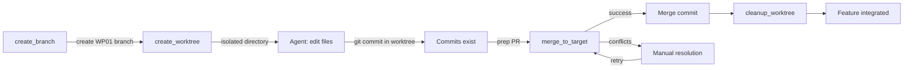

# VCS Port API

The `VcsPort` trait abstracts version control operations, allowing AgilePlus to work with different VCS backends (currently Git via `agileplus-git`). It provides async worktree management, branch operations, commit history scanning, and artifact read/write for isolated agent work.

## Trait Definition

```rust
pub trait VcsPort: Send + Sync {
    // -- Worktree operations (FR-010) --

    /// Create a worktree for a feature work package, returning its absolute path.
    fn create_worktree(
        &self,
        feature_slug: &str,
        wp_id: &str,
    ) -> impl Future<Output = Result<PathBuf, DomainError>> + Send;

    /// List all active worktrees.
    fn list_worktrees(&self)
    -> impl Future<Output = Result<Vec<WorktreeInfo>, DomainError>> + Send;

    /// Remove a worktree at the given path.
    fn cleanup_worktree(
        &self,
        worktree_path: &Path,
    ) -> impl Future<Output = Result<(), DomainError>> + Send;

    // -- Branch operations --

    /// Create a new branch from a base ref.
    fn create_branch(
        &self,
        branch_name: &str,
        base: &str,
    ) -> impl Future<Output = Result<(), DomainError>> + Send;

    /// Check out an existing branch.
    fn checkout_branch(
        &self,
        branch_name: &str,
    ) -> impl Future<Output = Result<(), DomainError>> + Send;

    /// Merge source branch into target, returning the merge result.
    fn merge_to_target(
        &self,
        source: &str,
        target: &str,
    ) -> impl Future<Output = Result<MergeResult, DomainError>> + Send;

    /// Detect merge conflicts between two branches without performing the merge.
    fn detect_conflicts(
        &self,
        source: &str,
        target: &str,
    ) -> impl Future<Output = Result<Vec<ConflictInfo>, DomainError>> + Send;

    // -- Artifact operations (FR-014) --

    /// Read a text artifact relative to the feature directory.
    fn read_artifact(
        &self,
        feature_slug: &str,
        relative_path: &str,
    ) -> impl Future<Output = Result<String, DomainError>> + Send;

    /// Write a text artifact relative to the feature directory.
    fn write_artifact(
        &self,
        feature_slug: &str,
        relative_path: &str,
        content: &str,
    ) -> impl Future<Output = Result<(), DomainError>> + Send;

    /// Check whether an artifact exists.
    fn artifact_exists(
        &self,
        feature_slug: &str,
        relative_path: &str,
    ) -> impl Future<Output = Result<bool, DomainError>> + Send;

    // -- History scanning (FR-017) --

    /// Scan and collect all feature artifacts from the repository.
    fn scan_feature_artifacts(
        &self,
        feature_slug: &str,
    ) -> impl Future<Output = Result<FeatureArtifacts, DomainError>> + Send;
}
```

## Key Types

### WorktreeInfo

Metadata about an active git worktree.

```rust
pub struct WorktreeInfo {
    pub path: PathBuf,
    pub branch: String,
    pub feature_slug: String,
    pub wp_id: String,
}
```

Example:
```json
{
  "path": "/path/to/repo/.worktrees/001-login-WP01",
  "branch": "feat/001-login-WP01",
  "feature_slug": "001-login",
  "wp_id": "WP01"
}
```

### MergeResult

Outcome of a merge operation, including conflict detection.

```rust
pub struct MergeResult {
    pub success: bool,
    pub conflicts: Vec<ConflictInfo>,
    pub merged_commit: Option<String>,
}

pub struct ConflictInfo {
    pub path: String,
    pub ours: Option<String>,      // Content from target branch
    pub theirs: Option<String>,    // Content from source branch
}
```

Example successful merge:
```json
{
  "success": true,
  "conflicts": [],
  "merged_commit": "abc123def456..."
}
```

Example with conflicts:
```json
{
  "success": false,
  "conflicts": [
    {
      "path": "src/auth/login.rs",
      "ours": "...\n<<<<<<< HEAD\nour version\n||||||| parent\n...",
      "theirs": "...\n=======\ntheir version\n>>>>>>> feat/001-login-WP01"
    }
  ],
  "merged_commit": null
}
```

### FeatureArtifacts

Collection of all artifacts discovered for a feature during history scanning.

```rust
pub struct FeatureArtifacts {
    pub meta_json: Option<String>,           // kitty-specs/001-*/meta.json
    pub audit_chain: Option<String>,         // Audit log path
    pub evidence_paths: Vec<String>,         // All PR/test artifact refs
}
```

## Built-in Implementation: GitVcsAdapter

The default implementation uses `git` CLI via `git2-rs` and handles standard Git operations.

```rust
use agileplus_git::GitVcsAdapter;
use std::path::PathBuf;

#[tokio::main]
async fn main() -> anyhow::Result<()> {
    let vcs = GitVcsAdapter::new(PathBuf::from("/path/to/repo"))?;

    // Create a branch
    vcs.create_branch("feat/001-login-WP01", "main").await?;

    // Create a worktree
    let wt_path = vcs
        .create_worktree("001-login", "WP01")
        .await?;
    println!("Worktree created at: {}", wt_path.display());

    // Write an artifact
    vcs.write_artifact(
        "001-login",
        "spec.md",
        "# Login Feature\n...",
    ).await?;

    // Merge when done
    let result = vcs.merge_to_target(
        "feat/001-login-WP01",
        "main",
    ).await?;

    if result.success {
        println!("Merged: {}", result.merged_commit.unwrap());
    } else {
        println!("Conflicts in: {:?}", result.conflicts);
    }

    // Cleanup
    vcs.cleanup_worktree(&wt_path).await?;

    Ok(())
}
```

## Worktree Workflow Lifecycle

Typical flow for a work package:



Example Python usage:

```python
import asyncio
from agileplus_git import GitVcsAdapter

async def main():
    vcs = GitVcsAdapter("/path/to/repo")

    # Set up isolated environment for WP01
    await vcs.create_branch("feat/001-login-WP01", "main")
    wt_path = await vcs.create_worktree("001-login", "WP01")

    # Agent works in wt_path, commits changes
    # ... agent operations ...

    # Check for conflicts before merging
    conflicts = await vcs.detect_conflicts(
        "feat/001-login-WP01",
        "main"
    )

    if not conflicts:
        result = await vcs.merge_to_target(
            "feat/001-login-WP01",
            "main"
        )
        assert result.success
        print(f"Merged: {result.merged_commit}")

    # Clean up
    await vcs.cleanup_worktree(wt_path)

asyncio.run(main())
```

## Artifact Operations

Artifacts are feature-relative files stored in the repository structure:

```
kitty-specs/
├── 001-login/
│   ├── meta.json          (Feature metadata)
│   ├── spec.md            (Specification document)
│   ├── plan.md            (Work package plan)
│   └── WP01/
│       ├── prompt.md      (Agent prompt)
│       └── results/
│           ├── test-report.txt
│           └── coverage.json
├── 002-auth/
│   └── ...
```

Reading an artifact:

```rust
let spec = vcs.read_artifact(
    "001-login",
    "spec.md"
).await?;
println!("{}", spec);
```

Writing an artifact:

```rust
vcs.write_artifact(
    "001-login",
    "WP01/results/test-report.txt",
    "Tests: 42 passed, 0 failed\n",
).await?;
```

Scanning all artifacts for a feature:

```rust
let artifacts = vcs.scan_feature_artifacts("001-login").await?;
if let Some(meta) = artifacts.meta_json {
    println!("Meta: {}", meta);
}
println!("Evidence files: {:?}", artifacts.evidence_paths);
```

## Error Handling

All methods return `Result<T, DomainError>`. Common cases:

```rust
pub enum DomainError {
    VcsError(String),           // Git operation failed
    NotFound(String),           // Branch/artifact not found
    Conflict(String),           // Merge conflict or worktree issue
    Io(std::io::Error),         // File I/O error
    // ...
}
```

Example handling:

```rust
match vcs.merge_to_target("feat/001-login-WP01", "main").await {
    Ok(result) => {
        if result.success {
            println!("Merged successfully");
        } else {
            eprintln!("Conflicts: {:?}", result.conflicts);
        }
    }
    Err(e) => eprintln!("Merge error: {}", e),
}
```

## Custom VCS Implementation

To support a different VCS (Mercurial, Fossil, Pijul):

```rust
use agileplus_domain::ports::VcsPort;

pub struct MyVcsAdapter { /* ... */ }

#[async_trait::async_trait]
impl VcsPort for MyVcsAdapter {
    async fn create_worktree(
        &self,
        feature_slug: &str,
        wp_id: &str,
    ) -> Result<PathBuf, DomainError> {
        // Implement for your VCS
        Ok(PathBuf::from("/path/to/worktree"))
    }

    // Implement all other methods...
}
```

Then wire into the CLI and configure in `.kittify/config.toml`.

## Git-Backed State Sync

Beyond worktrees and branches, the `VcsPort` supports exporting and importing the full AgilePlus state into a git-tracked directory. This enables:
- Sharing feature state across machines without a network service
- Git-based backup and restore of AgilePlus data
- Diffing feature state over time (`git log -- features/`)

```rust
/// Export AgilePlus domain state to a git-tracked directory.
fn export_state(
    &self,
    export_path: &Path,
    features: &[Feature],
    wps: &[WorkPackage],
    audit_entries: &[AuditEntry],
) -> impl Future<Output = Result<String, DomainError>> + Send;
// Returns the commit hash of the export commit.

/// Import AgilePlus domain state from a git-tracked export.
fn import_state(
    &self,
    import_path: &Path,
) -> impl Future<Output = Result<ImportResult, DomainError>> + Send;

pub struct ImportResult {
    pub features_imported: usize,
    pub wps_imported: usize,
    pub audit_entries_imported: usize,
    pub conflicts: Vec<ImportConflict>,
}
```

Exported directory structure:

```
.agileplus-state/                ← git-tracked directory
├── features/
│   ├── user-authentication.json
│   └── email-notifications.json
├── work-packages/
│   ├── user-authentication/
│   │   ├── WP01.json
│   │   ├── WP02.json
│   │   └── WP03.json
│   └── email-notifications/
│       └── WP01.json
├── audit/
│   ├── user-authentication.jsonl
│   └── email-notifications.jsonl
└── sync-mappings.json
```

Workflow:

```bash
# Export on Device A
agileplus state export --path /path/to/state-repo

# Push to shared git remote
cd /path/to/state-repo && git push origin main

# On Device B, import
cd /path/to/state-repo && git pull
agileplus state import --path /path/to/state-repo
```

## Conflict Detection Before Merge

The `detect_conflicts` method is useful for pre-merge validation:

```rust
// Check if WP02 would conflict with current main before merging
let conflicts = vcs.detect_conflicts("feat/user-auth/WP02", "main").await?;

if conflicts.is_empty() {
    println!("Clean merge possible");
} else {
    for conflict in &conflicts {
        println!("Conflict in {}: {:?} vs {:?}", conflict.path, conflict.ours, conflict.theirs);
    }
}
```

This is run automatically before any WP merge in the engine:

```
Merge pre-check for WP02:
  ✓ src/auth/login.rs — no conflicts
  ✓ src/auth/session.rs — no conflicts
  ✗ src/auth/mod.rs — CONFLICT (WP01 and WP02 both modified)

Resolution: WP02 must rebase on WP01's merge commit first.
```

## Worktree Branch Naming Convention

The `GitVcsAdapter` follows this naming convention for worktrees and branches:

```
Branch:   feat/{feature-slug}/{wp-id}
Worktree: .worktrees/{feature-slug}-{wp-id}/

Examples:
  Feature: user-authentication, WP01
  Branch:   feat/user-authentication/WP01
  Worktree: .worktrees/user-authentication-WP01/

  Feature: 001-email-notifications, WP03
  Branch:   feat/001-email-notifications/WP03
  Worktree: .worktrees/001-email-notifications-WP03/
```

The worktree directory lives inside the main repo (git 2.7+ supports this) and shares the `.git/objects` database. Disk usage is efficient — only changed files are duplicated.

## Scan Artifacts: What Gets Detected

`scan_feature_artifacts` traverses the artifact directory and populates `FeatureArtifacts`:

```rust
pub struct FeatureArtifacts {
    pub spec_path: Option<String>,           // spec.md
    pub research_path: Option<String>,       // research.md
    pub plan_path: Option<String>,           // plan.md
    pub meta_json: Option<String>,           // meta.json content
    pub audit_chain_path: Option<String>,    // audit/chain.jsonl
    pub wp_prompts: Vec<(String, String)>,   // [(wp_id, prompt_path)]
    pub evidence_paths: Vec<String>,         // evidence artifacts
    pub retrospective_path: Option<String>,  // retrospective.md
}
```

Example:

```rust
let artifacts = vcs.scan_feature_artifacts("user-authentication").await?;

if artifacts.spec_path.is_none() {
    println!("Warning: no spec.md found for user-authentication");
}

println!("Found {} WP prompts", artifacts.wp_prompts.len());
println!("Found {} evidence artifacts", artifacts.evidence_paths.len());
```

## Next Steps

- [Storage Port](storage-port.md) — StoragePort API reference
- [MCP Tools](mcp-tools.md) — MCP tool catalog
- [Domain Model](../architecture/domain-model.md) — Entity relationships
- [Extending](../developers/extending.md) — Implementing custom VCS adapters
- [Governance Constraints](../agents/governance-constraints.md) — Agent worktree rules
