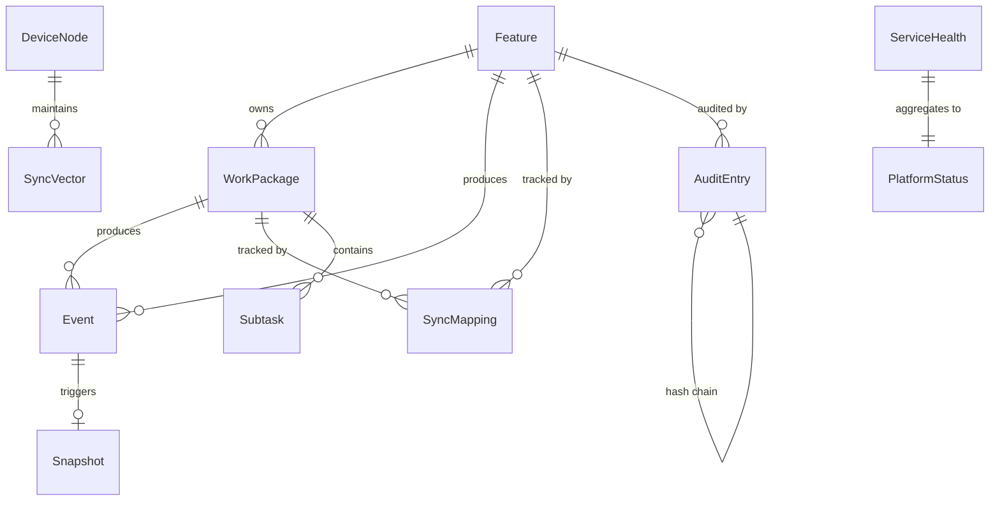
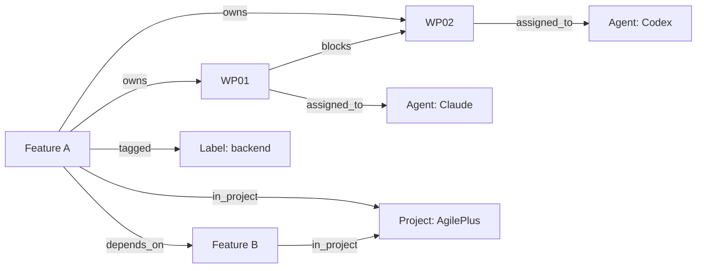

# Data Model — AgilePlus Platform Completion

## Entity Relationship Diagram



## Core Entities

### Feature (existing — extended)

| Attribute | Type | Notes |
|-----------|------|-------|
| id | i64 | Auto-increment PK |
| slug | String | Unique, kebab-case |
| friendly_name | String | Display title |
| state | FeatureState | Enum: created→specified→researched→planned→implementing→validated→shipped→retrospected |
| spec_hash | [u8; 32] | SHA-256 of spec content |
| target_branch | String | Default: "main" |
| plane_issue_id | `Option<String>` | **NEW** — Plane.so issue ID mapping |
| plane_state_id | `Option<String>` | **NEW** — Plane.so state UUID |
| labels | `Vec<String>` | **NEW** — Synced with Plane.so |
| created_at | `DateTime<Utc>` | Immutable |
| updated_at | `DateTime<Utc>` | Updated on mutation |

**Identity**: Unique by `slug` within a project. `id` is the internal PK.

### WorkPackage (existing — extended)

| Attribute | Type | Notes |
|-----------|------|-------|
| id | i64 | Auto-increment PK |
| feature_id | i64 | FK → Feature |
| title | String | WP title |
| ordinal | u32 | Ordering within feature |
| acceptance_criteria | String | Testable criteria |
| state | WpState | Enum: planned→doing→for_review→done |
| assignee | `Option<String>` | Agent or human |
| plane_sub_issue_id | `Option<String>` | **NEW** — Plane.so sub-issue ID |
| created_at | `DateTime<Utc>` | |
| updated_at | `DateTime<Utc>` | |

### Event (new)

| Attribute | Type | Notes |
|-----------|------|-------|
| id | i64 | Auto-increment, monotonic |
| entity_type | `String` | "feature", "work_package", "governance", etc. |
| entity_id | `i64` | FK to the entity |
| event_type | `String` | "state_transitioned", "created", "synced", "conflict_resolved", etc. |
| payload | `JSON` | Event-specific data (serde_json::Value) |
| actor | `String` | User, agent name, or "system" |
| timestamp | `DateTime<Utc>` | Event time |
| prev_hash | `[u8; 32]` | Hash of previous event in entity stream |
| hash | `[u8; 32]` | SHA-256(entity_id + event_type + payload + timestamp + actor + prev_hash) |
| sequence | `i64` | Per-entity monotonic sequence number |

**Identity**: Unique by `id`. Events are append-only, never updated or deleted.
**Partitioning**: Logically partitioned by `entity_type + entity_id` for per-entity streams.

### Snapshot (new)

| Attribute | Type | Notes |
|-----------|------|-------|
| id | `i64` | Auto-increment PK |
| entity_type | `String` | Same as Event |
| entity_id | `i64` | FK to entity |
| state | `JSON` | Serialized current state |
| event_sequence | `i64` | Sequence number of last applied event |
| created_at | `DateTime<Utc>` | Snapshot time |

**Rule**: Snapshot created every 100 events or every 5 minutes per entity.

### SyncMapping (new — replaces in-memory SyncState)

| Attribute | Type | Notes |
|-----------|------|-------|
| id | `i64` | Auto-increment PK |
| entity_type | `String` | "feature" or "work_package" |
| entity_id | `i64` | Local AgilePlus entity ID |
| plane_issue_id | `String` | Plane.so issue/sub-issue ID |
| content_hash | `String` | SHA-256 of synced content |
| last_synced_at | `DateTime<Utc>` | Last successful sync |
| sync_direction | `String` | "push", "pull", "bidirectional" |
| conflict_count | `i32` | Number of conflicts encountered |

**Identity**: Unique by `(entity_type, entity_id)`.

### AuditEntry (existing — enhanced)

| Attribute | Type | Notes |
|-----------|------|-------|
| id | `i64` | PK |
| feature_id | `i64` | FK → Feature |
| wp_id | `Option<i64>` | FK → WorkPackage (optional) |
| timestamp | `DateTime<Utc>` | |
| actor | `String` | |
| transition | `String` | Description of action |
| evidence_refs | `Vec<EvidenceRef>` | Links to evidence artifacts |
| prev_hash | `[u8; 32]` | Hash chain link |
| hash | `[u8; 32]` | Self-hash |
| event_id | `Option<i64>` | **NEW** — FK → Event (correlates audit to event) |
| archived_to | `Option<String>` | **NEW** — MinIO object key if archived |

### ServiceHealth (new)

| Attribute | Type | Notes |
|-----------|------|-------|
| service_name | `String` | "nats", "dragonfly", "neo4j", "minio", "api", "mcp" |
| status | `HealthStatus` | Enum: healthy, degraded, unavailable |
| last_check | `DateTime<Utc>` | |
| uptime_seconds | `u64` | |
| connection_info | `String` | Host:port or socket path |
| metadata | `JSON` | Service-specific details |

### DeviceNode (new)

| Attribute | Type | Notes |
|-----------|------|-------|
| device_id | `String` | Unique device identifier (UUID, generated on first run) |
| tailscale_ip | `Option<String>` | Tailscale IPv4/IPv6 |
| hostname | `String` | Machine hostname |
| last_seen | `DateTime<Utc>` | |
| sync_vector | `JSON` | Map of entity→sequence for vector clock sync |
| platform_version | `String` | AgilePlus version running on device |

### ApiKey (new)

| Attribute | Type | Notes |
|-----------|------|-------|
| id | i64 | PK |
| key_hash | `[u8; 32]` | SHA-256 of the API key (plaintext never stored) |
| name | `String` | "default", "cli", custom label |
| created_at | `DateTime<Utc>` | |
| last_used_at | `Option<DateTime<Utc>>` | |
| revoked | `bool` | Soft-delete |

## Graph Relationships (Neo4j)



**Node types**: Feature, WorkPackage, Agent, Label, Project
**Edge types**: owns, assigned_to, depends_on, blocks, tagged, in_project, reviewed_by

## Storage Backend Mapping

| Entity | Primary Store | Cache | Graph | Archive |
|--------|--------------|-------|-------|---------|
| Feature | SQLite | Dragonfly | Neo4j (node) | — |
| WorkPackage | SQLite | Dragonfly | Neo4j (node) | — |
| Event | SQLite | — | — | MinIO (old events) |
| Snapshot | SQLite | Dragonfly | — | — |
| SyncMapping | SQLite | Dragonfly | — | — |
| AuditEntry | SQLite | — | — | MinIO (archived) |
| ServiceHealth | In-memory | Dragonfly | — | — |
| DeviceNode | SQLite | — | Neo4j (node) | — |
| ApiKey | SQLite | — | — | — |
| Relationships | — | — | Neo4j (edges) | — |
| Artifacts | — | — | — | MinIO |

## SQLite Schema (events table)

```sql
CREATE TABLE events (
    id INTEGER PRIMARY KEY AUTOINCREMENT,
    entity_type TEXT NOT NULL,
    entity_id INTEGER NOT NULL,
    event_type TEXT NOT NULL,
    payload TEXT NOT NULL,  -- JSON
    actor TEXT NOT NULL,
    timestamp TEXT NOT NULL,  -- ISO 8601
    prev_hash BLOB NOT NULL,  -- 32 bytes
    hash BLOB NOT NULL,       -- 32 bytes
    sequence INTEGER NOT NULL,
    UNIQUE(entity_type, entity_id, sequence)
);

CREATE INDEX idx_events_entity ON events(entity_type, entity_id, sequence);
CREATE INDEX idx_events_timestamp ON events(timestamp);
CREATE INDEX idx_events_type ON events(event_type);

CREATE TABLE snapshots (
    id INTEGER PRIMARY KEY AUTOINCREMENT,
    entity_type TEXT NOT NULL,
    entity_id INTEGER NOT NULL,
    state TEXT NOT NULL,  -- JSON
    event_sequence INTEGER NOT NULL,
    created_at TEXT NOT NULL,
    UNIQUE(entity_type, entity_id, event_sequence)
);

CREATE TABLE sync_mappings (
    id INTEGER PRIMARY KEY AUTOINCREMENT,
    entity_type TEXT NOT NULL,
    entity_id INTEGER NOT NULL,
    plane_issue_id TEXT NOT NULL,
    content_hash TEXT NOT NULL,
    last_synced_at TEXT NOT NULL,
    sync_direction TEXT NOT NULL DEFAULT 'bidirectional',
    conflict_count INTEGER NOT NULL DEFAULT 0,
    UNIQUE(entity_type, entity_id)
);

CREATE TABLE api_keys (
    id INTEGER PRIMARY KEY AUTOINCREMENT,
    key_hash BLOB NOT NULL,
    name TEXT NOT NULL,
    created_at TEXT NOT NULL,
    last_used_at TEXT,
    revoked INTEGER NOT NULL DEFAULT 0
);

CREATE TABLE device_nodes (
    device_id TEXT PRIMARY KEY,
    tailscale_ip TEXT,
    hostname TEXT NOT NULL,
    last_seen TEXT NOT NULL,
    sync_vector TEXT NOT NULL,  -- JSON
    platform_version TEXT NOT NULL
);
```

## NATS Subjects (JetStream)

| Subject | Purpose | Retention |
|---------|---------|-----------|
| `agileplus.events.>` | All domain events | WorkQueue, 30 days |
| `agileplus.events.feature.{id}` | Feature-specific events | WorkQueue |
| `agileplus.events.wp.{id}` | WP-specific events | WorkQueue |
| `agileplus.sync.plane.inbound` | Plane.so webhook payloads | WorkQueue, 7 days |
| `agileplus.sync.plane.outbound` | Outbound sync commands | WorkQueue, 7 days |
| `agileplus.sync.device.{device_id}` | P2P sync messages | Interest, 1 day |
| `agileplus.health.{service}` | Health check heartbeats | Interest, 5 min |
| `agileplus.dashboard.updates` | Real-time UI updates | Interest, no persist |

## MinIO Buckets

| Bucket | Contents | Retention |
|--------|----------|-----------|
| `agileplus-artifacts` | Specs, plans, evidence, build outputs | Indefinite |
| `agileplus-events-archive` | Archived events beyond retention window | Configurable |
| `agileplus-audit-archive` | Archived audit entries | Indefinite |
| `agileplus-snapshots` | Snapshot exports for cross-device sync | 90 days |
