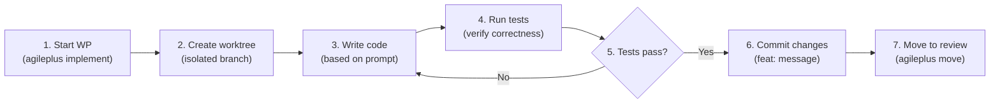

# Implement

Create an isolated git worktree and execute a work package implementation.

## What It Does

The implement phase:

1. **Creates a git worktree** with dedicated branch for isolation
2. **Loads the WP prompt file** with instructions and requirements
3. **Tracks subtask completion** as you check them off
4. **Validates governance** at completion (tests pass, files match scope)
5. **Marks ready for review** when implementation is complete

## Quick Usage

```bash
agileplus implement WP01
```

Output:

```
Setting up WP01: Email Models...

✓ Created worktree at .worktrees/001-email-notifications-WP01
✓ Checked out branch: feat/001-email-notifications-WP01
✓ Loaded prompt: WP01-email-models.md

Your task:
  Create Email, EmailPreference, and EmailTemplate data models

Subtasks (from WP01-email-models.md):
  [ ] Create Email struct with all fields
  [ ] Implement EmailStatus enum
  [ ] Add sqlx FromRow implementations
  [ ] Write unit tests
  [ ] Verify database integration

Start implementing:
  cd .worktrees/001-email-notifications-WP01
  # ... write code ...
  agileplus move WP01 --to for_review
```

## Worktree Isolation

Each work package gets its own isolated git worktree:

```
.worktrees/
├── 001-email-notifications-WP01/
│   ├── src/              # Full project copy
│   ├── tests/
│   ├── Cargo.toml
│   └── .git              # Dedicated git repo
├── 001-email-notifications-WP02/
│   └── ...
└── 001-email-notifications-WP03/
    └── ...
```

**Benefits of isolation**:

- ✓ No conflicts between parallel implementations
- ✓ Each WP has clean diff against main
- ✓ Independent branch per WP
- ✓ Easy cleanup after merge
- ✓ Allows safe parallel work on same codebase

**Structure**:

```bash
.worktrees/001-feature-WP01/
├── .git/                    # Worktree-specific repo
├── src/                     # Full source copy
│   └── models/
│       └── email.rs        # You implement here
├── tests/
├── Cargo.toml
├── Cargo.lock
└── [all project files]
```

## Implementation Workflow



## Step-by-Step Implementation

### 1. Start the Work Package

```bash
agileplus implement WP01
```

This:
- Creates worktree at `.worktrees/001-feature-WP01`
- Checks out dedicated branch `feat/001-feature-WP01`
- Loads the WP prompt file
- Marks WP status as `doing`

### 2. Navigate to Worktree

```bash
cd .worktrees/001-email-notifications-WP01
```

### 3. Read the Prompt

```bash
# View the WP instructions
cat ../../kitty-specs/001-email-notifications/tasks/WP01-database.md
```

Example prompt:

```markdown
# WP01: Database Schema

## Your Task
Create database migrations for email tables.

## Subtasks
- [ ] Create 001_email_schema.sql (up migration)
- [ ] Create 001_email_schema.down.sql (down migration)
- [ ] Define email table with proper indexes
- [ ] Define email_preference table with constraints
- [ ] Test migration up/down cycle

## Deliverables
- src/db/migrations/001_email_schema.sql
- src/db/migrations/001_email_schema.down.sql

## Acceptance Criteria
- [ ] Both migrations run without errors
- [ ] Migrations are reversible
- [ ] Tables have proper indexes and constraints
```

### 4. Implement

Write code according to the prompt:

```bash
# Example: create database migration
mkdir -p src/db/migrations
cat > src/db/migrations/001_email_schema.sql << 'EOF'
CREATE TABLE emails (
  id BIGINT PRIMARY KEY AUTO_INCREMENT,
  user_id BIGINT NOT NULL,
  event_type VARCHAR(50) NOT NULL,
  recipient VARCHAR(255) NOT NULL,
  subject TEXT NOT NULL,
  body LONGTEXT NOT NULL,
  status VARCHAR(20) NOT NULL DEFAULT 'pending',
  attempts INT DEFAULT 0,
  created_at TIMESTAMP DEFAULT CURRENT_TIMESTAMP,
  sent_at TIMESTAMP NULL,
  bounced_at TIMESTAMP NULL,
  FOREIGN KEY (user_id) REFERENCES users(id),
  INDEX idx_user_status (user_id, status),
  INDEX idx_created (created_at)
);

CREATE TABLE email_preferences (
  id BIGINT PRIMARY KEY AUTO_INCREMENT,
  user_id BIGINT NOT NULL,
  category VARCHAR(50) NOT NULL,
  enabled BOOLEAN DEFAULT true,
  unsubscribe_token VARCHAR(255) UNIQUE,
  created_at TIMESTAMP DEFAULT CURRENT_TIMESTAMP,
  updated_at TIMESTAMP DEFAULT CURRENT_TIMESTAMP ON UPDATE CURRENT_TIMESTAMP,
  FOREIGN KEY (user_id) REFERENCES users(id),
  UNIQUE KEY idx_user_category (user_id, category)
);
EOF
```

### 5. Run Tests

Ensure your implementation works:

```bash
# Run project tests
cargo test

# Run tests in isolation
cargo test --test email_integration

# Run with logging
RUST_LOG=debug cargo test -- --nocapture
```

Example test:

```rust
#[tokio::test]
async fn test_email_model() {
    let email = Email {
        user_id: 1,
        recipient: "test@example.com".to_string(),
        status: EmailStatus::Pending,
        ..Default::default()
    };

    assert_eq!(email.status, EmailStatus::Pending);
    assert!(email.recipient.contains("@"));
}
```

### 6. Commit Your Work

```bash
# Stage all changes
git add -A

# Commit with clear message (reference WP)
git commit -m "feat(WP01): create email database schema

- Add emails table with indexes
- Add email_preferences table with constraints
- Create up and down migrations

Implements: WP01-database
Spec: 001-email-notifications"
```

**Commit message format**:

```
feat(WP01): short description

- Detailed point 1
- Detailed point 2
- Detailed point 3

Implements: WP01-{name}
Spec: 001-{feature}
```

### 7. Verify Completion

Before moving to review, verify:

```bash
# Ensure all tests pass
cargo test --all

# Check git status (should be clean)
git status

# View your commits
git log --oneline main..HEAD

# Verify deliverables exist
ls -la src/db/migrations/001_email*
```

### 8. Mark Complete

When all subtasks are done:

```bash
agileplus move WP01 --to for_review
```

Output:

```
✓ WP01: Database Schema
  Status: for_review
  Commits: 1
  Files changed: 2

Ready for code review:
  agileplus review WP01

Dependent WPs waiting on this:
  - WP02: Email Models (blocked)
```

This:
- Moves WP from `doing` → `for_review`
- Marks ready for code review
- Unblocks dependent WPs (they can start planning)

## Worktree Commands

### Create a Worktree

```bash
agileplus implement WP01
# Creates .worktrees/001-feature-WP01
```

### Switch Between Worktrees

```bash
# Go to WP02's worktree
cd .worktrees/001-feature-WP02
git status

# Go to main project
cd ../..
git status
```

### Remove a Worktree

Usually automatic after merge, but manual cleanup:

```bash
# Remove WP01's worktree
rm -rf .worktrees/001-feature-WP01

# Or let merge command handle it
agileplus merge 001  # Cleans up all WP worktrees
```

## Common Patterns

### Pattern 1: Implement with Agent

Auto-dispatch to Claude:

```bash
agileplus implement WP01 --agent claude-code
```

Claude receives:
- WP prompt
- Spec and plan context
- File paths to modify
- Expected deliverables

### Pattern 2: Implement Locally

```bash
agileplus implement WP01
cd .worktrees/001-feature-WP01
# ... your implementation ...
git commit -m "feat(WP01): ..."
agileplus move WP01 --to for_review
```

### Pattern 3: Parallel Implementation

Multiple developers work in parallel:

```bash
# Developer A
agileplus implement WP01
cd .worktrees/001-feature-WP01
# ... implement ...

# Developer B (different terminal/machine)
agileplus implement WP02
cd .worktrees/001-feature-WP02
# ... implement ...

# Both commit independently
# Reviews happen in parallel
```

## Troubleshooting

### Worktree Creation Failed

```bash
# Check git status
git status

# Ensure clean state
git stash

# Retry
agileplus implement WP01 --force
```

### Tests Failing

```bash
# Run tests with more detail
cargo test -- --nocapture --test-threads=1

# Check recent changes
git diff main

# Revert specific file if needed
git checkout <file>
```

### Merge Conflicts (During Implementation)

If main branch changed while you were working:

```bash
# Update worktree from main
git fetch origin
git rebase origin/main

# Resolve conflicts
git status  # Shows conflicts
# Edit conflicted files
git add .
git rebase --continue

# Continue implementation
```

### Forgot to Commit

```bash
# Check what's staged
git status

# Stage all changes
git add -A

# Commit
git commit -m "feat(WP01): ..."
```

### Want to Reset

If things went wrong:

```bash
# Discard all changes (dangerous!)
git reset --hard main

# Or discard just one file
git checkout main -- <file>

# Start over if needed
cd ../..
agileplus implement WP01 --force
```

## Best Practices

**1. Small Commits**

```bash
# Good: Multiple commits for logical chunks
git commit -m "feat(WP01): create email model"
git commit -m "feat(WP01): add database fields"
git commit -m "feat(WP01): implement validation"

# Avoid: One giant commit
git commit -m "feat(WP01): do everything"
```

**2. Meaningful Messages**

```markdown
# Good
feat(WP01): create Email model with validation

- Add Email struct with id, recipient, subject, body
- Implement EmailStatus enum (pending, sent, failed)
- Add validation for email addresses
- Write unit tests for Email model

# Avoid
feat: stuff
```

**3. Regular Testing**

```bash
# Test after each logical chunk
cargo test
cargo clippy  # Check for warnings
```

**4. Sync with Dependencies**

If your WP depends on another WP:

```bash
# Check if dependent WP is done
agileplus show 001 --dependencies

# If yes, your blocker is resolved
# Start implementation
```

**5. Follow Subtasks**

The WP prompt has subtasks. Check them off:

```bash
# View prompt
cat ../../kitty-specs/001-feature/tasks/WP01-*.md

# As you implement, follow the subtasks
# When all are done, move to review
```

## Next Steps

After implementation:

```bash
# Move to review
agileplus move WP01 --to for_review

# Reviewer checks the work
agileplus review WP01

# If approved:
agileplus move WP01 --to done
```

This unblocks dependent WPs.

## Related Documentation

- **[Tasks](/workflow/tasks)** — Work package generation
- **[Review](/workflow/review)** — Code quality review
- **[Merge](/workflow/merge)** — Integration to main
- **[Core Workflow](/guide/workflow)** — Full pipeline overview
