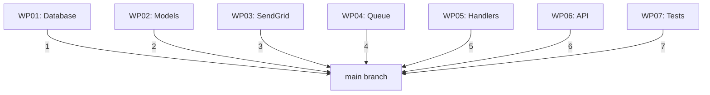

# Merge

Integrate all completed work packages into main and clean up.

## What It Does

The merge phase:

1. **Verifies readiness** — all WPs accepted, no conflicts
2. **Merges WP branches** — in dependency order to main
3. **Handles conflicts** — surfaces any merge conflicts immediately
4. **Cleans up** — removes worktrees and deletes feature branches
5. **Updates status** — marks feature as Shipped
6. **Syncs tracker** — closes issues in GitHub/Plane.so (if configured)
7. **Creates merge record** — audit trail of integration

## Quick Usage

```bash
agileplus merge 001
```

Output:

```
Merging feature: 001-email-notifications

Pre-Merge Validation:
✓ Feature status: accepted
✓ All 7 WPs in done state
✓ No uncommitted changes
✓ All commits present

Merge Sequence:
✓ Merging WP01 (database) — 1 commit
✓ Merging WP02 (models) — 3 commits
✓ Merging WP03 (sendgrid) — 5 commits
✓ Merging WP04 (queue) — 4 commits
✓ Merging WP05 (handlers) — 3 commits
✓ Merging WP06 (api) — 2 commits
✓ Merging WP07 (tests) — 2 commits

Post-Merge Cleanup:
✓ Removing worktrees (7 removed)
✓ Deleting feature branches (7 deleted)
✓ Updating tracker issues (7 closed)

Final Status:
✅ Feature merged to main
   Commits: 20
   Files changed: 15
   Lines added: 2,047

Shipped! Next release: 0.2.0
```

## Pre-Merge Checklist

Before merging, the system verifies:

```markdown
## Pre-Merge Validation

### Feature Status
- [ ] Feature marked as "accepted"
- [ ] All WPs in "done" state
- [ ] No WPs in "planned", "doing", or "for_review"

### Code Status
- [ ] No uncommitted changes in worktrees
- [ ] All commits are signed (if required)
- [ ] No local changes on main branch

### Conflict Check
- [ ] No conflicts between WP branches
- [ ] No conflicts with main branch
- [ ] All merges can fast-forward or cleanly squash

### Tracker Status
- [ ] All issues updated to latest status
- [ ] No pending review comments
```

If any check fails, merge is halted with error message.

## Merge Sequence

WP branches merge in dependency order (respecting the DAG):



**Order principle**: Dependencies merge before dependents

1. WP01 (database) — no deps, merges first
2. WP02 (models) — depends on WP01, merges second
3. WP03, WP04, WP06 — depend on WP02, merge in order
4. WP05 — depends on WP04, merges after WP04
5. WP07 — depends on WP05 and WP06, merges last

This ensures:
- No merge conflicts (dependencies already in main)
- Linear history (clean git log)
- Easy to bisect if issue discovered

## Merge Strategies

Configure how WP branches merge to main:

### 1. Squash Merge (Default)

```toml
[workflow.merge]
strategy = "squash"
```

Behavior:
```
All commits in WP02 → single squashed commit on main

Commit log:
  $ git log --oneline main | head -10
  abc1234 WP02: Email Models
  def5678 WP01: Database
  ghi9012 Previous feature
```

**Pros**: Clean commit history
**Cons**: Lose individual WP commits

### 2. Rebase Merge

```toml
[workflow.merge]
strategy = "rebase"
```

Behavior:
```
All commits in WP02 → replayed on top of main

Commit log:
  $ git log --oneline main | head -10
  aaa0001 feat(WP02): add email preferences
  bbb0002 feat(WP02): create Email model
  ccc0003 feat(WP01): create database schema
```

**Pros**: Preserves all commits, linear history
**Cons**: Rewrites history

### 3. Merge Commit

```toml
[workflow.merge]
strategy = "merge"
```

Behavior:
```
All commits in WP02 + merge commit on main

Commit log:
  $ git log --oneline main | head -10
  merge123 Merge branch 'feat/001-feature-WP02' into main
  aaa0001 feat(WP02): add email preferences
  bbb0002 feat(WP02): create Email model
  ccc0003 feat(WP01): create database schema
```

**Pros**: Preserves WP history as unit
**Cons**: Extra merge commits

## Conflict Resolution

If conflicts detected:

```bash
agileplus merge 001 --verbose
```

Output:

```
Merging WP04: Queue...

❌ Conflict detected: src/email/queue.rs
   WP04 modified line 45 (retry logic)
   main modified line 45 (different timeout)

Merge halted. Resolve conflict manually:

  cd .worktrees/001-feature-WP04
  git status
  # Edit conflicted file
  git add src/email/queue.rs
  git commit -m "fix: resolve merge conflict"
  cd ../..
  agileplus merge 001 --retry
```

**Conflict resolution steps**:

1. Enter worktree with conflict
2. Edit conflicted file
3. Resolve by choosing correct code
4. Stage resolution
5. Commit
6. Retry merge

## Cleanup Process

After successful merge:

### 1. Remove Worktrees

```bash
# Automatic:
agileplus merge 001
# Removes: .worktrees/001-feature-WP*

# Manual cleanup:
rm -rf .worktrees/001-feature-*
```

### 2. Delete Feature Branches

```bash
# Automatic:
agileplus merge 001
# Deletes: feat/001-feature-WP01, WP02, ...

# Manual cleanup:
git branch -D feat/001-feature-WP01
git branch -D feat/001-feature-WP02
# etc.
```

### 3. Update Tracker

If configured:

```toml
[sync.plane]
enabled = true

[sync.github]
enabled = true
```

System automatically:
- Closes all WP issues
- Updates feature issue to "Shipped"
- Comments with merge commit link

### 4. Create Merge Record

System creates audit record:

```
2026-03-05 15:30:00 UTC
Feature: 001-email-notifications
Status: Accepted → Shipped
Merged by: alice
Commits: 20
Files: 15 changed, 2,047 insertions
Main branch commit: abc1234567
```

## Complete Merge Example

```bash
# Everything is ready
agileplus merge 001
```

Log output:

```
🔍 Pre-Merge Checks
  ✓ Feature 001 accepted
  ✓ All 7 WPs done
  ✓ No conflicts detected
  ✓ Tracker synced

📝 Merge Sequence
  ✓ WP01: 1 commit squashed
  ✓ WP02: 3 commits squashed
  ✓ WP03: 5 commits squashed
  ✓ WP04: 4 commits squashed
  ✓ WP05: 3 commits squashed
  ✓ WP06: 2 commits squashed
  ✓ WP07: 2 commits squashed

🧹 Cleanup
  ✓ Removed 7 worktrees
  ✓ Deleted 7 feature branches
  ✓ Closed 7 tracker issues
  ✓ Updated feature status to Shipped

✅ Success!

Summary:
  Feature: 001-email-notifications
  Merged: 20 commits
  Files: +15 changed, +2,047 insertions
  Branches: feat/001-feature-WP01..WP07 → deleted
  Worktrees: .worktrees/001-feature-* → removed
  Status: Shipped 🚀

Main branch HEAD: abc1234 WP07: Integration tests

Next steps:
  - Tag release: git tag v0.2.0
  - Deploy to production
  - Update changelog
  - Announce feature
```

## Merge Flags

```bash
# Squash merge all WPs into single commit
agileplus merge 001 --squash-all

# Dry-run (preview without merging)
agileplus merge 001 --dry-run

# Don't delete worktrees (manual cleanup)
agileplus merge 001 --no-cleanup

# Verbose output
agileplus merge 001 --verbose

# Skip tracker update
agileplus merge 001 --no-sync

# Merge to specific branch (not main)
agileplus merge 001 --into develop
```

## Post-Merge Tasks

After merge completes:

### 1. Verify on Main

```bash
# Check out main
git checkout main

# Verify all commits present
git log --oneline | head -10

# Verify all files exist
ls src/models/email.rs
ls src/email/queue.rs
```

### 2. Deploy (If Automated)

If you have CI/CD:

```bash
# Merged code automatically:
# - Runs tests
# - Builds Docker image
# - Deploys to staging
# - (If configured) deploys to production
```

### 3. Tag Release

```bash
git tag -a v0.2.0 -m "Release 0.2.0: Email Notifications"
git push origin v0.2.0
```

### 4. Create Release Notes

```markdown
# Release 0.2.0 - Email Notifications

## Features
- Send transactional emails on user events
- User preference management
- Automatic retry with exponential backoff
- Unsubscribe support

## Files Changed
- 15 files modified
- 2,047 lines added

## Commits
- 20 commits merged
- Feature branch: feat/001-email-notifications
- Merged by: alice
```

### 5. Announce

```
🎉 Email Notifications feature shipped!

Users can now receive emails on:
- Account signup (welcome)
- Mentions in comments
- Payment receipts
- And more

Preferences available in Account Settings.
```

## Troubleshooting

### Merge Fails: Conflicts

```bash
# See conflict details
agileplus merge 001 --verbose

# Resolve conflicts manually
cd .worktrees/001-feature-WP04
git status  # Shows conflicts
# Edit conflicted files
git add .
git commit -m "fix: resolve merge conflicts"

# Retry
cd ../..
agileplus merge 001 --retry
```

### Merge Fails: WP Not Done

```bash
# Error: WP02 is for_review, not done

# Solution: Complete the WP first
agileplus review WP02
agileplus move WP02 --to done

# Then retry merge
agileplus merge 001
```

### Worktrees Won't Delete

```bash
# Permission error or files locked?

# Manual cleanup
rm -rf .worktrees/001-feature-*

# Or force remove
rm -rf .worktrees/001-feature-* --force

# Then re-run merge (will skip worktree deletion)
agileplus merge 001 --no-cleanup
```

### Branches Won't Delete

```bash
# Force delete feature branches
git branch -D feat/001-feature-WP01
git branch -D feat/001-feature-WP02
# etc.
```

## Best Practices

**1. Don't Skip Acceptance**

Always accept before merge:

```bash
agileplus accept 001  # Validates everything
agileplus merge 001
```

**2. Use Squash for Cleaner History**

```toml
[workflow.merge]
strategy = "squash"  # Cleaner commit history
```

**3. Create Release Notes**

Document what shipped:

```bash
# After merge
git log v0.1.0..v0.2.0 --oneline > RELEASE_NOTES.md
```

**4. Tag Releases**

```bash
git tag -a v0.2.0 -m "Release 0.2.0"
git push origin v0.2.0
```

**5. Announce Features**

Let team know what shipped:

```
📢 Feature shipped: Email Notifications
   Merge: 001-email-notifications
   Status: Production ready
   Next: Monitor delivery metrics
```

## Next Steps

After merge:

```bash
# Feature is shipped! 🚀
# Next feature:
agileplus specify "new feature description"
```

## Related Documentation

- **[Accept](/workflow/accept)** — Final validation before merge
- **[Review](/workflow/review)** — Code quality review
- **[Implement](/workflow/implement)** — Implementation
- **[Core Workflow](/guide/workflow)** — Full pipeline overview
