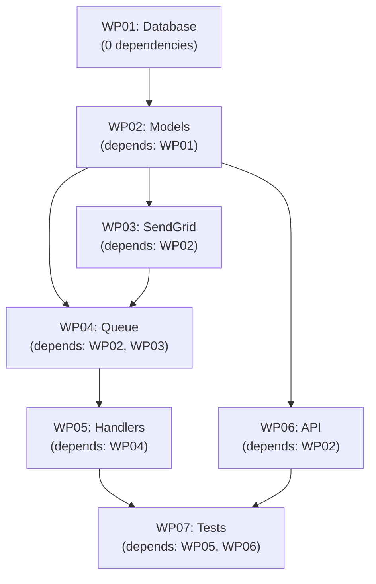

# Tasks & Work Packages

Decompose a plan into parallel-safe work packages (WPs) with subtasks, dependencies, and deliverables.

## What It Does

The tasks phase:

1. **Analyzes the plan** to identify groupings and dependencies
2. **Creates work packages** — self-contained units of work
3. **Defines dependencies** — which WPs must complete before others
4. **Generates subtasks** — concrete checklist items per WP
5. **Specifies deliverables** — files and artifacts to produce
6. **Creates WP prompt files** — instructions for implementation

## Quick Usage

```bash
agileplus tasks 001
```

Output:

```
Decomposing plan into work packages...

✓ Created WP01-database      (depends on: none)
✓ Created WP02-models        (depends on: WP01)
✓ Created WP03-sendgrid      (depends on: WP02)
✓ Created WP04-queue         (depends on: WP02, WP03)
✓ Created WP05-handlers      (depends on: WP04)
✓ Created WP06-api           (depends on: WP02)
✓ Created WP07-tests         (depends on: WP05, WP06)

Generated:
  kitty-specs/001-email-notifications/tasks/
  ├── WP01-database.md
  ├── WP02-models.md
  ├── WP03-sendgrid.md
  ├── WP04-queue.md
  ├── WP05-handlers.md
  ├── WP06-api.md
  └── WP07-tests.md

Ready to implement:
  agileplus implement WP01
```

## Work Package Structure

Each WP file contains:

```markdown
# WP01: Database Schema & Migrations

## Overview
Create the database tables needed for email support: email queue, preferences, templates.

## Subtasks
- [ ] Create migration up: 001_email_schema.sql
- [ ] Define email table with proper indexes
- [ ] Define email_preferences table with constraints
- [ ] Define email_template table
- [ ] Create migration down (for rollback)
- [ ] Test migration up/down in isolation
- [ ] Document schema design rationale

## Dependencies
None. This work package can start immediately.

## Deliverables

### Files to Create
- `src/db/migrations/001_email_schema.sql` (up migration)
- `src/db/migrations/001_email_schema.down.sql` (down migration)

### Files to Modify
None

### No Files to Delete

## Definition of Done
- [ ] All subtasks completed
- [ ] Migration runs without errors
- [ ] Migration can be reverted cleanly
- [ ] Tables have proper constraints and indexes
- [ ] Tests pass

## Acceptance Criteria
- Email table exists with all required columns
- Indexes created on frequently queried columns (user_id, status)
- Foreign key constraints defined
- Both up and down migrations work

## Estimated Effort
2-3 hours

## Lane
planned → doing → for_review → done
```

## Example: Complete Work Package

```markdown
---
spec: 001-email-notifications
wp_id: WP02
title: Email Data Models
estimated_hours: 4
---

# WP02: Email Data Models

## Overview

Create Rust data structures for Email, EmailPreference, and EmailTemplate entities.
These models will be used throughout the system for database operations and API contracts.

**Depends on**: WP01 (database schema must exist)
**Enables**: WP03, WP04, WP06 (all depend on these models)

## Requirements from Spec

From spec 001, these models must support:
- Sending different email types (welcome, mention, receipt)
- Tracking email status (pending, sent, failed, bounced)
- Retrying failed emails with attempt tracking
- User preference management per email category
- Template customization and rendering

## Subtasks

- [ ] Create Email struct with all required fields
  - id, user_id, event_type, recipient
  - subject, body, status
  - attempts, retry_at, last_error
  - created_at, sent_at, bounced_at

- [ ] Implement EmailStatus enum
  - Pending, Sent, Failed, Bounced
  - Implement Display and serde traits

- [ ] Create EmailPreference struct
  - user_id, category (marketing/transactional/account)
  - enabled (boolean)
  - unsubscribe_token for links

- [ ] Create EmailTemplate struct
  - id, event_type, subject, body_template
  - version tracking for templates

- [ ] Implement FromRow trait for sqlx
  - Custom deserialization from database rows

- [ ] Add validation methods
  - validate_email() — valid email addresses
  - validate_preference_category() — valid categories

- [ ] Write unit tests for models
  - Test serialization/deserialization
  - Test validation logic
  - Test enum conversions

- [ ] Document model fields and purpose

## Deliverables

### Files to Create
- `src/models/email.rs` (~150 lines)
  - Email struct with all fields
  - EmailStatus enum with FromRow impl
  - Validation methods

- `src/models/email_preference.rs` (~100 lines)
  - EmailPreference struct
  - Category validation

- `src/models/email_template.rs` (~80 lines)
  - EmailTemplate struct
  - Template field validation

### Files to Modify
- `src/models/mod.rs` — Add exports for new models
  - Add: `pub mod email;`
  - Add: `pub use email::{Email, EmailStatus};`

### No Files to Delete

## Definition of Done

- [ ] All subtasks completed
- [ ] Code compiles without warnings
- [ ] All unit tests pass
- [ ] Models have appropriate derives (Serialize, Deserialize, Clone, Debug)
- [ ] Code follows project conventions (naming, style, comments)
- [ ] Models properly implement sqlx::FromRow for database mapping
- [ ] Validation methods are tested
- [ ] Documentation complete (doc comments on public items)

## Acceptance Criteria

- **Completeness**: All email-related models defined
- **Correctness**: Models match database schema from WP01
- **Quality**: No compiler warnings, tests pass
- **Documentation**: Each public item has doc comments
- **Integration**: Models can be imported and used in other modules

## Estimated Effort

3-4 hours

## Implementation Notes

**Pattern**: Follow existing model pattern in codebase
- Look at `src/models/user.rs` for style
- Use same derive macros
- Same error handling approach

**Testing**: Create comprehensive unit tests
- Test Email creation and status transitions
- Test EmailPreference category validation
- Test serialization with serde

**Database Mapping**: Implement custom sqlx::FromRow
- Handle status enum conversion from string
- Handle datetime fields properly (created_at, sent_at)

## Related Work Packages

- **Depends on**: WP01 (database must be created first)
- **Unblocks**: WP03, WP04, WP06 (all use these models)

## Lane
planned → doing → for_review → done
```

## Dependency Graph

Work packages form a dependency DAG (directed acyclic graph):



**Rules**:
- WP01 can start immediately (no dependencies)
- WP02 can start once WP01 is done
- WP03, WP04, WP06 can run in parallel (once WP02 done)
- WP05 waits for WP04
- WP07 waits for both WP05 and WP06

## Kanban Lanes

Work packages flow through these states:

```
planned
   ↓ (when dependencies met)
doing
   ↓ (when implementation complete)
for_review
   ↓ (when reviewer approves)
done
   ↓
(unblocks dependent WPs)
```

| Lane | Meaning | Who Actions | Notes |
|------|---------|------------|-------|
| `planned` | Ready to implement (deps met) | Implementer | Can start implementing |
| `doing` | Currently being implemented | Implementer | Work in progress |
| `for_review` | Ready for code review | Reviewer | All subtasks done, code written |
| `done` | Approved and merged | Team | Unblocks dependent WPs |

## Work Package Sizing

Good WP sizing is critical for parallel work:

**Target size**: 1-4 hours of work

**Too large** (>4 hours):
```
❌ "WP01: Entire feature"
   - Single implementer blocked for days
   - Hard to review
   - Can't parallelize

✓ Split into smaller WPs
```

**Too small** (<30 minutes):
```
❌ "WP01: Import module"
   - Overhead of code review > actual work
   - Trivial to implement

✓ Combine with related work
```

**Just right**:
```
✓ WP01: Database schema (2 hours)
✓ WP02: Models (3 hours)
✓ WP03: API integration (3 hours)
```

## Creating Effective Subtasks

Each subtask should be:

**Specific and actionable**:
```
❌ "Create email service"
✓ "Create SendGrid HTTP client with authentication"
```

**Testable**:
```
❌ "Handle errors"
✓ "Add retry logic: exponential backoff, 5 attempts over 72 hours"
```

**Completable within an hour**:
```
❌ "Implement entire email system"
✓ "Create Email struct with sqlx FromRow implementation"
```

**Measurable**:
```
❌ "Make it fast"
✓ "Reduce email send latency to <5ms via caching"
```

## Parallel Work Strategies

### 1. No Dependencies

If WPs have no dependencies, start them all in parallel:

```
WP01 (0 deps) ─┐
WP02 (0 deps) ─┼→ All parallel
WP03 (0 deps) ─┘
```

### 2. Sequential Dependencies

If chain is linear, only one implementer needed:

```
WP01 → WP02 → WP03 → WP04
(2h)  (3h)  (2h)  (3h)
= 10 hours sequential
= 10 hours with 1 person
= ~3 hours with 4 people (optimal)
```

### 3. Fan-Out Dependencies

When one WP unblocks many:

```
WP01 (foundation)
  ├─ WP02
  ├─ WP03
  ├─ WP04
  └─ WP05
(can parallelize WP02-05 after WP01)
```

### 4. Complex DAG

When dependencies are non-trivial:

```bash
# Visualize dependencies
agileplus show 001 --dependency-graph

# See which WPs can run now
agileplus queue list --ready-now

# See what unblocks
agileplus show WP03 --will-unblock
```

## Prompt Files

Each WP gets a prompt file for agent dispatch:

```markdown
# WP02: Email Data Models

You are implementing work package WP02 for feature 001.

## Context
- Spec: `kitty-specs/001-email-notifications/spec.md`
- Plan: `kitty-specs/001-email-notifications/plan.md`
- Related WPs: WP01 (completed), WP03 (waiting on you)

## Your Task
Implement the Email, EmailPreference, and EmailTemplate data models.

## Deliverables
- `src/models/email.rs`
- `src/models/email_preference.rs`
- `src/models/email_template.rs`

## Subtasks
1. Create Email struct matching database schema
2. Implement EmailStatus enum
3. Add sqlx FromRow implementations
4. Write unit tests
5. Verify integration with database

## Definition of Done
- All subtasks completed
- Code compiles without warnings
- All tests pass
- Models match database schema from WP01

## Files Changed
- src/models/email.rs (CREATE)
- src/models/email_preference.rs (CREATE)
- src/models/email_template.rs (CREATE)
- src/models/mod.rs (MODIFY - add exports)

## Command to Start
agileplus implement WP02
```

## Tips for Good Work Packages

**1. Clear boundaries**

Each WP owns specific files and deliverables with no overlap.

**2. Self-documenting**

Prompt file clearly states what to build and acceptance criteria.

**3. Testable completion**

Clear definition of done — someone can verify completion objectively.

**4. Balanced sizing**

Roughly 2-4 hours per WP across the feature.

**5. Logical grouping**

Related code together (database + models, not database + UI).

## Next Steps

After creating work packages:

```bash
# Start implementing
agileplus implement WP01

# In parallel, other WPs ready for work
agileplus implement WP02

# Track progress
agileplus show 001 --dependency-graph
```

Then move to review:

```bash
agileplus move WP01 --to for_review
agileplus review WP01
agileplus move WP01 --to done
# ^ WP02 unblocks now
```

## Related Documentation

- **[Plan](/workflow/plan)** — Architecture and file changes
- **[Implement](/workflow/implement)** — Execute a work package
- **[Review](/workflow/review)** — Code review process
- **[Core Workflow](/guide/workflow)** — Full pipeline overview
