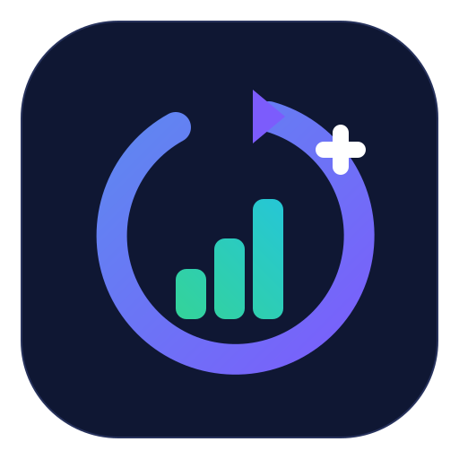

<!-- work-state: 🟢 ready | ██████████ 100% (phase-finish-stack complete) -->
# build / coverage / e2e / perf / qe
[](.github/workflows/coverage.yml)
[](.github/workflows/e2e.yml)
[](.github/workflows/perf.yml)
[](.github/workflows/qe.yml)
[](.github/workflows/deploy-worker.yml)
[](vercel.json)
[](.github/workflows/deploy-frontend.yml)
[](deploy/kubernetes/Chart.yaml)
[](workspace/manifest.json)
**Quality Gate:** coverage ≥85% · e2e 100% · perf 100% · qe 100%

<p align="center">
  <a href="assets/brand/logo.svg"></a>
</p>
<p align="center"><em>AI-native project management with hexagonal Rust core, Plane.so / GitHub integration, and an AI-agent MCP surface.</em></p>
<p align="center"><sub><a href="assets/brand/README.md">Brand assets &amp; palette</a> · <a href="docs/assets/identity/">visual identity demo</a></sub></p>

---

# AgilePlus

**Project management system with AI agent integration** — 24-crate Rust monorepo with hexagonal architecture, Python MCP server, and Plane.so/GitHub integration.

## Project Overview

AgilePlus is a full-stack project management platform built with:
- **Rust** (24 crates) — Core domain, storage, event sourcing, CLI, REST API
- **Python** — MCP server for AI agent integration
- **TypeScript** — pheno-cli, React components

## Key Features

- Domain model: Feature, WorkPackage, Cycle, Module with state machines
- Event sourcing with audit trails and hash chains
- SQLite storage with hexagonal adapter pattern
- gRPC protocol definitions
- REST API with API key authentication
- OpenTelemetry tracing and metrics
- Git VCS adapter integration
- Plane.so sync (push/pull)
- GitHub integration

## About this shelf

```bash
# Setup
cd AgilePlus
bun install
cargo build --workspace

# Run CLI
cargo run --package pheno-cli -- --help

# Start REST server
cargo run --package pheno-cli -- serve

# Run tests
cargo test --workspace
```

## Documentation

| Document | Purpose |
|----------|---------|
| [PLAN.md](./PLAN.md) | Implementation phases and task tracking |
| [PRD.md](./PRD.md) | Product requirements and user journeys |
| [FUNCTIONAL_REQUIREMENTS.md](./FUNCTIONAL_REQUIREMENTS.md) | Detailed FR traceability |
| [AGENTS.md](./AGENTS.md) | Agent interaction rules |
| [GOVERNANCE.md](./GOVERNANCE.md) | Project governance |

### MCP, APIs, and routing infrastructure

```
AgilePlus/
├── crates/          # 24 Rust crates (workspace)
├── python/          # Python MCP server
├── pheno-cli/       # CLI tool
├── kitty-specs/     # Feature specifications
├── docs/            # Documentation
└── harnesses/       # Agent harness configs
```

## Traceability

1. **Identify the project** — Check `projects/INDEX.md` or ask the user
2. **Navigate to project** — `cd <project-name>`
3. **Read project rules** — Check for `CLAUDE.md` or `AGENTS.md` in project
4. **Do the work** — Follow shelf rules in `AGENTS.md`
5. **Commit & push** — Use conventional commits, open PR if needed

## NOT AgilePlus

This shelf contains **many projects**, of which AgilePlus is one.
AgilePlus-specific documentation lives inside the `AgilePlus/` project directory,
not at shelf level.

The files that were previously here describing AgilePlus have been moved to
their correct locations:
- AgilePlus governance → `AgilePlus/GOVERNANCE.md`
- AgilePlus agent rules → `AgilePlus/AGENTS.md`
- AgilePlus README → `AgilePlus/README.md`

## Current recovery frontier

This workspace currently carries preserve-first recovery surfaces that should be
kept visible and organized, not deleted:

- `crates/hexa-kit/`
- `crates/agile-plus/`

Treat both as source-bearing consolidation work. Preserve the material, group
the recovery notes with the code, and avoid broad deletion or pruning.

## Getting Help

- Shelf-level issues: Ask here
- Project-specific issues: `cd <project>` and check that project's docs
- Architecture decisions: `cat docs/adr/INDEX.md`
- General questions: Check `projects/INDEX.md` first


## Worklog schema — cross-reference (ADR-032, 2026-06-18)

This repo's `WORKLOG.md` uses the **AgilePlus team-sprint schema** (`L#-#` req_ids, device/topic/branch/scope/owner/eta + per-sprint entries). It coexists with the **pheno-worklog-schema v2.0/v2.1** (`L5-###` req_ids, 10/11 columns) used by the fleet-substrate layer.

Per [ADR-032](https://github.com/KooshaPari/phenotype-org-audits/blob/main/audits/2026-06-18_ADR-032-worklog-schema-both-stay.md), **both schemas stay** — they track different metadata (team-sprint vs. fleet-level), have non-colliding `req_id` prefixes, and the cost of forcing convergence is higher than the cost of divergence. The `req_id` is the join key if cross-schema audit is ever needed.

To query across both schemas, use the `req_id` prefix as a discriminator: `L#-#` (this repo) vs. `L5-###` (fleet substrate).
