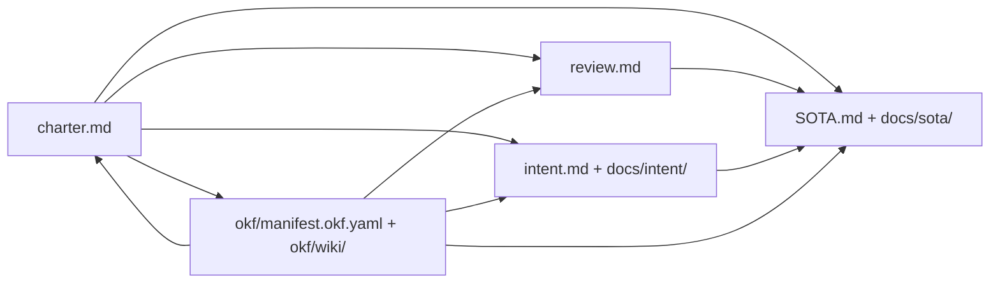

# Phenotype Genesis Documentation Standard

> **Owner:** HexaKit (genesis layer — project scaffolding and templates only, not domain SDK libraries)  
> **Version:** 1.0.0  
> **Status:** Active  
> **AgilePlus trace:** FR-GENESIS-001 (linked governance doc set per repo)  
> **Template root:** [`templates/genesis/`](../../templates/genesis/)

Every Phenotype-org repository (new or migrated) carries a **linked documentation set** so humans, automated PR agents, and LLM wikis share one source of truth for *why*, *what*, *how we review*, and *why this is SOTA*.

HexaKit publishes the **canonical spec** and **bootstrap scaffolds**. Product repos copy scaffolds at init and customize placeholders. HexaKit does **not** host domain libraries (auth, telemetry, MCP, testing kits) — those belong in `phenotype-*-sdk` workspaces per charter boundary class.

## Artifact graph



| Artifact | Purpose | Update trigger | Spec |
|----------|---------|----------------|------|
| [`charter.md`](../../templates/genesis/charter.md) | Scope, governance, links to all artifacts | Scope change; compliance requirement | [CHARTER_SPEC.md](CHARTER_SPEC.md) |
| [`review.md`](../../templates/genesis/review.md) | **Kilo Code Stand** — automated PR review contract | New lint gate; agent policy change | [REVIEW_SPEC.md](REVIEW_SPEC.md) |
| [`intent.md`](../../templates/genesis/intent.md) | North-star: user prompts, synthesized goals, agent assumptions | New originating prompt; major scope pivot | [INTENT_SPEC.md](INTENT_SPEC.md) |
| [`docs/intent/`](INTENT_SPEC.md) | Provenance archive + synthesis | Session log scrape; quarterly synthesis refresh | [INTENT_SPEC.md](INTENT_SPEC.md) |
| [`SOTA.md`](../../templates/genesis/SOTA.md) | Executive SOTA summary | Feature ship; alternative landscape shift | [SOTA_SPEC.md](SOTA_SPEC.md) |
| [`docs/sota/`](SOTA_SPEC.md) | Dimensional deep dives (technical, DX, UX, AX, …) | Per-feature research refresh | [SOTA_SPEC.md](SOTA_SPEC.md) |
| [`okf/manifest.okf.yaml`](../../templates/genesis/okf/manifest.okf.yaml) | [OKF](OKF.md) machine index | Any doc above changes | [OKF.md](OKF.md) |
| [`okf/wiki/`](../../templates/genesis/okf/wiki/README.md) | LLM wiki chunk index | OKF re-chunk; new dimensions | [OKF.md](OKF.md) |

## Required linkage (charter is hub)

`charter.md` **must** reference:

- [review.md](../../templates/genesis/review.md) — Kilo Code Stand
- [intent.md](../../templates/genesis/intent.md) — why
- [SOTA.md](../../templates/genesis/SOTA.md) — optimality claims
- [okf/manifest.okf.yaml](../../templates/genesis/okf/manifest.okf.yaml) — machine index

Downstream artifacts cross-link back to charter scope. On conflict between README prose and charter, **charter wins** (attestation footer).

## Bootstrap

New repos receive the scaffold from `templates/genesis/` via HexaKit genesis CLI (or manual copy):

```bash
# Planned: hexakit genesis init [--from-transcripts]
cp -r templates/genesis/* .

# After copy
python scripts/extract-intent-prompts.py \
  --out-dir docs/intent/prompts \
  --repo <RepoName> \
  --sources cursor,forge,claude,codex
```

Migrated repos:

1. Add missing files from `templates/genesis/` (do not overwrite filled synthesis without merge review).
2. Run prompt scraper; append to `docs/intent/prompts/`.
3. Refresh `docs/intent/synthesis.md` and bump `okf/manifest.okf.yaml` `provenance.last_scrape`.
4. Register repo in `phenotype-registry` if fleet-visible.

## Agent injection order

Automated agents (PR review, forge workers, Cursor subagents) should load context in this order unless a tool-specific skill overrides:

1. `charter.md` — scope boundaries
2. `review.md` — block/warn rules
3. `intent.md` + `docs/intent/synthesis.md` — user goals
4. Relevant `docs/sota/<dimension>.md` slice for the change class
5. `okf/manifest.okf.yaml` — resolve paths and summaries

## Spec documents

| Document | Contents |
|----------|----------|
| [OKF.md](OKF.md) | Open Knowledge Format: YAML frontmatter, manifest schema, LLM wiki chunking |
| [CHARTER_SPEC.md](CHARTER_SPEC.md) | Required charter sections and boundary classes |
| [REVIEW_SPEC.md](REVIEW_SPEC.md) | Kilo Code Stand for automated PR review agents |
| [INTENT_SPEC.md](INTENT_SPEC.md) | `intent.md` + `docs/intent/` structure, prompt provenance |
| [SOTA_SPEC.md](SOTA_SPEC.md) | SOTA dimensions, alternatives research, fork rationale |

## Non-goals (HexaKit genesis)

| Boundary | Owner |
|----------|-------|
| Domain libraries (auth, telemetry, MCP, testing) | `phenotype-python-sdk`, `phenotype-go-sdk`, `phenotype-rust-sdk` (planned) |
| Static analysis runtime | `KodeVibe` |
| LLM validation harness | `kwality` → `Benchora` / `Tracera` successors |
| Full compliance scanner runtime | `phenotype-compliance-scanner` (schema stubs may reference; implementation outside HexaKit) |
| Application business logic | product repos |

## Validation (planned)

```bash
hexakit genesis validate          # charter links, OKF manifest, required sections
hexakit okf validate okf/manifest.okf.yaml
```

## Changelog

| Date | Change |
|------|--------|
| 2026-06-16 | Initial genesis standard v1.0.0 |
