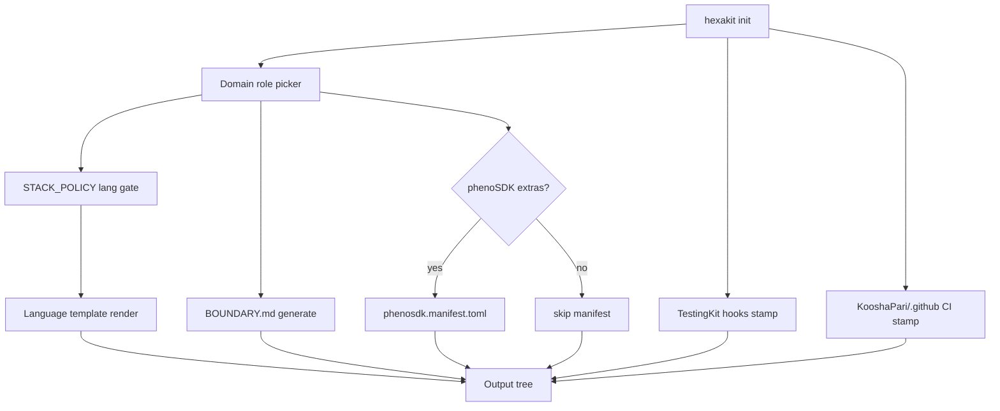

# Fleet Scaffold Generator — `hexakit init`

**Status:** Draft specification  
**Date:** 2026-06-16  
**Command:** `hexakit init`  
**Owner:** HexaKit (scaffolding layer)  
**Related:** [DISPOSITION.md](../boundary/DISPOSITION.md), [SCAFFOLDING_JOURNEYS.md](../SCAFFOLDING_JOURNEYS.md), [STACK_POLICY](https://github.com/KooshaPari/phenotype-registry/blob/main/docs/rationalization/STACK_POLICY.md), [DOMAIN_ROLES](https://github.com/KooshaPari/phenotype-registry/blob/main/docs/rationalization/DOMAIN_ROLES.md)

---

## Purpose

`hexakit init` bootstraps a **new fleet repository** onto Phenotype architectural patterns. It is the fleet-facing entry point for repo creation — distinct from `hexakit new`, which materializes language/project templates inside an existing tree.

The generator **stamps scaffolding only**. It wires imports, boundaries, CI, hooks, and optional phenoSDK manifest entries. It does **not** vendor or copy domain crates, SDK source trees, or runtime libraries from HexaKit's transitional workspace.

---

## Scope

### In scope (what `init` stamps)

| Artifact | Source SSOT | Notes |
| --- | --- | --- |
| **Git hooks** (`.githooks/`) | [TestingKit](https://github.com/KooshaPari/TestingKit) | Pre-commit / pre-push / spec-validator hooks; installed via `git config core.hooksPath .githooks` |
| **CI workflows** (`.github/workflows/`) | [KooshaPari/.github](https://github.com/KooshaPari/.github) | Reusable-workflow references or workflow-template starters from `workflow-templates/` |
| **Community defaults** | KooshaPari/.github | `CONTRIBUTING.md`, `CODE_OF_CONDUCT.md`, `pull_request_template.md`, `ISSUE_TEMPLATE/` when absent locally |
| **`BOUNDARY.md`** | Domain role picker | Generated from [DOMAIN_ROLES](https://github.com/KooshaPari/phenotype-registry/blob/main/docs/rationalization/DOMAIN_ROLES.md) row + stack choice |
| **Infra-generic config** | HexaKit templates | `.template.*` sources → `.editorconfig`, `.pre-commit-config.yaml`, `Taskfile.yml`, `.mise.toml`, `Brewfile`, `.devcontainer/` |
| **Language scaffold** | HexaKit `templates/<lang>/` | Core-tier default; edge tier requires `--justify` (see below) |
| **phenoSDK extras** | phenoSDK manifest | Opt-in domain packages listed in `phenosdk.manifest.toml` — not a monolithic lang SDK |

### Out of scope (explicit non-goals)

- Copying or vendoring domain crates from HexaKit (`crates/*`, `python/pheno-*`, `Metron/`, etc.)
- Embedding SDK runtime code in the scaffold output
- Creating language-bucket repos (`phenotype-rust-sdk`, `phenotype-python-sdk-*`)
- Replacing domain SDK installation — consumers add domain deps via normal package managers after init

Per [DISPOSITION.md](../boundary/DISPOSITION.md), domain modules **relocate** to their canonical repos; `init` only records *which* domains to wire, not their implementation.

---

## Domain role picker

Interactive (or flag-driven) selection of the repo's **domain concern** from the registry SSOT. The picker drives `BOUNDARY.md` content and default dependency hints.

```
? Domain role: (Use arrow keys)
  ▸ Scaffolding / templates     → HexaKit-like repos
    Schemas / shared types      → phenotype-types
    Testing                     → TestingKit
    Observability               → PhenoObservability
    MCP                         → McpKit
    Secrets / auth              → Authvault
    HTTP / resilience           → ResilienceKit
    Tooling crates              → phenotype-tooling
    Tiny cross-cutting infra    → phenoShared
    Optional extras manifest    → phenoSDK (manifest-only repo)
    … (extensible via registry sync)
```

**Generated `BOUNDARY.md` sections:**

1. **Status** — `ACTIVE` for new repos
2. **Owns** — domain-specific bullets from DOMAIN_ROLES row
3. **Does NOT own** — adjacent domains with canonical repo links
4. **Preferred core lang** — from STACK_POLICY for selected domain
5. **Edge langs** — empty by default; populated only when `--lang` is edge-tier and `--justify` provided
6. **phenoSDK extras** — optional manifest block when user selects extras

The picker reads a cached copy of `DOMAIN_ROLES.md` (bundled in HexaKit, refreshed from phenotype-registry on `hexakit registry sync`).

---

## Language template selection (STACK_POLICY)

Template choice follows [STACK_POLICY](https://github.com/KooshaPari/phenotype-registry/blob/main/docs/rationalization/STACK_POLICY.md).

### Core tier (default, no extra flags)

| Language | HexaKit template path |
| --- | --- |
| **Rust** | `templates/rust/` or `template-rust/` |
| **Zig** | `templates/zig/` |
| **Mojo** | `templates/mojo/` |

When `--lang` is omitted, `init` defaults to **Rust** for domain repos unless the domain role row specifies otherwise (e.g. phenoSDK manifest repos use N/A).

### Edge tier (requires `--justify`)

| Language | HexaKit template path | Gate |
| --- | --- | --- |
| Go | `templates/go/` | `--justify "<reason>"` required |
| Python 3.14+ (uv) | `templates/python/` or `template-python/` | `--justify` required |
| Bun + TypeScript | `templates/typescript/` or `template-typescript/` | `--justify` required |
| Kotlin, Swift, C#, Java | `templates/kotlin/`, `templates/swift/`, … | `--justify` required |

**Enforcement:**

```text
$ hexakit init --lang go --domain sharecli
Error: Go is edge-tier per STACK_POLICY.
Provide --justify with scope, reason, exit criteria, and optional ADR link.
See: https://github.com/KooshaPari/phenotype-registry/blob/main/docs/rationalization/STACK_POLICY.md
```

When `--justify` is supplied, `init` embeds the justification block in `BOUNDARY.md` using the STACK_POLICY template:

```markdown
## Edge language: Go
- **Scope:** cmd/, internal/
- **Reason:** <from --justify>
- **Exit criteria:** <from --exit-criteria or prompt>
- **ADR:** <from --adr or N/A>
```

---

## phenoSDK extras (manifest, not monolithic SDK)

Optional domain packages are declared in **`phenosdk.manifest.toml`** at repo root — not by copying phenoSDK source or creating a language-bucket SDK repo.

```toml
# phenosdk.manifest.toml (stamped by init when --extras selected)
[manifest]
version = 1
domain_role = "my-service"

[[extras]]
package = "pheno-mcp"
repo = "KooshaPari/McpKit"
install = "cargo add mcp-kit"  # or uv/pnpm per edge binding

[[extras]]
package = "pheno-observability"
repo = "KooshaPari/PhenoObservability"
install = "cargo add pheno-observability"
```

**Rules:**

- phenoSDK is a **dynamic extras manifest** — it lists opt-in packages; it does not own domain boundaries ([STACK_POLICY §phenoSDK](https://github.com/KooshaPari/phenotype-registry/blob/main/docs/rationalization/STACK_POLICY.md)).
- `init` writes the manifest skeleton and dependency install hints; it does **not** copy package source.
- Language-specific bindings at the edge are recorded as `install` hints, not as vendored trees.

---

## Stamp pipeline (high level)



**Idempotency:** Re-running `init` on an existing repo uses merge-safe rules (same as `hexakit new --update` policy): warn on conflicts, `--force` to overwrite stamped files.

---

## CLI interface (stub — docs only)

Implementation is **not** in scope for this PR. The intended surface:

```text
hexakit init [PATH] [flags]

Flags:
  --domain string       Domain role (from DOMAIN_ROLES); interactive if omitted
  --lang string         Core: rust|zig|mojo. Edge: go|python|typescript|…
  --justify string      Required for edge-tier langs (STACK_POLICY)
  --exit-criteria string  Edge lang fold-back criteria (optional)
  --adr string          Link to PhenoSpecs ADR (optional)
  --extras strings      Comma-separated phenoSDK extra package ids
  --no-hooks            Skip TestingKit hook stamp
  --no-ci               Skip KooshaPari/.github workflow stamp
  --dry-run             Print planned files without writing
  --force               Overwrite existing stamped files

Examples:
  hexakit init ./my-crate --domain testing --lang rust
  hexakit init --domain observability --lang rust --extras pheno-telemetry
  hexakit init ./sharecli --domain sharecli --lang go \
    --justify "Production deploy is Go binary today; Rust rewrite > 2 sprints"
```

**Relationship to other commands:**

| Command | Use when |
| --- | --- |
| `hexakit init` | New repo bootstrap: boundary, hooks, CI, lang scaffold, manifest |
| `hexakit new` | Add project from template inside existing repo |
| `hexakit template list` | Discover available language/domain templates |

---

## Source paths (HexaKit repo)

| Input | Location |
| --- | --- |
| Hook templates (transitional) | `.githooks/` → migrate to TestingKit-published bundle |
| Infra-generic templates | `.template.ci.yml`, `.template.editorconfig`, `.template.pre-commit.yaml` |
| Language templates | `templates/<lang>/`, `template-{rust,go,python,typescript}/` |
| Registry cache | `registry/domain-roles.json` (future; synced from phenotype-registry) |

---

## Implementation phases

| Phase | Deliverable |
| --- | --- |
| **P0 (this doc)** | Spec + CLI stub in docs |
| **P1** | Domain role picker + `BOUNDARY.md` generator |
| **P2** | TestingKit hook + KooshaPari/.github workflow stamper |
| **P3** | STACK_POLICY lang gate + `--justify` enforcement |
| **P4** | `phenosdk.manifest.toml` generator + registry sync |

---

## Acceptance criteria

1. `init` output tree contains no files copied from HexaKit `crates/` or `python/pheno-*`.
2. Edge-tier language without `--justify` exits non-zero with STACK_POLICY link.
3. Generated `BOUNDARY.md` matches selected DOMAIN_ROLES row and records edge justification when applicable.
4. CI workflows reference `KooshaPari/.github` reusable workflows, not inlined copies of org workflows.
5. phenoSDK extras appear only as manifest entries + install hints, never as vendored SDK trees.

---

## Related documents

- [DISPOSITION.md](../boundary/DISPOSITION.md) — HexaKit module disposition; scaffolding-only end-state
- [BOUNDARY.md](../../BOUNDARY.md) — HexaKit's own boundary lock
- [SCAFFOLDING_JOURNEYS.md](../SCAFFOLDING_JOURNEYS.md) — template usage journeys (`hexakit new`)
- [STACK_POLICY](https://github.com/KooshaPari/phenotype-registry/blob/main/docs/rationalization/STACK_POLICY.md) — core vs edge language tiers
- [DOMAIN_ROLES](https://github.com/KooshaPari/phenotype-registry/blob/main/docs/rationalization/DOMAIN_ROLES.md) — domain role picker SSOT
- [KooshaPari/.github](https://github.com/KooshaPari/.github) — org workflow and community file SSOT
